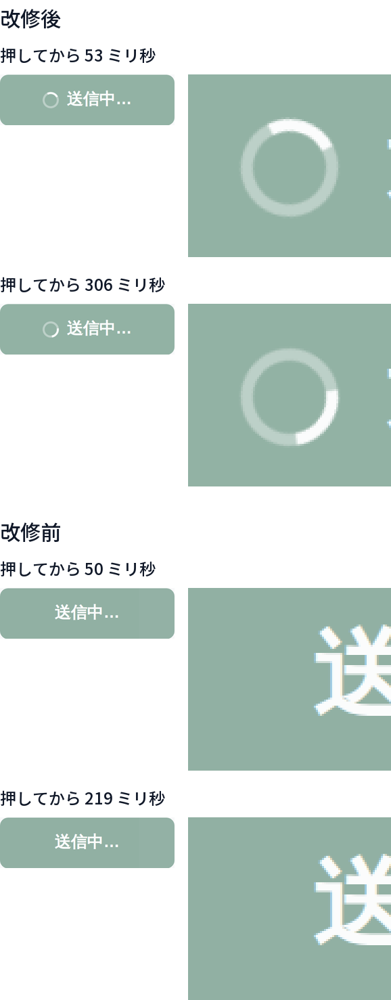
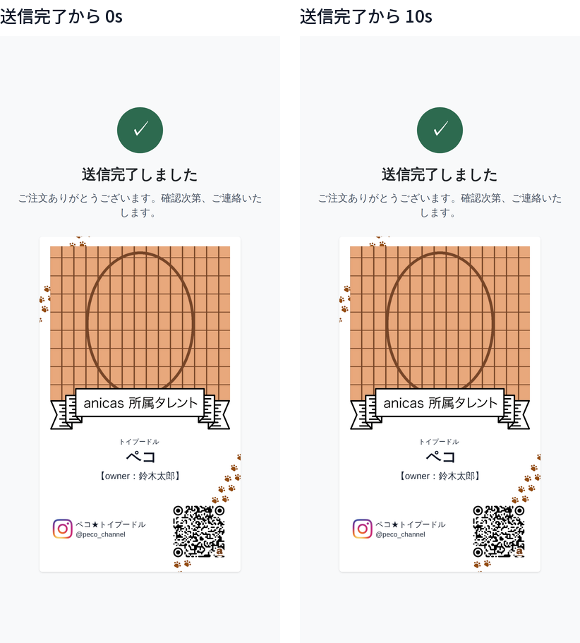
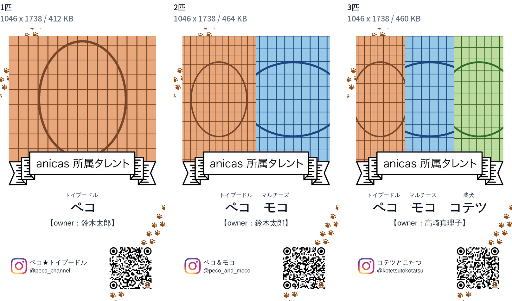
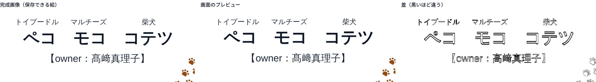

# 送信中の表示と、送信完了の画面の検証

送信ボタンを押してから完了までのあいだ画面が止まって見えたこと、完了の画面が
1.5 秒で勝手に閉じていたこと、完了の画面に何も残らなかったことの3点を直した回の
検証記録。変えたのは次の3つ。

1. 送信しているあいだ、ボタンの中の印が回る（文言は増やしていない）
2. 完了の画面を閉じるタイマーを消した（閉じるのはタレント自身）
3. 完了の画面に、出来上がった名刺そのものの絵を出す（長押しで保存できる形）

減らしたもの＝自動で閉じる動き（`liff.closeWindow()` の呼び出しと、それ専用の
`closeLiffWindow` ヘルパ）。増えたもの＝完成した名刺の絵1つ。ボタンも説明文も
増やしていない。

検証は **本番ビルドした実アプリを、iPhone 12 と同じ画面（390 × 844、3倍）・
タッチ操作だけの headless Chromium で実際に操作し**、送信ボタンを押して飛んだ
POST を実測している。マウスイベントは使っていない（`hasTouch` / `isMobile` を
立て、`tap()` と CDP のタッチジェスチャだけで操作する）。

```
next build → next start
  ├─ :4598  この改修
  └─ :4602  改修前（23c10dd）を git worktree でビルド
       ↓ Playwright で Step1〜Step5 を実操作（写真アップロードを含む）
       ↓ 「送信する」
GAS の代わりに立てたローカルサーバ (:4599) が POST body をそのまま保存
       ↓
payload を項目ごとに突き合わせ、print_base64 は pypdfium2 (PDFium) で
350 / 600 / 1200 dpi に描画して画素比較。完成画像の QR は zxing-cpp で実読み取り。
送信中の画面は CDP の screencast（＝コンポジタが出したフレームそのもの）で記録する
```

3パターンを通した。文言はこれまでの検証記録とそろえてある。

| | ペット | Instagram | オーナー |
|---|---|---|---|
| 1匹 | トイプードル ペコ | @peco_channel / ペコ★トイプードル | 鈴木太郎 |
| 2匹 | ＋ マルチーズ モコ | @peco_and_moco / ペコ＆モコ | 鈴木太郎 |
| 3匹 | ＋ 柴犬 コテツ | @kotetsutokotatsu / コテツとこたつ | 髙﨑真理子 |

写真は毎回同じ画素のダミー画像を使っているので、改修前後の差はコードの差だけを
反映する。

---

## 1. 送信しているあいだ、動いていることが分かる

### 何が「止まって見える」の正体だったか

送信の中身はほとんど通信ではなく、**印刷用 PDF をその場で描く処理**で、これが
メインスレッドを数百ミリ秒単位で占有する。改修前のボタンは文字が「送信する」から
「送信中…」に変わるだけなので、その間**画面に変化が一切ない**。

CDP の screencast で、押してから完了までに**コンポジタが実際に出したフレーム**を
数えた（1匹・同条件）。

| | 送信にかかった時間 | 出たフレーム | 直前のフレームとボタンが違うフレーム |
|---|---|---|---|
| 改修前 | 1005 ms | **3** | 2（66 ms＝文字が「送信中…」に変わった瞬間、719 ms＝完了画面に切り替わった瞬間） |
| 改修後 | 980 ms | **45** | **44** |

改修前は 66 ms から 719 ms までの **653 ミリ秒、画面が1画素も変わっていない**。
これが「固まったように見える」の実測値。

### 回る印は、ページが動けない間も回る

印は CSS の `transform` アニメーション（Tailwind の `animate-spin`）にした。
ブラウザはこれをコンポジタ側で回すので、メインスレッドが PDF を描いていて
`requestAnimationFrame` が1回も走らない間も止まらない。

ページ側で `requestAnimationFrame` が走った時刻を記録し、80 ms 以上あいた区間を
「メインスレッドが止まっていた区間」として screencast のフレームと突き合わせた
（1匹）。

- メインスレッドが止まっていた区間: **191〜275 ms** と **481〜662 ms**
- その区間に出たフレームのうち、**16 フレームがひとつ前とボタンの絵が違う**
  （1フレームあたり 50〜100 画素が変化＝印が回っている）

つまり、いちばん固まって見えていたまさにその間も印は回っている。

### 時刻をずらした2枚

同じ位置を切り抜いた2枚。画素の変化数は改修後が 558〜584 画素、改修前が **0 画素**
（1匹・2匹・3匹とも同じ）。



| | 押してから 50 ms 前後 と 220〜310 ms の2枚で変わった画素 |
|---|---|
| 改修前 1匹 / 2匹 / 3匹 | 0 / 0 / 0 |
| 改修後 1匹 / 2匹 / 3匹 | 569 / 584 / 584 |

---

## 2. 完了の画面は自動で閉じない

改修前は完了と同時に `setTimeout(() => closeLiffWindow(), 1500)` が仕掛けられて
いた。`window.setTimeout` を記録するようにして実測した結果:

| | 完了時に仕掛けられた1秒以上のタイマー |
|---|---|
| 改修前 1匹 / 2匹 / 3匹 | **1500 ms が1本ずつ**（呼び出し元はアプリのチャンク） |
| 改修後 1匹 / 2匹 / 3匹 | **無し** |

出来上がったバンドルでも確認した。「送信完了しました」を含むアプリのチャンクに
出てくる `closeWindow` の数は、

- 改修前 `0v168mwmpjalm.js` … **2**
- 改修後 `0eixl3ihv8h-t.js` … **0**

（両方に入っている `0tr_cz3n6n~6s.js` は LIFF SDK 本体のチャンクで、こちらは
変えていない。）

完了から 10 秒後も画面はそのまま。完了直後と 10 秒後のスクリーンショットは
**1画素も違わない**（1匹・2匹・3匹とも 0 / 2,962,440 画素）。



閉じる手段はタレント自身の操作（LINE が出しているヘッダの × ）に任せている。
閉じるボタンは足していない。

---

## 3. 完了の画面に出る名刺の絵

### 何を描いているか

`lib/card-image.ts` を足した。プレビューと印刷 PDF が使っているのと**同じ
`resolveCard`**（`lib/card-adjust.ts`）から、同じ順番——テンプレート → 写真
（デザインの窓＝リボンの輪郭で切る） → リボン → 文字 → QR——で canvas に描く。
位置・大きさ・文字列を、この新しいモジュールが独自に持っている箇所は無い。

大きさはデザインそのものの画素数 1046 × 1738。テンプレートとリボンが等倍で
入るので、絵柄は一度も拡大縮小されない。



| | 画像サイズ | ファイル | QR を読み取った結果 |
|---|---|---|---|
| 1匹 | 1046 × 1738 | 422 KB | `https://www.instagram.com/peco_channel` |
| 2匹 | 1046 × 1738 | 475 KB | `https://www.instagram.com/peco_and_moco` |
| 3匹 | 1046 × 1738 | 471 KB | `https://www.instagram.com/kotetsutokotatsu` |

QR は zxing-cpp で保存した画像そのものから読んでいる。絵だけ保存しても
Instagram に飛べる。

### 画面のプレビューと同じ位置に出ているか

完成画像をプレビューのスクリーンショットと同じ大きさにそろえ、部位ごとに
インクの重心のずれを測った（単位は名刺の画素、1738 画素＝91 mm）。

| 部位 | 1匹 | 2匹 | 3匹 |
|---|---|---|---|
| 種類の行 | −0.45 | −0.10 | −0.01 |
| 名前の行 | +2.37 | +2.40 | +2.45 |
| オーナーの行 | +0.98 | +0.98 | +1.01 |
| Instagram の行 | +0.06 | +0.17 | +0.67 |
| QR | −0.16 | −0.14 | −0.16 |

名前の行だけ 2.4 画素（**0.13 mm**）低い。これはずれではなく**丸めの差**で、
完成画像は `lib/print.ts` と同じ規則（行ボックスの中で ascent + descent を
中央に置く）でベースラインを出しているのに対し、プレビューは CSS が実際の
表示倍率で整数に丸めた位置に置いているため。印刷 PDF を基準にすると、名前の行は
プレビューが −6.5〜−7.1 画素、完成画像が −4.1〜−4.7 画素で、**完成画像のほうが
印刷物に近い**。



差の画像に出ているのは輪郭のアンチエイリアスだけで、字の形も位置も一致している。

### 長押しで保存できる形か

保存ボタンは足していない。素の `` に画像データそのもの（`data:image/png`）を
持たせてあり、その上に何も乗せていない。実測したのは次の通り（1匹・2匹・3匹とも
同じ結果）。

| 測ったこと | 結果 |
|---|---|
| `src` の形式 | `data:image/png;base64,…`（562,870〜633,782 文字） |
| 画像として読めているか | `naturalWidth` 1046 / `naturalHeight` 1738 / `complete` true |
| 絵の中心にあるのはその `` 自身か | `document.elementFromPoint` → **その ``**（覆っている要素は無い） |
| `contextmenu` を止めている箇所があるか | `dispatchEvent` して `defaultPrevented` **false** |
| `user-select` / `-webkit-user-drag` | `` から `<html>` まで全て `auto` |
| `-webkit-touch-callout: none` の指定 | この画面には無い（アプリ内で指定しているのは Step4 の編集レイヤーだけ） |
| 900 ms 押し続けたあと | 画面はそのまま（`` は消えず、遷移も起きない） |

**headless Chromium は長押しのコンテキストメニュー自体を出さない**——素の
ページに置いた素の `` を 900 ms 押しても `contextmenu` は1回も飛ばない
ことを確認済み——ので、「写真に保存」のメニューが実際に出るかどうかは
**この環境では測れない**。ここで確認できるのは「ページ側に、それを妨げるものが
無い」までで、メニューが出るかは実機確認に回す。

---

## 4. 送信されるデータは変わっていない

完了画面の絵は**画面に出すだけ**で、payload には入れていないし、GAS に送るものを
この絵から作ってもいない（`app/page.tsx` で、POST が終わったあとに別途描いて
`useState` に置くだけ。描画に失敗しても送信は成功のまま扱う）。

同じ操作・同じ写真で改修前後の POST body を突き合わせた。

| 項目 | 1匹 | 2匹 | 3匹 |
|---|---|---|---|
| キーの集合 | 一致 | 一致 | 一致 |
| `ig_handle` / `ig_name` / `owner_name` / `pets` / `adjust` / `line_user_id` | 一致 | 一致 | 一致 |
| `photo_base64` | **完全一致**（sha256 も一致） | **完全一致** | **完全一致** |
| `print_base64` のバイト列 | 不一致 | 不一致 | 不一致 |

`print_base64` のバイト列だけが違う。中身を開いて確かめた結果、**違いは3つだけ**で
どれもこの改修とは関係しない。

1. `/CreationDate` と `/ModDate`（PDF を作った時刻）
2. 埋め込みフォントのサブセットタグ（`NotoSansJP-Regular-2708` ↔
   `NotoSansJP-Bold-2708` のように、同じ番号が別のウェイトに付く）
3. オブジェクトの並び順と、それに伴う相互参照ストリーム

いずれも `generateMeishiPrintPdf` が `Promise.all` でテンプレート・リボン・ロゴ・
フォントを**同時に**読み込んでいて、どれが先に終わるかが毎回違うことから来る。
**同じビルドを2回走らせても同じように食い違う**ことを確認した。

| | 1匹 | 2匹 | 3匹 |
|---|---|---|---|
| 同じビルドを2回（new / new2）の `print_base64` バイト列 | 不一致 | 不一致 | 不一致 |

そこで PDFium で描画して画素で比べた。**どの解像度でも1画素も違わない。**

| | 350 dpi | 600 dpi | 1200 dpi |
|---|---|---|---|
| 改修前 vs 改修後 1匹 | 0 px | 0 px | 0 px |
| 改修前 vs 改修後 2匹 | 0 px | 0 px | 0 px |
| 改修前 vs 改修後 3匹 | 0 px | 0 px | 0 px |
| 同じビルド2回 1匹/2匹/3匹 | — | 0 px | — |

（画像サイズは 600 dpi で 1441 × 2292、1200 dpi で 2882 × 4583。）

入稿データは今まで通り。

---

## 実機で見てほしいこと

この環境で測れなかったのは1つだけ。

- 完了画面の名刺を **長押しして「写真に保存」が出るか**（headless Chromium は
  長押しのメニュー自体を出さないため、ここでは測れない）
