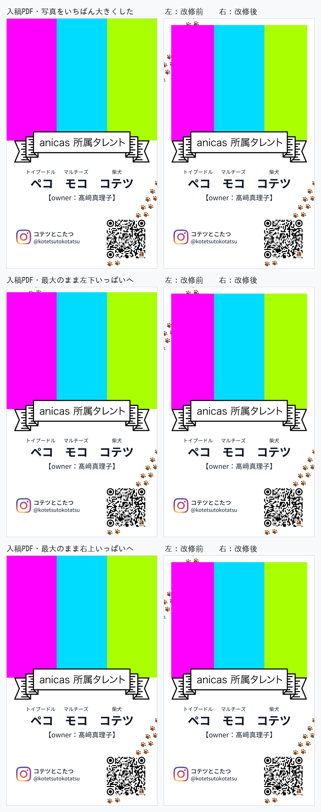
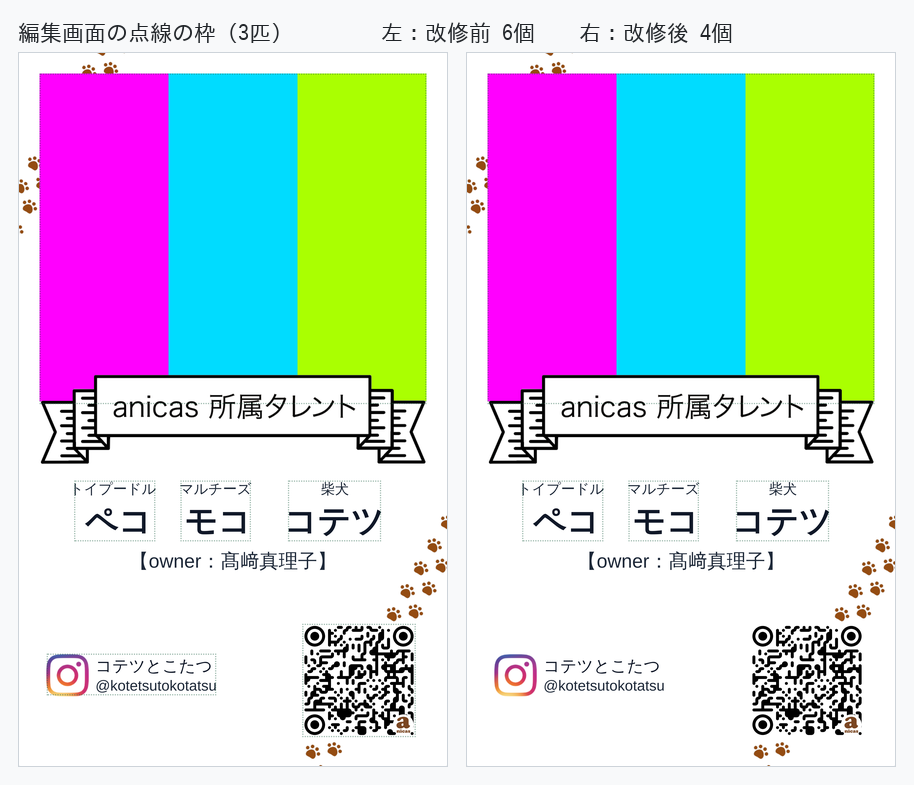
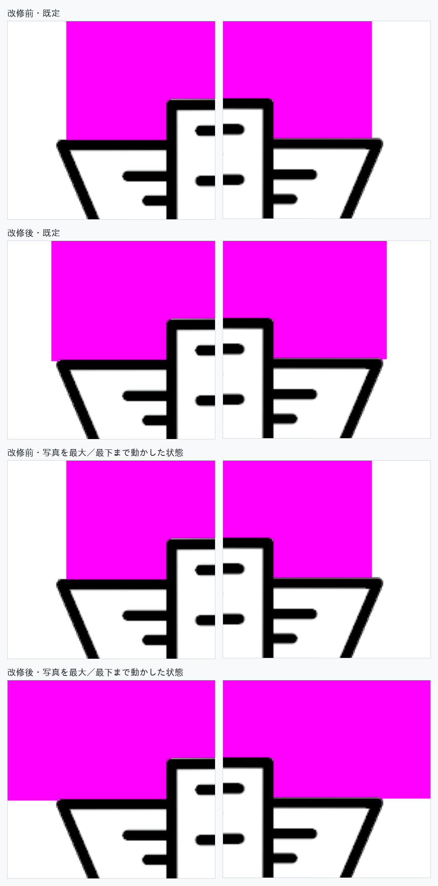
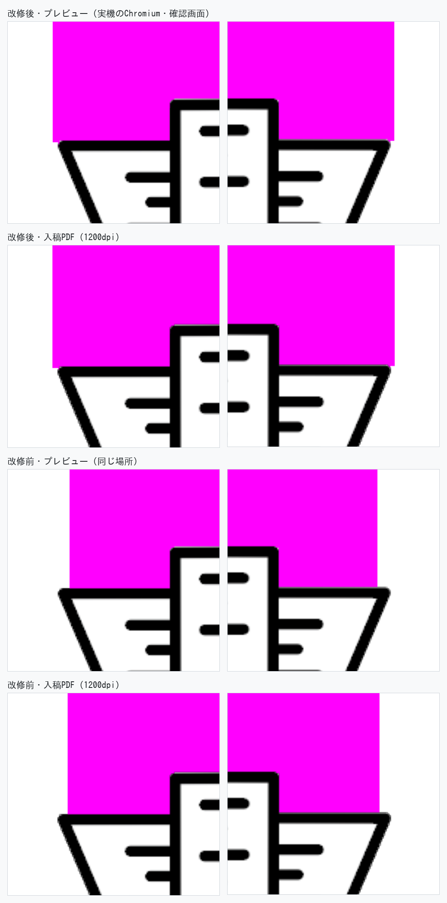
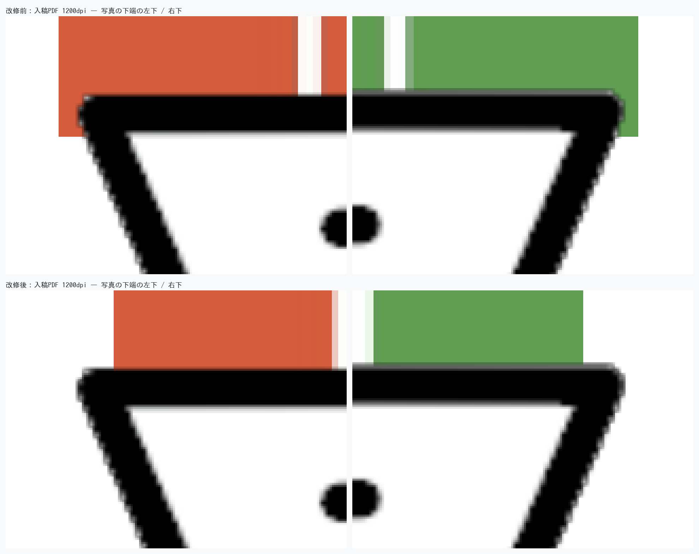

# プレビューの上で直接レイアウトできるようにした検証

名刺プレビューの上でタレントが指で部分を動かし、つまみで大きさを変えられるように
した改修の検証記録。さわれるのは **写真／ペットの列（匹数ぶん）** の2種類で、ペットの列は1匹につき1つ、種類と名前がセットで
入っている。列は**横に動かすだけ**で、大きさはプレビューの下の「文字の大きさ」で
全部の列いっしょに決める。「名前の間隔」と「ペットNの拡大率」のバーはこの改修で
削除している。

（この記録は前回までのぶんも含む。今回変えたのは**スマホの指で操作できるようにしたこと**
だけで、0 章に足してある。その前に変えたのは3つ——**写真の窓を動かなくしたこと**、
**QR をさわれなくしたこと**、**Instagram の行をさわれなくしたこと**（0-2 章）。）

その前に変えたのは、**写真を四角で合わせるのをやめ、リボンの輪郭そのもので切るように
したこと**（6章の頭）。写真の枠の左右はデザイン本来の 2.750〜52.250mm に戻した。
さらにその前は、**写真の窓の左右を、リボンが実際に覆っている範囲まで狭めたこと**。
さらにその前に変えたのは4つ——**写真をデザインの窓の外に描かないこと**（6章）、
**中央と等間隔で違う印を出すこと**（7章）、**動かせる部分に編集画面のあいだずっと
点線を出すこと**（8章、一度光る演出はやめた）、そして**文字の大きさを枠の外の1つの
指定にまとめ、列のドラッグ拡大縮小をやめたこと**（9章）。

検証は前回までと同じく **本番ビルドした実アプリを headless Chromium で実際に操作し**、
送信ボタンを押して飛んだ POST の `print_base64` を実測している。
見た目を別スクリプトで真似て比べる方法は使っていない。

```
next build → next start
  ├─ :4598  この改修
  ├─ :4601  改修が始まった地点（PR #8 / #9 マージ後）を git worktree でビルド
  └─ :4602  この回の直前（PR #10 の 2352485）を git worktree でビルド
       ↓ Playwright で Step1〜Step5 を実操作（写真アップロード・プレビュー上のドラッグ含む）
       ↓ 「送信する」
GAS の代わりに立てたローカルサーバ (:4599) が POST body をそのまま保存
       ↓
payload.print_base64 を base64 デコード → PDF
  ├─ pikepdf でページの内容ストリームを読み、配置命令そのものを mm で実測
  ├─ pypdfium2 (PDFium) で 350 / 600 / 1200dpi に描画して画素比較
  └─ zxing-cpp で QR を実読み取り
プレビュー側は描画済みの DOM を実測（getBoundingClientRect / Range / ベースライン
プローブ）し、字の実際の位置はスクリーンショットの画素から実測する
```

3パターンを通した。文言はこれまでの検証記録とそろえてある。

| | ペット | Instagram | オーナー |
|---|---|---|---|
| 1匹 | トイプードル ペコ | @peco_channel / ペコ★トイプードル | 鈴木太郎 |
| 2匹 | ＋ マルチーズ モコ | @peco_and_moco / ペコ＆モコ | 鈴木太郎 |
| 3匹 | ＋ 柴犬 コテツ | @kotetsutokotatsu / コテツとこたつ | 髙﨑真理子 |

写真は毎回同じ画素の合成用ダミー画像を使っているので、改修前後の PDF は
コードの差だけを反映する。

---

## 0. 今回：スマホの指で操作できるようにする

実機の iPhone（Safari）で、**写真の角のつまみを引いても大きさが変わらず**、
**写真をなぞると名刺ではなくページが縦にスクロールする**という報告。

### 原因

指の動きの行き先を `touch-action: none` だけに頼っていたこと。スマホは「この指は
スクロールなのか、そうでないのか」を**最初の1回の動きで決め**、スクロールだと決めた
瞬間にポインタを取り上げる（`pointercancel`）。取り上げられれば、動かしていた部分は
その場に置き去りになる——「ページがスクロールして写真は動かない」も「つまみを引いても
大きさが変わらない」も、**同じ1つのことの見え方**。

### 直しかた

指の動きを**カードがはっきり断る**ようにした（`preventDefault`）。React が自分で付ける
touch のリスナーは passive で `preventDefault` が効かないので、素の
`addEventListener(..., { passive: false })` で付けている。断るのは**部分をつかんでいる
間だけ**なので、名刺の外は今までどおりスクロールする。

あわせて3つ:

| | 直したこと | なぜ |
|---|---|---|
| つまみ | 指の当たり判定を 28px → **44px**（見えている丸の大きさは変えていない） | 指の腹で外すと、その動きがスクロールになる |
| つまみ | `touch-action: none` をつまみ自身にも書いた | この指定は**継承されない**ので、つまみは指定なしのままだった |
| 指の追跡 | ポインタの捕捉先を、つまんだ**つまみ**から**カード全体**に変えた | つまみは数ミリしかなく、指はすぐ外へ出る |

### 実測

**画面 390×844・DPR 3・指の操作（touch）で動く headless Chromium**。フォームの入力から
プレビューの操作まで、**マウスは1回も使っていない**——指の動きは Chrome 自身の入力経路
（CDP `Input.dispatchTouchEvent`）に流していて、`touch-action` もページのスクロールも
そこで効く。

まず正直なところ:**この環境では改修前でも指の操作そのものは通ってしまい、実機の症状は
再現しない**。再現しないものを「直った」とは言えないので、**実機で効く仕組みそのもの**を
数えることにした——指の動きをカードが断ったかどうか。

| 指の動き | 改修前 ページが受け取った / カードが断った | 改修後 |
|---|---|---|
| 写真をなぞる | 21 回 / **0 回** | 21 回 / **21 回** |
| つまみを引く | 21 回 / **0 回** | 21 回 / **21 回** |
| 列をなぞる | 15 回 / **0 回** | 15 回 / **15 回** |
| **名刺の外をなぞる** | 10 回 / **0 回** | 10〜11 回 / **0 回**（＝断らない） |

1匹・2匹・3匹とも同じ。改修前は**1回も断っていない**——スクロールにするかどうかの
判断が、そっくりそのままブラウザ任せだった。改修後は、部分をつかんでいる間の動きは
**1回残らず断り**、名刺の外は**1回も断らない**。

指の操作の結果（1匹・2匹・3匹すべてで同じ数字）:

| | 前 | 後 | 動いた量 | ページのスクロール |
|---|---|---|---|---|
| 写真をなぞる（左右） | 2.749〜52.247 mm | 0.000〜49.498 mm | **−2.749 mm** | 485 → 485（**変わらない**） |
| 写真をなぞる（上下） | 2.650〜44.998 mm | 6.866〜49.214 mm | **+4.215 mm** | 同上 |
| **角のつまみを引く** | 49.498 × 42.348 mm | **55.000 × 47.053 mm** | **+5.502 / +4.705 mm** | 485 → 485（**変わらない**） |
| 列をなぞる（1匹） | 種類 21.643 ／ 名前 23.662 mm | 27.788 ／ 29.807 mm | **+6.145 mm** | 485 → 485（**変わらない**） |
| 列をなぞる（2匹・3匹） | — | — | **+3.104 mm** | 変わらない |
| **名刺の外をなぞる** | — | — | — | **485 → 280（スクロールした）** |

スクロールできる幅は 701〜729 なので、外をなぞったときの 205 は確かにページが動いた量。

触っていない既定の入稿PDFは、直前のコミット(d9173ac)と**1200dpi でページ全面を1画素ずつ
突き合わせて 0 / 0 / 0 画素差**（各 13,208,206 画素中）。つまみの当たり判定を広げても、
見えている丸の大きさも、カードに刷られるものも変わっていない。

---

## 0-2. 前回：窓は動かない、さわれるのは写真とペットの列だけ

### 写真の窓が広がらない

写真を大きくすると**窓ごと広がって**リボンの左右からはみ出し、カードの端まで写真が
届いていた。切り抜きの形が3辺ともカードの外に逃がしてあり（前回、角ではなく直線で
受けるためにそうした）、実際には何も切っていなかったのが原因。

窓の3辺をデザインの写真枠そのもの（**2.750〜52.250 mm ／ 上端 2.457 mm**）に戻し、
下辺はリボンの輪郭のままにした。窓は**カードに据わっていて動かない**。動かす・
大きくするは、窓の**うしろの絵**を動かす・大きくすることになる。

ただし**絵が届いていない辺は、切らずにカードの外へ逃がす**。切る線を絵のふちに
ぴったり重ねると描画側がそのふちを二度描き、そこだけ色が変わってしまうため。
逃がすのは切るものが無い辺だけなので、窓の外に絵が出ることはない（下の実測）。

#### 窓の外に出た写真の画素（入稿PDF・1200dpi・1ページ 2882×4583 画素）

写真の画素は**色で見分けていない**。同じ入稿PDFを、**写真の画像だけ白に差し替えて**
もう一度描き、2枚が違う画素＝写真が置いた画素、としている（デザイン自身の絵と
色が似ていても混ざらない）。

| | 窓の外 | 左 | 右 | 上 | 下 | 描かれた範囲（左・右・上） | 写真の画素数 |
|---|---|---|---|---|---|---|---|
| 改修前・いちばん大きくした | **833,300** | 272,480 | 272,220 | 288,600 | 0 | −0.016〜55.016 ／ 0.090 mm | 5,164,234 |
| 改修前・最大のまま左下へ | **581,620** | 261,040 | 260,780 | 59,800 | 0 | −0.016〜55.016 ／ 1.953 mm | 4,935,434 |
| 改修前・最大のまま右上へ | **873,340** | 274,300 | 274,040 | 325,000 | 0 | −0.016〜55.016 ／ −0.206 mm | 5,200,634 |
| **改修後・既定** | **0** | 0 | 0 | 0 | 0 | 2.736〜52.264 ／ 2.440 mm | **4,359,794** |
| **改修後・いちばん大きくした** | **0** | 0 | 0 | 0 | 0 | 2.736〜52.264 ／ 2.440 mm | **4,359,794** |
| **改修後・最大のまま左下へ** | **0** | 0 | 0 | 0 | 0 | 2.736〜52.264 ／ 2.440 mm | **4,359,794** |
| **改修後・最大のまま右上へ** | **0** | 0 | 0 | 0 | 0 | 2.736〜52.264 ／ 2.440 mm | **4,359,794** |

1匹・2匹・3匹すべてで同じ数字。改修後は**どの状態でも写真の画素数が
4,359,794 でぴたりと同じ**——描かれる範囲そのものが動いていない、ということ。
「描かれた範囲」の 2.736／52.264／2.440 mm は、窓のふちが通る画素1つぶん
（1200dpi で 0.021 mm）を含めた値で、まるごと外に出た画素は 0。

絵のほうはちゃんと動いている（入稿PDFのページの配置命令から実測）:

| | 絵の箱（左・右・上・下 mm） |
|---|---|
| 既定 | 2.750／52.250／2.457／44.805 |
| いちばん大きくした | 0.000／55.000／0.104／47.158 |
| 最大のまま左下へ | 0.000／55.000／1.969／49.023 |
| 最大のまま右上へ | 0.000／55.000／−0.193／46.861 |



#### 触っていない既定は1画素も変わっていない

直前のコミット(99ccbeb)の出す入稿PDFと、**1200dpi でページ全面を1画素ずつ**
突き合わせた。

| | 違う画素 |
|---|---|
| 1匹 / 2匹 / 3匹 | **0 / 0 / 0**（各 13,208,206 画素中） |

#### プレビューと入稿PDFが一致する

| | プレビュー（絵の箱 mm） | 入稿PDF | ずれ |
|---|---|---|---|
| いちばん大きくした | 0.000／55.000／0.103／47.154 | 0.000／55.000／0.104／47.158 | **0.0037 mm** |
| 最大のまま左下へ | 0.000／55.000／1.967／49.019 | 0.000／55.000／1.969／49.023 | **0.0043 mm** |
| 最大のまま右上へ | 0.000／55.000／−0.193／46.858 | 0.000／55.000／−0.193／46.861 | **0.0027 mm** |

切り抜きの形そのものも、プレビューの `clip-path` と入稿PDFのクリップ命令を同じ
座標に直して突き合わせた——**頂点の数が同じで、いちばん離れている頂点で
0.0014〜0.0024 mm**（既定は18点、辺を切っている状態は16点）。1匹・2匹・3匹とも同じ。

### QR と Instagram の行はさわれない

どちらもデザインが決めた場所に据わっているもの（Instagram の印はテンプレートに
焼き込まれた絵、QR は断裁から逃げた隅）で、動かせることに見合う値打ちがなかった。
点線の枠もつまみも出ないし、さわっても何も起きない。

| | 編集画面の点線 | 確認画面 | QRをさわる | Instagramをさわる | 写真をさわる |
|---|---|---|---|---|---|
| 改修前 1匹 / 2匹 / 3匹 | 4 / 5 / 6 個 | 0 個 | 枠が出る | 枠が出る | 枠が出る |
| **改修後 1匹 / 2匹 / 3匹** | **2 / 3 / 4 個** | 0 個 | **何も起きない** | **何も起きない** | 枠が出る |

改修後の数は **写真1つ＋列の数** ちょうど。写真をさわったときに出る枠は
`{x: .05, y: .029, width: .90, height: .4634}`——**デザインの窓そのもの**で、
動かしても大きくしてもこの枠は動かない。



**文字の大きさのバーは Instagram の行に効かない**（プレビューの実測 mm）:

| バー | Instagram の2行 | ペットの2行 |
|---|---|---|
| 0.60 倍 | 2.09 ／ 1.87 mm | 1.8 ／ 3.0 mm |
| 1.00 倍 | 2.09 ／ 1.87 mm | 1.815 ／ 4.18 mm |
| 1.40 倍 | 2.09 ／ 1.87 mm | 2.541 ／ 5.852 mm |

これは改修前も同じだった（バーはもともとペットの列にしか効かない）。今回変わったのは、
**Instagram の行を指で大きくすることもできなくなった**という点。

送信ペイロードの `adjust.front` は `photo` / `pets` / `text` の3つになり、
`ig` と `qr` は無くなった（実測: `keys: ['pets', 'photo', 'text']`）。

---

## 1. ペットごとの列 — 別々に動き、上下は揃ったまま


匹数ぶんの列ができ、1つの列にはそのペットの種類と名前がセットで入る。列をさわると
2行が一緒に選ばれ、一緒に動く。

### 3つの列をそれぞれ別々に横へ動かせる

3つの列を順に、左の限界／右の限界まで引っぱった。プレビューの画像から
**実際に描かれた字**の左右を測っている（字送りの箱ではなく字そのもの。和文は
サイドベアリングが広いので、箱どうしは触れていても字は離れている）。

| 3匹 | 1匹目の列 | 2匹目の列 | 3匹目の列 |
|---|---|---|---|
| 触っていない | 7.282 – 17.569 mm | 20.778 – 29.792 mm | 34.630 – 46.394 mm |
| 各列を左の限界まで | **2.037** – 12.375 | 12.324 – 21.287 | 21.236 – 33.356 |
| 各列を右の限界まで | 10.389 – 20.676 | 25.514 – 34.528 | 41.148 – **52.963** |
| 列ごとに別々の大きさへ | 5.806 – 19.046 | 20.829 – 29.741 | 33.815 – 47.259 |

左右の限界は、カードの端ではなく**仕上がり枠の内側 2.0mm**（下の 5. 参照）。
1匹・2匹も同じ規則で動く（1匹：左の限界 2.037 – 12.324 mm、右の限界
42.625 – 52.912 mm）。


### 名前も種類も上下位置が揃ったまま

各列を動かしたあと、各列の大きさを変えたあとの、**プレビューに描かれた行の
ベースライン**を実測した（0幅の inline-block をその行に差し込み、その上端＝
ベースラインを読んでいる）。

| 3匹 | 種類のベースライン | ばらつき | 名前のベースライン | ばらつき |
|---|---|---|---|---|
| 各列を左の限界まで | 56.5118 / 56.5118 / 56.5118 mm | **0.0000 mm** | 61.3459 / 61.3459 / 61.3459 mm | **0.0000 mm** |
| 各列を右の限界まで | 56.5118 / 56.5118 / 56.5118 mm | **0.0000 mm** | 61.3459 / 61.3459 / 61.3459 mm | **0.0000 mm** |
| 列ごとに別々の大きさへ | 56.5118 / 56.5118 / 56.5118 mm | **0.0000 mm** | 61.3459 / 61.3459 / 61.3459 mm | **0.0000 mm** |

大きさを変えたときの各列の級数は、種類が **2.3597 / 1.5426 / 2.0873 mm**、
名前が **5.4345 / 3.5527 / 4.8072 mm**（それぞれ 1.30 / 0.85 / 1.15 倍）。
級数がばらばらでもベースラインは 1 つも動いていない。触っていない状態の
ベースラインも 56.5118 / 61.3459 mm なので、**列を動かしても大きくしても行は
まったく上下しない**。

仕組みは、行の外側の span を**行の級数**で組んで line box を持たせ、その中の
高さ 0 の span に各ペットの字を入れること。入稿PDFも同じで、ベースラインは行の
級数から、字の大きさは列ごとの級数から決めている（`drawRun`）。

なお、列は `dy` を持てないデータ構造にしてある（`ColumnAdjust = { dx, scale }`）。
検証では列を下方向（+0.02）にも引いているが、値の置き場がないので何も起きない。

### 隣の列と重ならない

上の実測から、各列を左の限界まで詰めたときの隣とのすき間は
**−0.0509 mm / −0.0509 mm**。これはプレビューの1画素（55mm ÷ 1080px ＝
0.0509mm）ぶんで、**字の箱どうしが接した状態**（幾何学的なすき間 0）を画素に
落としたときに境目の1列を両方が塗るために出る。列は重なる手前で止まっている。

---

## 2. 何も触らずに送信したPDFで動いたのは写真の下端だけ

改修前のアプリと改修後のアプリに、同じ入力・同じ写真を入れ、
**プレビューには一切触らずに**送信した。

写真の窓をリボンが覆う範囲に合わせたので（→ 6章）、写真そのものは意図して変わって
いる。**それ以外は1つも動いていない。**

| | ページの配置命令（写真の1命令を除く） | 写真の箱の外の画素（1200dpi） |
|---|---|---|
| 1匹 | 8件 **完全一致** | 箱のふち1画素を除いて **0 / 8,529,868 画素** |
| 2匹 | 10件 **完全一致** | **0 画素** |
| 3匹 | 12件 **完全一致** | **0 画素** |

配置命令は pikepdf でページの内容ストリームを読み、画像の配置行列と文字の書き出し
座標・フォントサイズを mm で突き合わせたもの。リボン・文字・QR・anicas の印は
すべて同じ命令のまま。

**この改修が始まる前（PR #8 / #9 マージ後）との比較**では、写真の窓に手を入れるまでは
350dpi・1200dpi とも差分 0 画素・配置命令も全件一致だった（PR #10 の各回で確認）。
いま写真の窓は下端が 0.695 mm 上がり、左右が片側 0.55 mm 内側に入っている。

編集画面（ステップ4）には動かせる部分の点線が出るので（→ 8章）、そこも意図して
変えている。

---

## 3. 触って変えた結果が入稿PDFに一致する

3つの列をそれぞれ別の量だけ動かし、別の倍率に変え、さらに写真・Instagram・QR も
動かして送信した。飛んだ値（3匹、`payload.adjust.front`）:

```json
{ "photo": { "scale": 0.920, "dx":  0.020, "dy":  0.015 },
  "ig":    { "scale": 1.150, "dx":  0.060, "dy": -0.030 },
  "qr":    { "scale": 0.850, "dx": -0.050, "dy": -0.060 },
  "pets":  [ { "dx": -0.028 }, { "dx": 0.040 }, { "dx": 0.045 } ],
  "text":  1.2 }
```

列は `dx` だけを持ち、大きさは `text` の1つ（→ 9章）。列の値が指を離した位置
ちょうどでないのは、7章の「ぴたっと止まる」が効いているため。

### 絵柄（写真・Instagram の印・QR）— そのまま突き合わせ

フォントに依存しないので、プレビューの実測値と PDF の実測値をそのまま mm で
比べられる。3匹（いちばん差が大きいもの）:

| 部分 | | プレビュー | 入稿PDF | 差 |
|---|---|---|---|---|
| 写真 | x / y | 5.829 / 5.741 mm | 5.830 / 5.743 mm | **0.001 / 0.002 mm** |
| | 幅 / 高さ | 45.540 / 39.599 mm | 45.540 / 39.599 mm | **0.000 / 0.001 mm** |
| Instagram の印 | x / y | 5.299 / 73.833 mm | 5.205 / 73.835 mm | **0.094 / 0.002 mm** |
| | 幅 / 高さ | 6.228 / 6.166 mm | 6.228 / 6.168 mm | **0.000 / 0.002 mm** |
| QR | x / y | 34.642 / 68.718 mm | 34.643 / 68.719 mm | **0.001 / 0.002 mm** |
| | 幅 / 高さ | 12.387 / 12.387 mm | 12.388 / 12.388 mm | **0.001 / 0.001 mm** |

すべて **0.1mm 以内**。QR の枠は、QR のグリッドに固定されている anicas の印の
配置命令から逆算して求めている（PDF 側は QR をパスで描くため、枠そのものの
命令が存在しないため）。

### 文字 — 級数は完全一致、位置は「動かした量」で一致

列ごとの級数は3匹とも全行で **差 0.000mm**:

| 3匹（文字の大きさ 1.2 倍） | 1匹目 | 2匹目 | 3匹目 |
|---|---|---|---|
| 種類（プレビュー / PDF） | 2.178 / 2.178 | 2.178 / 2.178 | 2.178 / 2.178 mm |
| 名前（プレビュー / PDF） | 5.016 / 5.016 | 5.016 / 5.016 | 5.016 / 5.016 mm |

3列とも同じ級数になっているのが、9章の「1つの指定で全部の列が揃う」。

文字の**絶対位置**は、プレビューと入稿PDFで 0.14〜0.51mm 離れる。これは
**この改修より前から同じだけ離れていた**もので（canvas の字面測定と fontkit の
グリフ輪郭の差）、PR #10 の検証記録に改修前後を並べた表がある。

受入基準が問うている「**触って変えた結果**」＝触る前と触った後の差そのものを、
それぞれのレンダラの中で測って比べると、文字の級数の変化量は全行 **差 0.000mm**、
左端の移動量は最大 **0.096mm**。ベースラインの移動量だけ最大 0.180mm 出るが、
これは行の高さの中でどこにベースラインを置くかが各レンダラの組版だからで、
Chromium がベースラインを CSS ピクセルに丸めるぶん（360px 幅のプレビューで
1px＝0.153mm）が残っている。


---

## 4. 文字の下限 — 名前 3.0mm・種類 1.8mm

下限は**行の種類ごとに別**にしてある。列を縮めていくと種類が先に 1.8mm で止まり、
名前だけがそこから 3.0mm まで縮み続ける。

すべての部分を「これ以上小さくならない」ところまでつまみで引き、送信した。
プレビューの実測と、飛んだ入稿PDFの級数（3匹の例、1匹・2匹も同値）:

| 行 | 止まった級数 | 入稿PDFに同じ級数 | 根拠 |
|---|---|---|---|
| 種類（3匹とも） | **1.8000 mm** | あり | `MIN_TYPE_SIZE.breed` |
| 名前（3匹とも） | **3.0000 mm** | あり | `MIN_TYPE_SIZE.name` |
| Instagram 名 | 1.6765 mm | あり | ハンドルが `MIN_TYPE_SIZE.other` に届いたところ（0.8021 倍） |
| Instagram ハンドル | **1.5000 mm** | あり | 同上 |
| オーナー行 | 2.4750 mm（動かせない） | あり | — |
| QR | **14.575 → 11.538 mm**（1モジュール 0.3790 → **0.3000 mm**） | — | `MIN_QR_MODULE_MM` |
| 写真 | 既定の 0.5 倍 | — | `PHOTO_FLOOR` |

種類の設計級数は 1.815mm、下限は 1.8mm なので、列の倍率でいうと種類は 0.9917 倍で
止まり、名前は 3.0/4.18＝**0.7177 倍**まで下がる。**種類が止まったあとも名前が
縮み続ける**のは、列の倍率を行ごとに `heldSize` で受け止めているため。

すでに詰め込みで下限を割っている行は、下限まで**押し上げない**（縮められないだけ）。

最小まで縮めた QR を、実際に飛んだ入稿PDFから読み取った:

| | 350dpi | 600dpi | 1200dpi |
|---|---|---|---|
| 1匹 | `https://www.instagram.com/peco_channel` | 同左 | 同左 |
| 2匹 | `https://www.instagram.com/peco_and_moco` | 同左 | 同左 |
| 3匹 | `https://www.instagram.com/kotetsutokotatsu` | 同左 | 同左 |


---

## 5. 左右2.0mmの余白 — 断裁がぶれても文字が切れない

（この章はこの規則を入れた回の記録。**今回 Instagram の行と QR は動かせなく
なった**ので、余白が効くのは今はペットの列だけ——`SAFE_BOUNDS` はそのまま。）

文字（ペットの列・Instagram の行）と QR は、仕上がり枠の左右それぞれ内側 2.0mm
（`SAFE_MARGIN`）に入らない。写真だけは例外で、これまでどおり端まで届く。

全部を左／右へ目一杯引いて送信し、**飛んだ入稿PDFを 1200dpi で描画して字の
インクを実測**した（字送りの箱ではなく字そのもの。QR は枠そのものを、ページの
内容ストリームから逆算して実測）。

| 3匹・右へ目一杯 | 字／枠の右端 | 仕上がり線まで |
|---|---|---|
| 1匹目の列 | 20.937 mm | 34.063 mm |
| 2匹目の列 | 34.550 mm | 20.450 mm |
| 3匹目の列 | 52.608 mm | **2.392 mm** |
| Instagram 名 | 52.735 mm | **2.265 mm** |
| Instagram ハンドル | 52.989 mm | **2.011 mm** |
| QR（枠） | 53.000 mm | **2.000 mm** |

| 3匹・左へ目一杯 | 字／枠の左端 | 仕上がり線まで |
|---|---|---|
| 1匹目の列 | 2.435 mm | **2.435 mm** |
| 2匹目の列 | 11.982 mm | 11.982 mm |
| 3匹目の列 | 20.683 mm | 20.683 mm |
| Instagram の印 | 2.000 mm | **2.000 mm** |
| QR（枠） | 2.000 mm | **2.000 mm** |

1匹・2匹も同じで、いちばん端まで行った部分の仕上がり線までの距離は
**2.000〜2.435 mm**（1匹右：列 2.117 / QR 2.000、2匹右：列 2.244 / ハンドル 2.011 /
QR 2.000）。**2.0mm を下回るものはない。**

プレビュー側でも、止まった枠の位置を DOM から実測すると左右とも
**1.998〜2.003 mm**（0.002mm のずれは 360px 幅のプレビューで CSS が百分率を
1/64 ピクセルに丸めるぶん。入稿PDFでは 2.000mm ちょうど）。


---

## 6. 写真がリボンの外に出ない

### 今回：四角をやめ、リボンの輪郭で切る

窓を狭めたら、角は消えた代わりに**ひらひらとの間に白いすき間**ができた。広げると角が
出て、狭めるとすき間ができる——これは四角で合わせようとしている限り必ず起きる。
リボンの端は斜めなので、四角の幅をどこに決めても、ある高さでは足りず、別の高さでは出る。

そこで写真は**リボンの輪郭そのもの**で切ることにした。

`scripts/build-ribbon-profile.sh` が `public/meishi-ribbon.png` を読み、列ごとに
「最初に不透明になる行 `top`」と「そこから続く不透明な区間の長さ `run`」を求める。
切る線はこの帯の中でなければならない:

| | 越えると | 実測 |
|---|---|---|
| `top` より上 | 白いすき間が出る | リボンの列 56…990、`top` は 785…850 行 |
| `top + run` より下 | 写真がリボンの外に出る | いちばん短い `run` でも **4 行** |

線は帯の中でまっすぐ伸ばせるところまで伸ばし、**書き出す前に列あたり16点で帯の中に
あることを確かめている**（外れたらスクリプトが止まる／実測「はみ出し +0.000 行・
食い込み +0.000 行」）。ひらひらの肩でリボンの縁がほぼ真上に立つところでは、線も
同じ x のまま真上に立つ。ひらひらの先より外側は、先の高さより **1 行上**で平ら——
そこにリボンは無いので、写真が一画素も下に残らないようにしてある。

結果は `lib/ribbon-profile.ts` の **14点**。線はリボンの縁の **2.0〜6.5 行下**に入る。
実行時に PNG を読み直すことはない。**リボンの絵を差し替えたらスクリプトを実行し直す
だけ**でよい。

`lib/meishi-layout.ts` の **`PHOTO_CLIP` が唯一の定義**で、プレビューは
`clip-path: polygon()`、入稿PDFはクリップパスにする。

窓の左右はデザイン本来の値に戻した。上端・下端は動かしていない。

| 入稿PDFの写真（ページの配置命令から実測） | 上端 | 下端 | 左右 |
|---|---|---|---|
| 改修前（1匹・2匹・3匹とも） | 2.457 mm | 44.806 mm | 3.300〜51.700 mm |
| **改修後（1匹・2匹・3匹とも）** | 2.457 mm | 44.806 mm | **2.750〜52.250 mm** |

#### 入稿PDFを 1200dpi で描いて数えた

写真は判別できるよう単色（マゼンタ／シアン／黄緑）にした。**すき間の行では、デザイン
自身のインクはどの画素も色の開き（最大チャンネル − 最小チャンネル）が 12 以下**なので、
開きが 20 以上あれば写真しかありえない。リボンは白で塗られていて紙と同じ白なので、
**色ではなく PDF に埋まっているリボン画像のアルファ**を、PDF自身の配置行列で置いて使う。

| | リボンの外に残る写真 | 写真とリボンの間の白 | リボン直上 1.27mm の白い紙 | 写真の無いリボンの列 |
|---|---|---|---|---|
| 改修前・既定（1/2/3匹とも） | 0 画素 | 0 画素 | **2,126 画素** | **36 列** |
| 改修前・最大／最下（同上） | 0 画素 | 0 画素 | **2,126 画素** | **36 列** |
| **改修後・既定（1/2/3匹とも）** | **0 画素** | **0 画素** | **0 画素** | **0 列** |
| **改修後・最大／最下（同上）** | **0 画素** | **0 画素** | **0 画素** | **0 列** |

改修前の「リボン直上の白」と「写真の無い列」が、実機で見えていた白いすき間そのもの。
改修後は、**リボンが通っているどの列でも写真の下端がリボンの縁より 1〜81 画素
（0.021〜1.715 mm）下**にある——つまりどこも必ず重なっている。



#### プレビューでも同じ

確認画面をカードの箱ごと 2880×4792 で撮り、同じ数え方をした。

| | リボンの外に残る写真 | リボン直上 1.27mm の白い紙 |
|---|---|---|
| 改修前・既定（1/2/3匹とも） | 0 画素 | **2,867 画素** |
| **改修後・既定（1/2/3匹とも）** | **0 画素** | **0 画素** |
| **改修後・最大／最下（同上）** | **0 画素** | **0 画素** |

切り抜きの形そのものも突き合わせた。プレビューの `clip-path` と入稿PDFのクリップ命令を
カード箱の割合という同じ座標に直して比べると:

| | 頂点 | いちばん離れている頂点 |
|---|---|---|
| 1匹・2匹・3匹とも | **18 個**（同数） | **0.00152 mm** |

残っているずれは PDF が数値を書き出すときの丸めぶん。



**リボン・文字・QR は動いていない**:

| | ページの配置命令（写真の1命令を除く） | 写真の箱の外の画素（1200dpi） |
|---|---|---|
| 1匹 | 8件 **完全一致** | 箱のふち1画素を除いて **0 / 8,529,868 画素** |
| 2匹 | 10件 **完全一致** | **0 画素** |
| 3匹 | 12件 **完全一致** | **0 画素** |

---

### 前回：窓の左右を、リボンが覆っている範囲まで狭めた（今回やめた）

（この回の結果できたのが、上で直した白いすき間。記録として残す。）

下端を実物に合わせても、**窓の左右がリボンより広い**ままだと角は残る。写真の左端は
2.750mm、リボンが覆い始めるのは 3.050mm——その 0.30mm ぶんが角として見えていた。

`/meishi-ribbon.png` を写真の下端の高さで実測すると:

| リボンの行 | 不透明な範囲（px） | 同（mm） |
|---|---|---|
| 848（ひらひらの始まり） | 57…990 | 2.997〜52.055 |
| 850〜852（いちばん広い） | 56…991 | 2.945〜52.108 |
| **856（＝写真の下端）** | **58…989** | **3.050〜52.003** |
| 860 | 59…987 | 3.102〜51.898 |

写真の下端の高さでいちばん狭くなるので、そこが効く。`LAYOUT.photo` の
`left .05 → .06`、`width .90 → .88`（**3.300〜51.700mm**）にした。角はリボンの内側
**0.25mm（左）／0.30mm（右）**に入る。上端・下端は動かしていない。

| 入稿PDFの写真（ページの配置命令から実測） | 上端 | 下端 | 左右 |
|---|---|---|---|
| その回の前（1匹・2匹・3匹とも） | 2.457 mm | 44.805 mm | 2.750〜52.250 mm |
| **その回の後（1匹・2匹・3匹とも）** | 2.457 mm | 44.805 mm | **3.300〜51.700 mm** |

ひらひらが始まる行（テンプレの 849 行）より下に残っている写真を、入稿PDFを 1200dpi で
描画して数えた（そこはリボンの白と黒しか無いので、色のついた画素＝はみ出した写真）:

| | 左下 | 右下 |
|---|---|---|
| その回の前 | 16〜186 画素（0.06〜0.28 mm 幅） | 133〜143 画素（0.19〜0.21 mm 幅） |
| **その回の後（1匹・2匹・3匹とも）** | **0 画素** | **0 画素** |



**リボン・文字・QR は動いていない**:

| | ページの配置命令（写真の1命令を除く） | 写真の箱の外の画素（1200dpi） |
|---|---|---|
| 1匹 | 8件 **完全一致** | 箱のふち1画素を除いて **0 / 8,529,868 画素** |
| 2匹 | 10件 **完全一致** | **0 画素** |
| 3匹 | 12件 **完全一致** | **0 画素** |

---

### さらに前：写真の窓の下端を実物に合わせた

窓の中にだけ描くようにしても、**窓の下端そのものがデザインより 0.7mm 低い**ままだと、
写真の下端がひらひらの始まるところより下で終わってしまい、四角い角が残る。

実物の名刺 `public/sample-meishi.png` は同じデザインを約 1.023 倍にしたもので、数画素
切り落とされている。**両方に入っている唯一のかたい図形＝リボンの輪郭**で重ね合わせた:

| | テンプレート | 実物 |
|---|---|---|
| リボンの輪郭 | x 56…991 ／ y 785…1001 | x 54…1010 ／ y 800…1021 |
| → 倍率・ずらし | x 1.022460 / y 1.023148 ／ x −3.258 / y −3.171 px | |
| 確かめ（合わせに使っていない Instagram の印） | 予想 x 67.3 / y 1494.7 | 実物 x 66 / y 1494（ずれ **1.3 / 0.7 px**） |

この重ね方で、実物の写真の下端は**実物の行 872.5 ＝ カード箱の .49244**
（ひらひらの外に見えている細い部分で読んだ。32 列すべて同じ行）。
`LAYOUT.photo.height` を **.471 → .4634**（下端 .500 → **.4924**）にした。

| 入稿PDFの写真（この回の前後） | 上端 | 下端 |
|---|---|---|
| この回の前 | 2.457 mm | 45.500 mm |
| **この回の後（1匹・2匹・3匹とも）** | 2.457 mm | **44.805 mm** |
| 実物 | — | **44.809 mm** |

**実物との差 0.004 mm。** 上端と左右はこの回では動かしていない。

ひらひらが始まる行より下に残る写真は、入稿PDFを 1200dpi で描画して数えると、
高さ **1.016 mm → 0.318 mm**、面積でおよそ 1/8 になった（残った 0.2〜0.3mm ぶんは
窓の左右がリボンより広かったためで、それが上の「今回」で 0 になっている）。

写真を最大まで大きくし最も下まで動かしても、描かれる範囲は窓のまま
（窓からのはみ出し **+0.0019 mm**。入稿PDFの画素では **0.021 mm**＝1200dpi の
走査線1本）。


角のところ（左下 / 右下）を拡大したもの:


同じところを入稿PDFで、実物と並べたもの:


---

### さらに前：リボンはもう不透明だった

「リボンの白い塗りまで抜けていて、ひらひらは線だけで中が透けている」——**そうは
なっていなかった。** `/meishi-ribbon.png` をそのまま読むと:

| | 画素数 |
|---|---|
| 透明（alpha 0） | 1,676,168 |
| **半透明（alpha 1〜254）** | **0** |
| 不透明（alpha 255） | 141,780 |

半透明の画素が**1つも無い**ので、「中が透ける」場所は原理的に存在しない。
ひらひらの内側を直接読んでも、白い帯の内側と同じ**不透明な白**だった。

| 読んだ場所 | rgba |
|---|---|
| 左のひらひらの内側 (90, 900) | (255, 255, 255, **255**) |
| 右のひらひらの内側 (955, 900) | (255, 255, 255, **255**) |
| 左のひらひらの下の方 (110, 960) | (255, 255, 255, **255**) |
| 右のひらひらの下の方 (935, 960) | (255, 255, 255, **255**) |
| 白い帯の内側 (520, 860) | (255, 255, 255, **255**) |

つまり作り直しても1画素も変わらない。透けているのではなかった。

### 本当の原因：リボンは写真の幅を覆っていない

問題は**覆っている幅**だった。リボンが不透明な範囲を行ごとに実測すると:

| リボンの行 | 不透明な範囲 | 写真の窓（2.750〜52.250mm）を覆う？ |
|---|---|---|
| 786 | 9.780〜45.167 mm | 覆わない（左 +7.030 / 右 −7.083 mm） |
| 820 | 7.046〜48.059 mm | 覆わない（左 +4.296 / 右 −4.191 mm） |
| **850（いちばん広い）** | **2.945〜52.108 mm** | 覆わない（左 **+0.195** / 右 **−0.142** mm） |
| 869 | 3.313〜51.740 mm | 覆わない（左 +0.563 / 右 −0.510 mm） |
| 920 | 4.469〜50.583 mm | 覆わない（左 +1.719 / 右 −1.667 mm） |

**いちばん広い行でも写真の窓を覆いきらない。** だから窓より外へ広げた写真は、
リボンのひらひらの「外」に顔を出す。前回の「下端で横に切る」直しは下へのはみ出しは
止めたが、横に広がったぶんはそのまま残っていた——実機で見えていたのはこれ。

### 直しかた：デザインが切った窓の外には描かない

写真は**`LAYOUT.photo` の長方形の外には描かない**ことにした。動かす・大きさを
変えるは、窓の中で絵を寄せる・拡大することになる。触っていない既定では絵と窓が
ぴったり同じ長方形なので、切り取り自体が出ず、1画素も変わらない（→ 2章）。

### 実測

写真をつまみで最大まで大きくし、指で最も下まで動かした状態:

| | わく（＝絵の全体） | **実際に描かれる範囲** |
|---|---|---|
| 1匹・2匹・3匹とも | 0.000〜55.000 mm ／ 1.383〜49.006 mm | **2.750〜52.250 mm ／ 2.638〜45.498 mm** |
| デザインの窓 | — | 2.750〜52.250 mm ／ 2.639〜45.500 mm |

窓からのはみ出しは **+0.0013 mm**（360px 幅のプレビューで CSS が百分率を丸めるぶん）。
これはプレビューの要素そのものから読んだ値で、絵は窓の外へ出ていない。

入稿PDFでも同じことを画素で測った。触っていないカードと、写真を最大・最下まで
動かしたカードを 1200dpi で描画し、**窓の外**だけを突き合わせた（2枚の違いは写真
だけなので、窓の外の差はそのまま「窓から出た写真」になる）。

| | 改修前（PR #10 現在） | 改修後 |
|---|---|---|
| 1匹 | 窓の外に **637,813 画素**（いちばん外まで 2.773 mm） | 2,608 画素（**0.021 mm**） |
| 2匹 | **649,055 画素**（2.773 mm） | 5,979 画素（**0.021 mm**） |
| 3匹 | **466,441 画素**（2.773 mm） | 4,634 画素（**0.021 mm**） |

改修後に残る 0.021mm は 1200dpi の**走査線1本**——切り取りの境目そのもの。

プレビューの画素でも、写真の帯の左右は
**改修前 0.000〜55.000 mm → 改修後 2.801〜52.250 mm**（既定は 2.750〜52.250 mm）。


ひらひらのところを拡大したもの（左のひらひら／右のひらひら）:


---

## 7. 中央は縦線、間隔が等しくなったときは横線

止まる位置は `lib/card-adjust.ts` の **`SNAP_TABLE` という1つの表**。**出る印も表の行が
自分で決める**ので、「中央に止まった」と「すき間が等しくなった」が見て区別できる。

| 表の行 | 止まる位置 | 出る印 |
|---|---|---|
| カードの中央 | 27.500 mm | カードを縦に貫く細い線1本 |
| 隣とのすき間が等しくなるところ | 左右にあるもの（隣の列、なければ余白）の真ん中 | すき間ごとに**同じ長さの横線** |

指で引いて、止まった位置と印を DOM から実測した。

| 操作 | 止まった中央 | 出た印 |
|---|---|---|
| 1匹：中央の 2.2mm 手前まで | 25.298 mm（止まらない） | **印なし** |
| 1匹：中央の 0.55mm 手前まで | **27.499 mm** | 縦線 27.500 mm |
| 　　同上・指を離した後 | 27.499 mm | **印なし** |
| 2匹：QR を中央の 0.44mm 手前まで | **27.499 mm** | 縦線 27.500 mm |
| 2匹：1匹目を等間隔の近くまで | **15.718 mm** | **横線** 1.998〜10.513（長さ **8.5150**）／ 20.923〜29.438（長さ **8.5150**）mm |
| 3匹：2匹目を中央の 0.5mm 手前まで | **27.499 mm** | 縦線 27.500 mm |
| 3匹：2匹目を等間隔の近くまで | **29.370 mm** | **横線** 17.632〜24.812（長さ **7.1806**）／ 33.931〜41.112（長さ **7.1806**）mm |

3匹で等間隔に止めたあとの、列と列の実際のすき間は
**左 7.1829 mm ／ 右 7.1829 mm（差 0.0000 mm）**。


---

## 8. 動かせる部分に、編集画面のあいだずっと点線

一度光るだけでは気づけないので、**動かせる部分には薄い点線の枠を出しっぱなしに**した。
確認画面（ステップ5）には出さない——そこで完成形を見るため。説明文は足していない。

| | 編集画面（ステップ4） | 確認画面（ステップ5） |
|---|---|---|
| 1匹 | 点線の枠 **4** 個（写真・列1・Instagram・QR） | **0 個** |
| 2匹 | **5** 個 | **0 個** |
| 3匹 | **6** 個 | **0 個** |

（**今回 Instagram と QR がさわれなくなったので、いまは 2 / 3 / 4 個**——
写真1つ＋列の数。→ 0章）

確認画面のプレビューは改修前と**差分0画素**（→ 2章）なので、点線は確認画面の
見た目に一切かかっていない。


選ぶと点線が実線になり、**大きさを変えられる部分だけ**につまみが4つ出る。
ペットの列にはつまみが出ない（大きさは枠の外で決めるため）。


---

## 9. 文字の大きさ — 1つの指定で全部の列が揃う

列の角を引いて大きさを変える形だと3匹の名前を同じ大きさに揃えるのが難しいので、
**プレビューの下の「文字の大きさ」1つ**にまとめた。指定した大きさに収まらない列
だけが、その列の中で自動的に小さくなる。

| 指定 | 種類（3匹） | 名前（3匹） | |
|---|---|---|---|
| **1.25 倍** | 2.2869 / 2.2869 / 2.2869 mm | 5.2668 / 5.2668 / 5.2668 mm | **すべて同じ** |
| **1.40 倍** | 2.541 / **2.4872** / 2.541 mm | 5.852 / **5.7281** / 5.852 mm | 真ん中の列だけ収まらず小さくなる |
| **0.70 倍** | 1.8 / 1.8 / 1.8 mm | 3.0 / 3.0 / 3.0 mm | **すべて下限で止まる** |

1匹・2匹はどの指定でも全列同じ（1.25倍で 2.2869 / 5.2668 mm、0.70倍で 1.8 / 3.0 mm）。
下限は4章のまま——名前 3.0mm、種類 1.8mm。

**列をドラッグしても大きさは変わらない。** 以前つまみがあった枠の角を外へ引くと:

| | 引く前 | 引いた後 | |
|---|---|---|---|
| 1匹 | 幅 10.4056 mm | 幅 10.4056 mm | 幅の変化 **0.0000 mm** ／ 位置 +4.400 mm |
| 2匹 | 幅 10.4056 mm | 幅 10.4056 mm | 幅の変化 **0.0000 mm** ／ 位置 +3.103 mm |
| 3匹 | 幅 10.4056 mm | 幅 10.4056 mm | 幅の変化 **0.0000 mm** ／ 位置 +3.103 mm |

名前の級数も引く前後で 4.18 mm のまま変わらない。


---

## 10. 崩れない仕組み（現状維持ぶん）

### 列どうしの間隔 — 変更なし

列は接するところまで寄せられる。3匹を左へ詰めたときの隣とのすき間は
プレビューの1画素ぶん（−0.0509mm）で、字の箱どうしが接した状態を画素に落とした
境目にあたる。

### 「最初に戻す」で全部が既定に戻る

すべてを動かしたあと「最初に戻す」を押して送信した。

- 送信された値は3パターンとも
  `{"front":{"photo":{"dx":0,"dy":0,"scale":1}, "pets":[], "text":1}}`
- 飛んだ PDF は**改修前のアプリが出す PDF と差分 0 画素**（350dpi、3パターンとも）

---

## 11. 画面の要素

ステップ4の要素を実測した（:4602 が PR #10 の現在、:4598 がこの改修）。

| | スライダー | 見出し | ボタン |
|---|---|---|---|
| 改修前（PR #8 / #9 時点） | 2本 | 写真の編集 / **ペット1の拡大率** / **名前の間隔** / 名刺プレビュー | 戻る・次へ |
| この回の直前（PR #10） | 0本 | 写真の編集 / 名刺プレビュー | 最初に戻す・戻る・次へ |
| 現在 | **1本** | 写真の編集 / 名刺プレビュー / **文字の大きさ** | 最初に戻す・戻る・次へ |

増えたのは「文字の大きさ」1つだけ。代わりに**列のドラッグ拡大縮小**（列ごとに
大きさがばらつく状態）と**一度だけ光る演出**がなくなっているので、操作の種類は減る。
**今回はさらに、さわれる部分が2つ減った**（Instagram の行と QR）——増えた要素は無し。


---

## 消した資産

- `public/meishi-instagram.png` … テンプレートから取り出した Instagram の印。
  行を動かしたときに元の印を白で伏せて置き直すためのものだったが、行が動かなく
  なったので要らない。印はテンプレートが描いたものがそのまま出る。

## 検証で使ったもの

`pikepdf` / `pypdfium2`（PDFium＝Chrome の PDF エンジン）/ `zxing-cpp` / `Pillow` /
`playwright`（Chromium）。いずれも本番の依存には入れていない。
