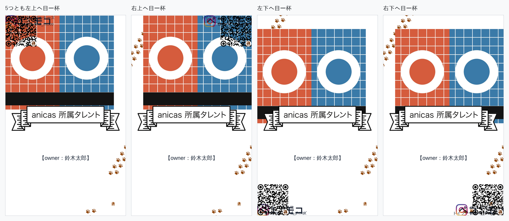

# プレビューの上で直接レイアウトできるようにした検証

名刺プレビューの上でタレントが5つの部分（写真・種類の行・名前の行・Instagram の行・QR）を
指で動かし、つまみで大きさを変えられるようにした改修の検証記録。
「名前の間隔」と「ペットNの拡大率」のバーはこの改修で削除している。

検証は前回までと同じく **本番ビルドした実アプリを headless Chromium で実際に操作し**、
送信ボタンを押して飛んだ POST の `print_base64` を実測している。
見た目を別スクリプトで真似て比べる方法は使っていない。

```
next build → next start
  ├─ :4598  この改修
  └─ :4601  改修が始まった地点（PR #8 / #9 マージ後）を git worktree でビルド
       ↓ Playwright で Step1〜Step5 を実操作（写真アップロード・プレビュー上のドラッグ含む）
       ↓ 「送信する」
GAS の代わりに立てたローカルサーバ (:4599) が POST body をそのまま保存
       ↓
payload.print_base64 を base64 デコード → PDF
  ├─ pikepdf でページの内容ストリームを読み、配置命令そのものを mm で実測
  ├─ pypdfium2 (PDFium) で 350 / 600 / 1200dpi に描画して画素比較
  └─ zxing-cpp で QR を実読み取り
プレビュー側は描画済みの DOM を実測（getBoundingClientRect / Range）
```

3パターンを通した。文言はこれまでの検証記録とそろえてある。

| | ペット | Instagram | オーナー |
|---|---|---|---|
| 1匹 | トイプードル ペコ | @peco_channel / ペコ★トイプードル | 鈴木太郎 |
| 2匹 | ＋ マルチーズ モコ | @peco_and_moco / ペコ＆モコ | 鈴木太郎 |
| 3匹 | ＋ 柴犬 コテツ | @kotetsutokotatsu / コテツとこたつ | 髙﨑真理子 |

写真は毎回同じ画素の合成用ダミー画像を使っているので、改修前後の PDF は
コードの差だけを反映する。

---

## 1. 受入基準5 — 何も触らずに送信したPDFが改修前と同一

改修前のアプリと改修後のアプリに、同じ入力・同じ写真を入れ、
**プレビューには一切触らずに**送信した。飛んだ PDF を描画して1画素ずつ突き合わせた。

| | 350dpi（入稿解像度） | 1200dpi |
|---|---|---|
| 1匹 | 差分 **0 画素** / 841×1337 | 差分 **0 画素** / 2882×4583 |
| 2匹 | 差分 **0 画素** | 差分 **0 画素** |
| 3匹 | 差分 **0 画素** | 差分 **0 画素** |

画素だけでなく、**ページが行う配置命令そのもの**（画像の配置行列・文字の書き出し
座標とフォントサイズ）も pikepdf で読み出して照合した。

| | 命令の数 | 改修前と一致 |
|---|---|---|
| 1匹 | 9 | ✅ |
| 2匹 | 11 | ✅ |
| 3匹 | 13 | ✅ |

プレビュー（画面）も同じ入力で突き合わせた。

| | 確認画面（ステップ5） | 編集画面（ステップ4） |
|---|---|---|
| 1匹 | 差分 **0 画素** / 1080×1797 | 38 画素・最大差 12/255 |
| 2匹 | 差分 **0 画素** | 20 画素・最大差 5/255 |
| 3匹 | 差分 **0 画素** | 20 画素・最大差 5/255 |

ステップ4だけ残る差は、**カードの上に透明な編集レイヤーが1枚増えたこと**による
Chromium のラスタライズ差で、絵柄の1走査線が最大 5〜12/255 だけ濃さを変える
（位置・大きさは 0.000mm 一致）。編集レイヤーを持たない確認画面が完全一致すること、
入稿PDFが完全一致することから、レイアウトそのものは動いていない。

---

## 2. 受入基準6 — 触って変えた結果が入稿PDFに一致する

5つの部分すべてに対して「つまみで大きさを変える → 指で動かす」を行い、送信した。

実際に飛んだ値（2匹の例、`payload.adjust.front`）:

```json
{ "photo": { "scale": 0.920, "dx":  0.020, "dy":  0.015 },
  "breed": { "scale": 1.250, "dx": -0.030, "dy": -0.008 },
  "name":  { "scale": 1.150, "dx":  0.030, "dy":  0.010 },
  "ig":    { "scale": 1.150, "dx":  0.060, "dy": -0.030 },
  "qr":    { "scale": 0.850, "dx": -0.050, "dy": -0.060 } }
```

### 絵柄（写真・Instagram の印・QR）— そのまま突き合わせ

フォントに依存しない部分なので、プレビューの実測値と PDF の実測値を
そのまま mm で比べられる。3匹の場合（いちばん差が大きいもの）:

| 部分 | | プレビュー | 入稿PDF | 差 |
|---|---|---|---|---|
| 写真 | x | 5.829mm | 5.830mm | **0.001mm** |
| | y | 5.741mm | 5.743mm | **0.002mm** |
| | 幅 | 45.540mm | 45.540mm | **0.000mm** |
| | 高さ | 39.599mm | 39.599mm | **0.001mm** |
| Instagram の印 | x | 5.299mm | 5.205mm | **0.094mm** |
| | y | 73.833mm | 73.835mm | **0.002mm** |
| | 幅 | 6.228mm | 6.228mm | **0.000mm** |
| | 高さ | 6.166mm | 6.168mm | **0.002mm** |
| QR | x | 34.642mm | 34.643mm | **0.001mm** |
| | y | 68.718mm | 68.719mm | **0.002mm** |
| | 幅 | 12.387mm | 12.388mm | **0.001mm** |
| | 高さ | 12.387mm | 12.388mm | **0.001mm** |

すべて **0.1mm 以内**。QR の枠は、QR のグリッドに固定されている anicas の印の
配置命令から逆算して求めている（PDF 側は QR をパスで描くため、枠そのものの
命令が存在しないため）。

### 文字 — 大きさは完全一致、位置は「動かした量」で一致

文字の級数は3匹とも全行で **差 0.000mm**（例：種類 2.269mm / 2.269mm、
名前 4.807mm / 4.807mm）。

文字の**絶対位置**は、プレビューと入稿PDFで 0.16〜0.58mm 離れる。これは
**この改修より前から同じだけ離れていた**もので、改修で増えても減ってもいない。
理由は、プレビューは canvas の `actualBoundingBox`（ラスタライズされた字面）で、
入稿PDFは fontkit のグリフ輪郭で字面を測っており、和文の中央合わせがその差の
ぶんだけずれるため。

同じ入力・同じフォント（検証中はブラウザにも入稿PDFと同じ Noto Sans JP を
読ませている）で、改修前と改修後の「プレビュー vs 自分のPDF」を並べた:

| 行（3匹） | 改修前の差 | 改修後の差 |
|---|---|---|
| トイプードル | 0.479mm | 0.479mm |
| マルチーズ | 0.225mm | 0.225mm |
| 柴犬 | 0.262mm | 0.262mm |
| ペコ | 0.172mm | 0.172mm |
| モコ | 0.024mm | 0.024mm |
| コテツ | 0.219mm | 0.219mm |
| 【owner：髙﨑真理子】 | 0.302mm | 0.302mm |
| コテツとこたつ | 0.000mm | 0.000mm |
| @kotetsutokotatsu | 0.000mm | 0.000mm |

受入基準が問うている「**触って変えた結果**」＝触る前と触った後の差そのものを、
それぞれのレンダラの中で測って比べると:

- 文字の級数の変化量: 全行で **差 0.000mm**
- 文字の左端の移動量: 最大 **0.098mm**
- ベースラインの移動量: 最大 0.180mm

ベースラインだけ 0.1mm を超えるのは、**行の高さの中でどこにベースラインを置くか**
が各レンダラの組版だから。Chromium はベースラインを CSS ピクセル単位に丸めるため
（360px 幅のプレビューでは 1px＝0.153mm）、拡大したときの丸め残りがそのまま出る。
これも改修前から同じで、行の**置き場所**（行ボックスの上端・左端・級数）自体は
両者同じ数値から描いている。

---

## 3. 受入基準2 — どれも名刺の枠から出ない

5つの部分を、四隅それぞれに向かって**枠の外まで**（カードの1.5倍の距離）
引っぱった。止まった位置を実測した（0＝カードの左端／上端、1＝右端／下端）。

| 向き | 部分 | 左 | 右 | 上 | 下 |
|---|---|---|---|---|---|
| 左上 | QR | 0.00000 | 0.26497 | 0.00000 | 0.15947 |
| 左上 | Instagram | 0.00000 | 0.39857 | 0.00000 | 0.05867 |
| 左上 | 名前 | 0.00000 | 0.37344 | 0.00000 | 0.05715 |
| 左上 | 種類 | 0.00000 | 0.41141 | 0.00000 | 0.02482 |
| 左上 | 写真 | 0.00000 | 0.90000 | 0.00000 | 0.47098 |
| 右下 | QR | 0.73498 | 0.99996 | 0.84050 | 0.99997 |
| 右下 | Instagram | 0.60139 | 0.99996 | 0.94130 | 0.99997 |
| 右下 | 名前 | 0.62652 | 0.99996 | 0.94282 | 0.99997 |
| 右下 | 種類 | 0.58854 | 0.99996 | 0.97516 | 0.99997 |
| 右下 | 写真 | 0.10000 | 1.00000 | 0.06753 | **0.53850** |

（右上・左下も同じ値で止まる。）どの向き・どの部分でも 0 と 1 の外に出ない。

写真だけは下端が **0.53850** で止まる。リボンの白帯の下端は **0.53855**
（`/meishi-ribbon.png` の実測、px 936/1738）なので、写真の下端は帯の中に
とどまり、帯からはみ出すことがない。



---

## 4. 受入基準3 — 文字とQRが読めない大きさにならない

5つとも「これ以上小さくならない」ところまでつまみを引いた。送信された倍率:

| 部分 | 止まった倍率 | 根拠 |
|---|---|---|
| 写真 | 0.500 | 既定の半分（`PHOTO_FLOOR`） |
| 種類 | 1.000 | すでに設計上の最小級数なので、これ以上小さくできない |
| 名前 | 0.43421 | 0.033 ÷ 0.076＝名前が種類と同じ級数まで下がったところ |
| Instagram | 0.97059 | 0.033 ÷ 0.034＝ハンドルが最小級数に届いたところ |
| QR | 0.79166 | 1モジュールが 0.30mm に届いたところ |

入稿PDFを実測した結果（3パターンとも同じ）:

- 文字の級数は **1.815mm**（＝5.15pt）で止まる。これは設計上いちばん小さい
  「種類」の級数そのもの。オーナー行（動かせない）だけ 2.475mm のまま。
- QR は **14.575mm → 11.538mm**、1モジュール **0.3790mm → 0.3000mm**。

最小まで縮めた QR を、実際に飛んだ入稿PDFから読み取った:

| | 350dpi | 600dpi | 1200dpi |
|---|---|---|---|
| 1匹 | `https://www.instagram.com/peco_channel` | 同左 | 同左 |
| 2匹 | `https://www.instagram.com/peco_and_moco` | 同左 | 同左 |
| 3匹 | `https://www.instagram.com/kotetsutokotatsu` | 同左 | 同左 |

いずれも正しい URL が取れた。


---

## 5. 受入基準4 — 「最初に戻す」で全部が既定に戻る

上の「5つとも動かして大きさも変える」を行ったあと「最初に戻す」を押し、
そのまま送信した。

- 送信された値は3パターンとも
  `{"front":{"photo":{"dx":0,"dy":0,"scale":1}, ... "qr":{"dx":0,"dy":0,"scale":1}}}`
- 飛んだ PDF は**改修前のアプリが出す PDF と差分 0 画素**（350dpi、3パターンとも）

---

## 6. 受入基準1・7 — 操作と画面


何も選んでいない状態が既定。触るとその部分だけに枠が出て、角に大きさのつまみが
4つ出る。出るのはつまみだけで、他の操作は出さない。枠の外を触ると外れる。

ステップ4の要素を数えた:

| | スライダー | 見出し | ボタン |
|---|---|---|---|
| 改修前 | 2本 | 写真の編集 / **ペット1の拡大率** / **名前の間隔** / 名刺プレビュー | 戻る・次へ |
| 改修後 | **0本** | 写真の編集 / 名刺プレビュー | **最初に戻す**・戻る・次へ |

バー2種類とその見出しが消え、増えたのは「最初に戻す」1つとプレビュー上の
つまみ（選んだときだけ出る）だけ。差し引きで要素数は減っている。


---

## 7. プレビューと入稿PDFの見た目


---

## 追加した資産

- `public/meishi-instagram.png` … `/meishi-template.png` が持つ Instagram の印
  （px 69–171 × 1464–1565、103×102）を、描かれていた白から取り出して透明背景に
  したもの。白の上に重ね直すと**元の画素と誤差 0** で戻る（アルファを
  `255 − min(R,G,B)` として色を割り戻しているため、白地では厳密に可逆）。
  行を動かしたときだけ、元の印を白で伏せてこれを置く。

## 検証で使ったもの

`pikepdf` / `pypdfium2`（PDFium＝Chrome の PDF エンジン）/ `zxing-cpp` / `Pillow` /
`playwright`（Chromium）。いずれも本番の依存には入れていない。
