# プレビューの上で直接レイアウトできるようにした検証

名刺プレビューの上でタレントが指で部分を動かし、つまみで大きさを変えられるように
した改修の検証記録。さわれるのは **写真のかたまり／ペットの列（匹数ぶん）／
Instagram の行／QR** の4種類で、ペットの列は1匹につき1つ、種類と名前がセットで
入っている。列は**横に動かすだけ**で、大きさはプレビューの下の「文字の大きさ」で
全部の列いっしょに決める。「名前の間隔」と「ペットNの拡大率」のバーはこの改修で
削除している。

（この記録は前回のぶんも含む。今回変えたのは**写真の窓の下端を実物に合わせたこと**
だけで、それは 6 章の頭に足してある。）

前回変えたのは4つ——**写真をデザインの窓の外に描かないこと**（6章）、
**中央と等間隔で違う印を出すこと**（7章）、**動かせる部分に編集画面のあいだずっと
点線を出すこと**（8章、一度光る演出はやめた）、そして**文字の大きさを枠の外の1つの
指定にまとめ、列のドラッグ拡大縮小をやめたこと**（9章）。

検証は前回までと同じく **本番ビルドした実アプリを headless Chromium で実際に操作し**、
送信ボタンを押して飛んだ POST の `print_base64` を実測している。
見た目を別スクリプトで真似て比べる方法は使っていない。

```
next build → next start
  ├─ :4598  この改修
  ├─ :4601  改修が始まった地点（PR #8 / #9 マージ後）を git worktree でビルド
  └─ :4602  この回の直前（PR #10 の 542761a）を git worktree でビルド
       ↓ Playwright で Step1〜Step5 を実操作（写真アップロード・プレビュー上のドラッグ含む）
       ↓ 「送信する」
GAS の代わりに立てたローカルサーバ (:4599) が POST body をそのまま保存
       ↓
payload.print_base64 を base64 デコード → PDF
  ├─ pikepdf でページの内容ストリームを読み、配置命令そのものを mm で実測
  ├─ pypdfium2 (PDFium) で 350 / 600 / 1200dpi に描画して画素比較
  └─ zxing-cpp で QR を実読み取り
プレビュー側は描画済みの DOM を実測（getBoundingClientRect / Range / ベースライン
プローブ）し、字の実際の位置はスクリーンショットの画素から実測する
```

3パターンを通した。文言はこれまでの検証記録とそろえてある。

| | ペット | Instagram | オーナー |
|---|---|---|---|
| 1匹 | トイプードル ペコ | @peco_channel / ペコ★トイプードル | 鈴木太郎 |
| 2匹 | ＋ マルチーズ モコ | @peco_and_moco / ペコ＆モコ | 鈴木太郎 |
| 3匹 | ＋ 柴犬 コテツ | @kotetsutokotatsu / コテツとこたつ | 髙﨑真理子 |

写真は毎回同じ画素の合成用ダミー画像を使っているので、改修前後の PDF は
コードの差だけを反映する。

---

## 1. ペットごとの列 — 別々に動き、上下は揃ったまま

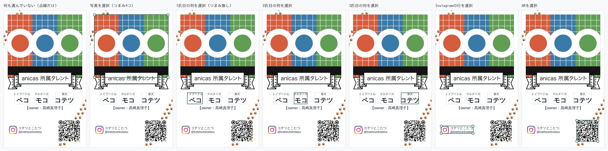

匹数ぶんの列ができ、1つの列にはそのペットの種類と名前がセットで入る。列をさわると
2行が一緒に選ばれ、一緒に動く。

### 3つの列をそれぞれ別々に横へ動かせる

3つの列を順に、左の限界／右の限界まで引っぱった。プレビューの画像から
**実際に描かれた字**の左右を測っている（字送りの箱ではなく字そのもの。和文は
サイドベアリングが広いので、箱どうしは触れていても字は離れている）。

| 3匹 | 1匹目の列 | 2匹目の列 | 3匹目の列 |
|---|---|---|---|
| 触っていない | 7.282 – 17.569 mm | 20.778 – 29.792 mm | 34.630 – 46.394 mm |
| 各列を左の限界まで | **2.037** – 12.375 | 12.324 – 21.287 | 21.236 – 33.356 |
| 各列を右の限界まで | 10.389 – 20.676 | 25.514 – 34.528 | 41.148 – **52.963** |
| 列ごとに別々の大きさへ | 5.806 – 19.046 | 20.829 – 29.741 | 33.815 – 47.259 |

左右の限界は、カードの端ではなく**仕上がり枠の内側 2.0mm**（下の 5. 参照）。
1匹・2匹も同じ規則で動く（1匹：左の限界 2.037 – 12.324 mm、右の限界
42.625 – 52.912 mm）。

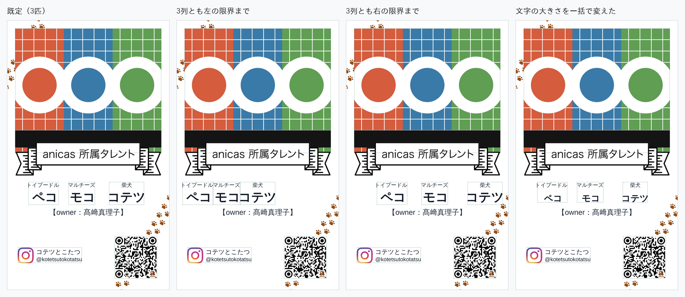

### 名前も種類も上下位置が揃ったまま

各列を動かしたあと、各列の大きさを変えたあとの、**プレビューに描かれた行の
ベースライン**を実測した（0幅の inline-block をその行に差し込み、その上端＝
ベースラインを読んでいる）。

| 3匹 | 種類のベースライン | ばらつき | 名前のベースライン | ばらつき |
|---|---|---|---|---|
| 各列を左の限界まで | 56.5118 / 56.5118 / 56.5118 mm | **0.0000 mm** | 61.3459 / 61.3459 / 61.3459 mm | **0.0000 mm** |
| 各列を右の限界まで | 56.5118 / 56.5118 / 56.5118 mm | **0.0000 mm** | 61.3459 / 61.3459 / 61.3459 mm | **0.0000 mm** |
| 列ごとに別々の大きさへ | 56.5118 / 56.5118 / 56.5118 mm | **0.0000 mm** | 61.3459 / 61.3459 / 61.3459 mm | **0.0000 mm** |

大きさを変えたときの各列の級数は、種類が **2.3597 / 1.5426 / 2.0873 mm**、
名前が **5.4345 / 3.5527 / 4.8072 mm**（それぞれ 1.30 / 0.85 / 1.15 倍）。
級数がばらばらでもベースラインは 1 つも動いていない。触っていない状態の
ベースラインも 56.5118 / 61.3459 mm なので、**列を動かしても大きくしても行は
まったく上下しない**。

仕組みは、行の外側の span を**行の級数**で組んで line box を持たせ、その中の
高さ 0 の span に各ペットの字を入れること。入稿PDFも同じで、ベースラインは行の
級数から、字の大きさは列ごとの級数から決めている（`drawRun`）。

なお、列は `dy` を持てないデータ構造にしてある（`ColumnAdjust = { dx, scale }`）。
検証では列を下方向（+0.02）にも引いているが、値の置き場がないので何も起きない。

### 隣の列と重ならない

上の実測から、各列を左の限界まで詰めたときの隣とのすき間は
**−0.0509 mm / −0.0509 mm**。これはプレビューの1画素（55mm ÷ 1080px ＝
0.0509mm）ぶんで、**字の箱どうしが接した状態**（幾何学的なすき間 0）を画素に
落としたときに境目の1列を両方が塗るために出る。列は重なる手前で止まっている。

---

## 2. 何も触らずに送信したPDFで動いたのは写真の下端だけ

改修前のアプリと改修後のアプリに、同じ入力・同じ写真を入れ、
**プレビューには一切触らずに**送信した。

写真の窓の下端を実物に合わせたので（→ 6章）、写真そのものは意図して変わっている。
**それ以外は1つも動いていない。**

| | ページの配置命令（写真の1命令を除く） | 写真の箱の外の画素（1200dpi） |
|---|---|---|
| 1匹 | 8件 **完全一致** | 箱のふち1画素を除いて **0 / 8,455,052 画素** |
| 2匹 | 10件 **完全一致** | **0 画素** |
| 3匹 | 12件 **完全一致** | **0 画素** |

配置命令は pikepdf でページの内容ストリームを読み、画像の配置行列と文字の書き出し
座標・フォントサイズを mm で突き合わせたもの。リボン・文字・QR・anicas の印は
すべて同じ命令のまま。

**この改修が始まる前（PR #8 / #9 マージ後）との比較**では、写真の窓の下端を実物に
合わせるまでは 350dpi・1200dpi とも差分 0 画素・配置命令も全件一致だった（PR #10 の
各回で確認）。今回それを実物に合わせたので、写真だけが 0.695 mm 上がっている。

編集画面（ステップ4）には動かせる部分の点線が出るので（→ 8章）、そこも意図して
変えている。

---

## 3. 触って変えた結果が入稿PDFに一致する

3つの列をそれぞれ別の量だけ動かし、別の倍率に変え、さらに写真・Instagram・QR も
動かして送信した。飛んだ値（3匹、`payload.adjust.front`）:

```json
{ "photo": { "scale": 0.920, "dx":  0.020, "dy":  0.015 },
  "ig":    { "scale": 1.150, "dx":  0.060, "dy": -0.030 },
  "qr":    { "scale": 0.850, "dx": -0.050, "dy": -0.060 },
  "pets":  [ { "dx": -0.028 }, { "dx": 0.040 }, { "dx": 0.045 } ],
  "text":  1.2 }
```

列は `dx` だけを持ち、大きさは `text` の1つ（→ 9章）。列の値が指を離した位置
ちょうどでないのは、7章の「ぴたっと止まる」が効いているため。

### 絵柄（写真・Instagram の印・QR）— そのまま突き合わせ

フォントに依存しないので、プレビューの実測値と PDF の実測値をそのまま mm で
比べられる。3匹（いちばん差が大きいもの）:

| 部分 | | プレビュー | 入稿PDF | 差 |
|---|---|---|---|---|
| 写真 | x / y | 5.829 / 5.741 mm | 5.830 / 5.743 mm | **0.001 / 0.002 mm** |
| | 幅 / 高さ | 45.540 / 39.599 mm | 45.540 / 39.599 mm | **0.000 / 0.001 mm** |
| Instagram の印 | x / y | 5.299 / 73.833 mm | 5.205 / 73.835 mm | **0.094 / 0.002 mm** |
| | 幅 / 高さ | 6.228 / 6.166 mm | 6.228 / 6.168 mm | **0.000 / 0.002 mm** |
| QR | x / y | 34.642 / 68.718 mm | 34.643 / 68.719 mm | **0.001 / 0.002 mm** |
| | 幅 / 高さ | 12.387 / 12.387 mm | 12.388 / 12.388 mm | **0.001 / 0.001 mm** |

すべて **0.1mm 以内**。QR の枠は、QR のグリッドに固定されている anicas の印の
配置命令から逆算して求めている（PDF 側は QR をパスで描くため、枠そのものの
命令が存在しないため）。

### 文字 — 級数は完全一致、位置は「動かした量」で一致

列ごとの級数は3匹とも全行で **差 0.000mm**:

| 3匹（文字の大きさ 1.2 倍） | 1匹目 | 2匹目 | 3匹目 |
|---|---|---|---|
| 種類（プレビュー / PDF） | 2.178 / 2.178 | 2.178 / 2.178 | 2.178 / 2.178 mm |
| 名前（プレビュー / PDF） | 5.016 / 5.016 | 5.016 / 5.016 | 5.016 / 5.016 mm |

3列とも同じ級数になっているのが、9章の「1つの指定で全部の列が揃う」。

文字の**絶対位置**は、プレビューと入稿PDFで 0.14〜0.51mm 離れる。これは
**この改修より前から同じだけ離れていた**もので（canvas の字面測定と fontkit の
グリフ輪郭の差）、PR #10 の検証記録に改修前後を並べた表がある。

受入基準が問うている「**触って変えた結果**」＝触る前と触った後の差そのものを、
それぞれのレンダラの中で測って比べると、文字の級数の変化量は全行 **差 0.000mm**、
左端の移動量は最大 **0.096mm**。ベースラインの移動量だけ最大 0.180mm 出るが、
これは行の高さの中でどこにベースラインを置くかが各レンダラの組版だからで、
Chromium がベースラインを CSS ピクセルに丸めるぶん（360px 幅のプレビューで
1px＝0.153mm）が残っている。

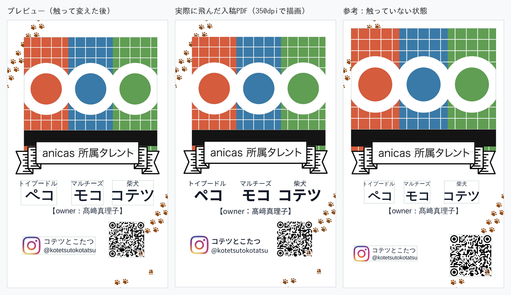

---

## 4. 文字の下限 — 名前 3.0mm・種類 1.8mm

下限は**行の種類ごとに別**にしてある。列を縮めていくと種類が先に 1.8mm で止まり、
名前だけがそこから 3.0mm まで縮み続ける。

すべての部分を「これ以上小さくならない」ところまでつまみで引き、送信した。
プレビューの実測と、飛んだ入稿PDFの級数（3匹の例、1匹・2匹も同値）:

| 行 | 止まった級数 | 入稿PDFに同じ級数 | 根拠 |
|---|---|---|---|
| 種類（3匹とも） | **1.8000 mm** | あり | `MIN_TYPE_SIZE.breed` |
| 名前（3匹とも） | **3.0000 mm** | あり | `MIN_TYPE_SIZE.name` |
| Instagram 名 | 1.6765 mm | あり | ハンドルが `MIN_TYPE_SIZE.other` に届いたところ（0.8021 倍） |
| Instagram ハンドル | **1.5000 mm** | あり | 同上 |
| オーナー行 | 2.4750 mm（動かせない） | あり | — |
| QR | **14.575 → 11.538 mm**（1モジュール 0.3790 → **0.3000 mm**） | — | `MIN_QR_MODULE_MM` |
| 写真 | 既定の 0.5 倍 | — | `PHOTO_FLOOR` |

種類の設計級数は 1.815mm、下限は 1.8mm なので、列の倍率でいうと種類は 0.9917 倍で
止まり、名前は 3.0/4.18＝**0.7177 倍**まで下がる。**種類が止まったあとも名前が
縮み続ける**のは、列の倍率を行ごとに `heldSize` で受け止めているため。

すでに詰め込みで下限を割っている行は、下限まで**押し上げない**（縮められないだけ）。

最小まで縮めた QR を、実際に飛んだ入稿PDFから読み取った:

| | 350dpi | 600dpi | 1200dpi |
|---|---|---|---|
| 1匹 | `https://www.instagram.com/peco_channel` | 同左 | 同左 |
| 2匹 | `https://www.instagram.com/peco_and_moco` | 同左 | 同左 |
| 3匹 | `https://www.instagram.com/kotetsutokotatsu` | 同左 | 同左 |

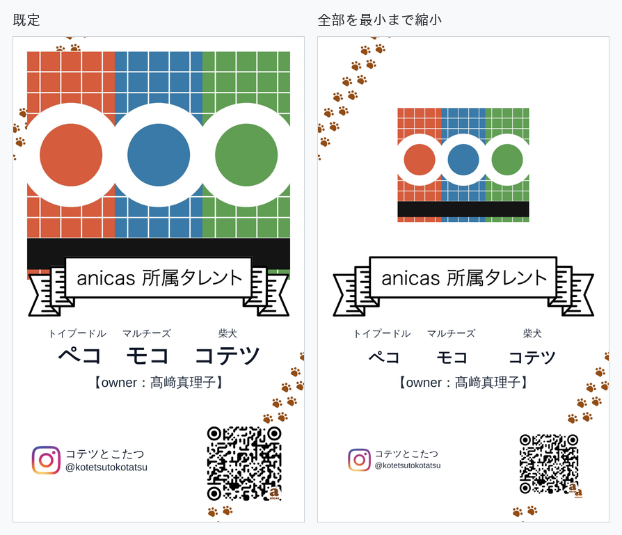

---

## 5. 左右2.0mmの余白 — 断裁がぶれても文字が切れない

文字（ペットの列・Instagram の行）と QR は、仕上がり枠の左右それぞれ内側 2.0mm
（`SAFE_MARGIN`）に入らない。写真だけは例外で、これまでどおり端まで届く。

全部を左／右へ目一杯引いて送信し、**飛んだ入稿PDFを 1200dpi で描画して字の
インクを実測**した（字送りの箱ではなく字そのもの。QR は枠そのものを、ページの
内容ストリームから逆算して実測）。

| 3匹・右へ目一杯 | 字／枠の右端 | 仕上がり線まで |
|---|---|---|
| 1匹目の列 | 20.937 mm | 34.063 mm |
| 2匹目の列 | 34.550 mm | 20.450 mm |
| 3匹目の列 | 52.608 mm | **2.392 mm** |
| Instagram 名 | 52.735 mm | **2.265 mm** |
| Instagram ハンドル | 52.989 mm | **2.011 mm** |
| QR（枠） | 53.000 mm | **2.000 mm** |

| 3匹・左へ目一杯 | 字／枠の左端 | 仕上がり線まで |
|---|---|---|
| 1匹目の列 | 2.435 mm | **2.435 mm** |
| 2匹目の列 | 11.982 mm | 11.982 mm |
| 3匹目の列 | 20.683 mm | 20.683 mm |
| Instagram の印 | 2.000 mm | **2.000 mm** |
| QR（枠） | 2.000 mm | **2.000 mm** |

1匹・2匹も同じで、いちばん端まで行った部分の仕上がり線までの距離は
**2.000〜2.435 mm**（1匹右：列 2.117 / QR 2.000、2匹右：列 2.244 / ハンドル 2.011 /
QR 2.000）。**2.0mm を下回るものはない。**

プレビュー側でも、止まった枠の位置を DOM から実測すると左右とも
**1.998〜2.003 mm**（0.002mm のずれは 360px 幅のプレビューで CSS が百分率を
1/64 ピクセルに丸めるぶん。入稿PDFでは 2.000mm ちょうど）。

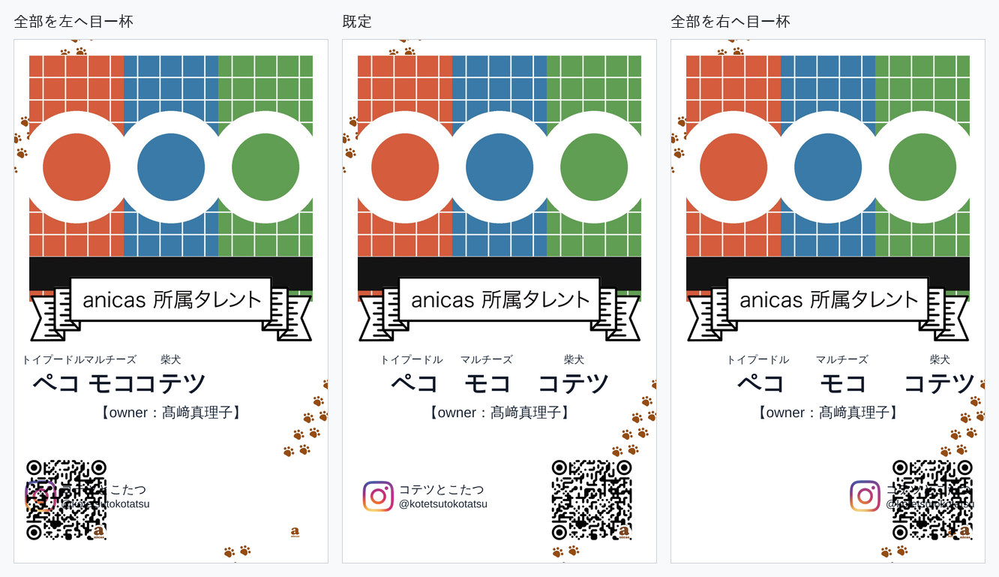

---

## 6. 写真がリボンの外に出ない

### 今回：写真の窓の下端を実物に合わせた

窓の中にだけ描くようにしても、**窓の下端そのものがデザインより 0.7mm 低い**ままだと、
写真の下端がひらひらの始まるところより下で終わってしまい、四角い角が残る。

実物の名刺 `public/sample-meishi.png` は同じデザインを約 1.023 倍にしたもので、数画素
切り落とされている。**両方に入っている唯一のかたい図形＝リボンの輪郭**で重ね合わせた:

| | テンプレート | 実物 |
|---|---|---|
| リボンの輪郭 | x 56…991 ／ y 785…1001 | x 54…1010 ／ y 800…1021 |
| → 倍率・ずらし | x 1.022460 / y 1.023148 ／ x −3.258 / y −3.171 px | |
| 確かめ（合わせに使っていない Instagram の印） | 予想 x 67.3 / y 1494.7 | 実物 x 66 / y 1494（ずれ **1.3 / 0.7 px**） |

この重ね方で、実物の写真の下端は**実物の行 872.5 ＝ カード箱の .49244**
（ひらひらの外に見えている細い部分で読んだ。32 列すべて同じ行）。
`LAYOUT.photo.height` を **.471 → .4634**（下端 .500 → **.4924**）にした。

| 入稿PDFの写真（ページの配置命令から実測） | 上端 | 下端 | 左右 |
|---|---|---|---|
| 改修前（1匹・2匹・3匹とも） | 2.457 mm | 45.500 mm | 2.750〜52.250 mm |
| **改修後（1匹・2匹・3匹とも）** | 2.457 mm | **44.805 mm** | 2.750〜52.250 mm |
| 実物 | — | **44.809 mm** | — |

**実物との差 0.004 mm。** 上端と左右は動かしていない。

ひらひらが始まる行（テンプレの 850 行）より下に残る写真は、入稿PDFを 1200dpi で
描画して数えると:

| | 左下 | 右下 |
|---|---|---|
| 改修前 | 0.36〜0.57 mm × **1.016 mm** | 0.51〜0.53 mm × **1.016 mm** |
| **改修後** | 0.06〜0.28 mm × **0.318 mm** | 0.19〜0.21 mm × **0.318 mm** |

高さで **1.016 mm → 0.318 mm**、面積でおよそ 1/8 になった。

**リボン・文字・QR は動いていない**（受入基準4）:

| | ページの配置命令（写真の1命令を除く） | 写真の箱の外の画素（1200dpi） |
|---|---|---|
| 1匹 | 8件 **完全一致** | 箱のふち1画素を除いて **0 画素** |
| 2匹 | 10件 **完全一致** | **0 画素** |
| 3匹 | 12件 **完全一致** | **0 画素** |

写真を最大まで大きくし最も下まで動かしても、描かれる範囲は窓のまま
（**2.750〜52.250 mm ／ 2.637〜44.804 mm**、窓からのはみ出し **+0.0019 mm**。
入稿PDFの画素では、窓の外へ出る深さ **0.021 mm**＝1200dpi の走査線1本）。

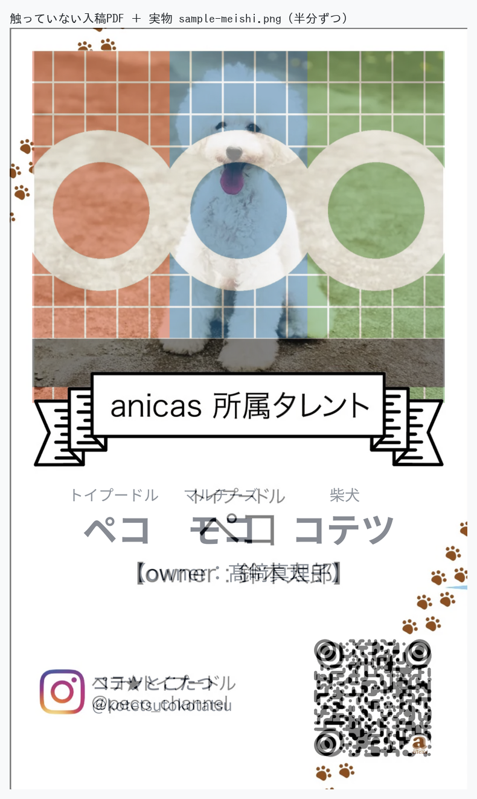

角のところ（左下 / 右下）を拡大したもの:

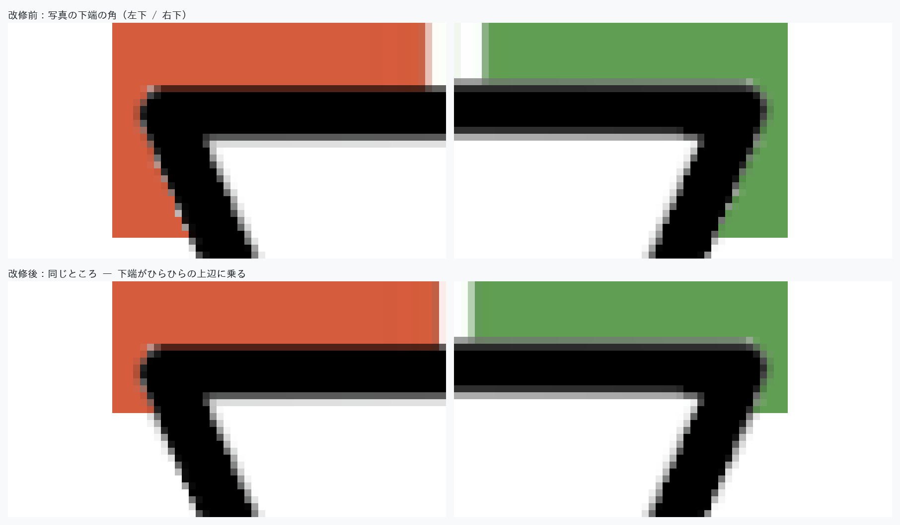

同じところを入稿PDFで、実物と並べたもの:

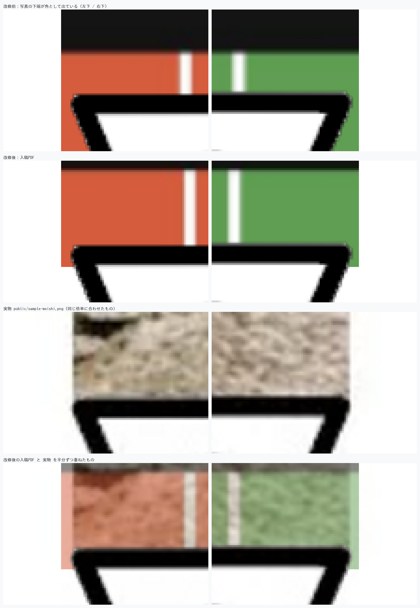

**残っているぶん。** 改修後も 0.2〜0.3 mm × 0.32 mm の細い色が残る。写真の左端
（2.750 mm）より内側 3.05 mm からしかリボンが始まらないため、その差のぶんは
どうしても出る。実物も同じ形で、写真の左端は 2.75〜2.89 mm あたりにあり、同じ細い
線が出ている（上の「実物」の画像）。消すには写真の左右も実物に合わせて 0.1mm ほど
内側へ動かすことになるが、今回は左右を変えない指示なので触っていない。

---

### 前回：リボンはもう不透明だった

「リボンの白い塗りまで抜けていて、ひらひらは線だけで中が透けている」——**そうは
なっていなかった。** `/meishi-ribbon.png` をそのまま読むと:

| | 画素数 |
|---|---|
| 透明（alpha 0） | 1,676,168 |
| **半透明（alpha 1〜254）** | **0** |
| 不透明（alpha 255） | 141,780 |

半透明の画素が**1つも無い**ので、「中が透ける」場所は原理的に存在しない。
ひらひらの内側を直接読んでも、白い帯の内側と同じ**不透明な白**だった。

| 読んだ場所 | rgba |
|---|---|
| 左のひらひらの内側 (90, 900) | (255, 255, 255, **255**) |
| 右のひらひらの内側 (955, 900) | (255, 255, 255, **255**) |
| 左のひらひらの下の方 (110, 960) | (255, 255, 255, **255**) |
| 右のひらひらの下の方 (935, 960) | (255, 255, 255, **255**) |
| 白い帯の内側 (520, 860) | (255, 255, 255, **255**) |

つまり作り直しても1画素も変わらない。透けているのではなかった。

### 本当の原因：リボンは写真の幅を覆っていない

問題は**覆っている幅**だった。リボンが不透明な範囲を行ごとに実測すると:

| リボンの行 | 不透明な範囲 | 写真の窓（2.750〜52.250mm）を覆う？ |
|---|---|---|
| 786 | 9.780〜45.167 mm | 覆わない（左 +7.030 / 右 −7.083 mm） |
| 820 | 7.046〜48.059 mm | 覆わない（左 +4.296 / 右 −4.191 mm） |
| **850（いちばん広い）** | **2.945〜52.108 mm** | 覆わない（左 **+0.195** / 右 **−0.142** mm） |
| 869 | 3.313〜51.740 mm | 覆わない（左 +0.563 / 右 −0.510 mm） |
| 920 | 4.469〜50.583 mm | 覆わない（左 +1.719 / 右 −1.667 mm） |

**いちばん広い行でも写真の窓を覆いきらない。** だから窓より外へ広げた写真は、
リボンのひらひらの「外」に顔を出す。前回の「下端で横に切る」直しは下へのはみ出しは
止めたが、横に広がったぶんはそのまま残っていた——実機で見えていたのはこれ。

### 直しかた：デザインが切った窓の外には描かない

写真は**`LAYOUT.photo` の長方形の外には描かない**ことにした。動かす・大きさを
変えるは、窓の中で絵を寄せる・拡大することになる。触っていない既定では絵と窓が
ぴったり同じ長方形なので、切り取り自体が出ず、1画素も変わらない（→ 2章）。

### 実測

写真をつまみで最大まで大きくし、指で最も下まで動かした状態:

| | わく（＝絵の全体） | **実際に描かれる範囲** |
|---|---|---|
| 1匹・2匹・3匹とも | 0.000〜55.000 mm ／ 1.383〜49.006 mm | **2.750〜52.250 mm ／ 2.638〜45.498 mm** |
| デザインの窓 | — | 2.750〜52.250 mm ／ 2.639〜45.500 mm |

窓からのはみ出しは **+0.0013 mm**（360px 幅のプレビューで CSS が百分率を丸めるぶん）。
これはプレビューの要素そのものから読んだ値で、絵は窓の外へ出ていない。

入稿PDFでも同じことを画素で測った。触っていないカードと、写真を最大・最下まで
動かしたカードを 1200dpi で描画し、**窓の外**だけを突き合わせた（2枚の違いは写真
だけなので、窓の外の差はそのまま「窓から出た写真」になる）。

| | 改修前（PR #10 現在） | 改修後 |
|---|---|---|
| 1匹 | 窓の外に **637,813 画素**（いちばん外まで 2.773 mm） | 2,608 画素（**0.021 mm**） |
| 2匹 | **649,055 画素**（2.773 mm） | 5,979 画素（**0.021 mm**） |
| 3匹 | **466,441 画素**（2.773 mm） | 4,634 画素（**0.021 mm**） |

改修後に残る 0.021mm は 1200dpi の**走査線1本**——切り取りの境目そのもの。

プレビューの画素でも、写真の帯の左右は
**改修前 0.000〜55.000 mm → 改修後 2.801〜52.250 mm**（既定は 2.750〜52.250 mm）。

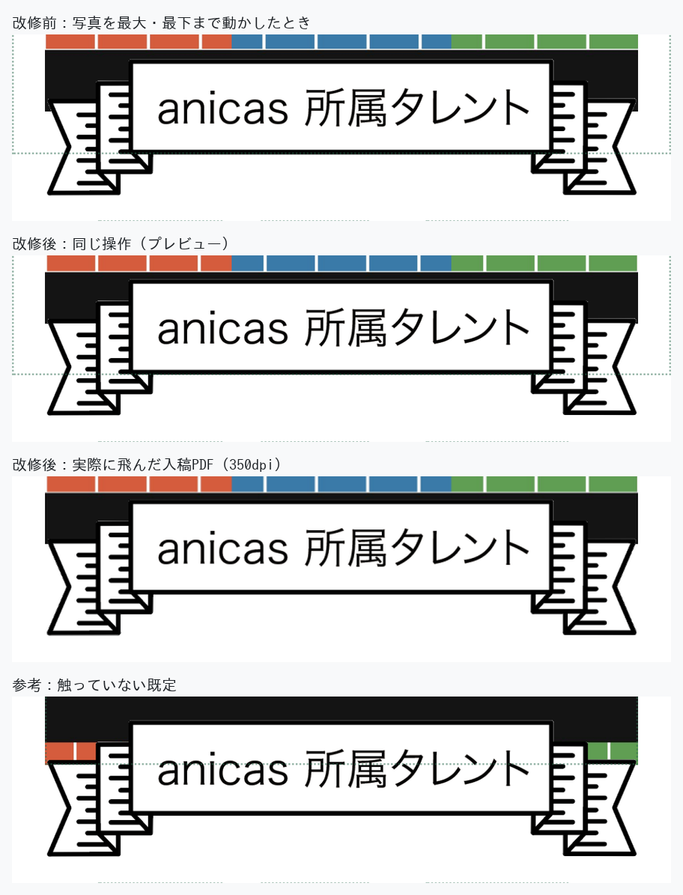

ひらひらのところを拡大したもの（左のひらひら／右のひらひら）:

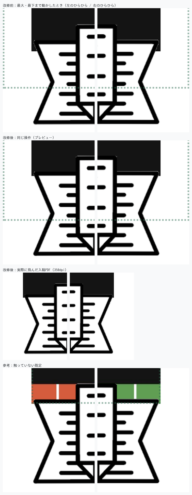

---

## 7. 中央は縦線、間隔が等しくなったときは横線

止まる位置は `lib/card-adjust.ts` の **`SNAP_TABLE` という1つの表**。**出る印も表の行が
自分で決める**ので、「中央に止まった」と「すき間が等しくなった」が見て区別できる。

| 表の行 | 止まる位置 | 出る印 |
|---|---|---|
| カードの中央 | 27.500 mm | カードを縦に貫く細い線1本 |
| 隣とのすき間が等しくなるところ | 左右にあるもの（隣の列、なければ余白）の真ん中 | すき間ごとに**同じ長さの横線** |

指で引いて、止まった位置と印を DOM から実測した。

| 操作 | 止まった中央 | 出た印 |
|---|---|---|
| 1匹：中央の 2.2mm 手前まで | 25.298 mm（止まらない） | **印なし** |
| 1匹：中央の 0.55mm 手前まで | **27.499 mm** | 縦線 27.500 mm |
| 　　同上・指を離した後 | 27.499 mm | **印なし** |
| 2匹：QR を中央の 0.44mm 手前まで | **27.499 mm** | 縦線 27.500 mm |
| 2匹：1匹目を等間隔の近くまで | **15.718 mm** | **横線** 1.998〜10.513（長さ **8.5150**）／ 20.923〜29.438（長さ **8.5150**）mm |
| 3匹：2匹目を中央の 0.5mm 手前まで | **27.499 mm** | 縦線 27.500 mm |
| 3匹：2匹目を等間隔の近くまで | **29.370 mm** | **横線** 17.632〜24.812（長さ **7.1806**）／ 33.931〜41.112（長さ **7.1806**）mm |

3匹で等間隔に止めたあとの、列と列の実際のすき間は
**左 7.1829 mm ／ 右 7.1829 mm（差 0.0000 mm）**。

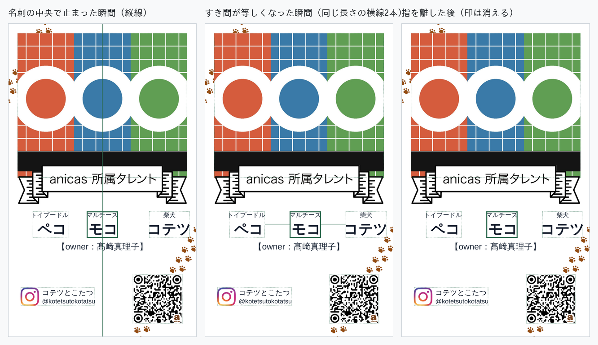

---

## 8. 動かせる部分に、編集画面のあいだずっと点線

一度光るだけでは気づけないので、**動かせる部分には薄い点線の枠を出しっぱなしに**した。
確認画面（ステップ5）には出さない——そこで完成形を見るため。説明文は足していない。

| | 編集画面（ステップ4） | 確認画面（ステップ5） |
|---|---|---|
| 1匹 | 点線の枠 **4** 個（写真・列1・Instagram・QR） | **0 個** |
| 2匹 | **5** 個 | **0 個** |
| 3匹 | **6** 個 | **0 個** |

確認画面のプレビューは改修前と**差分0画素**（→ 2章）なので、点線は確認画面の
見た目に一切かかっていない。

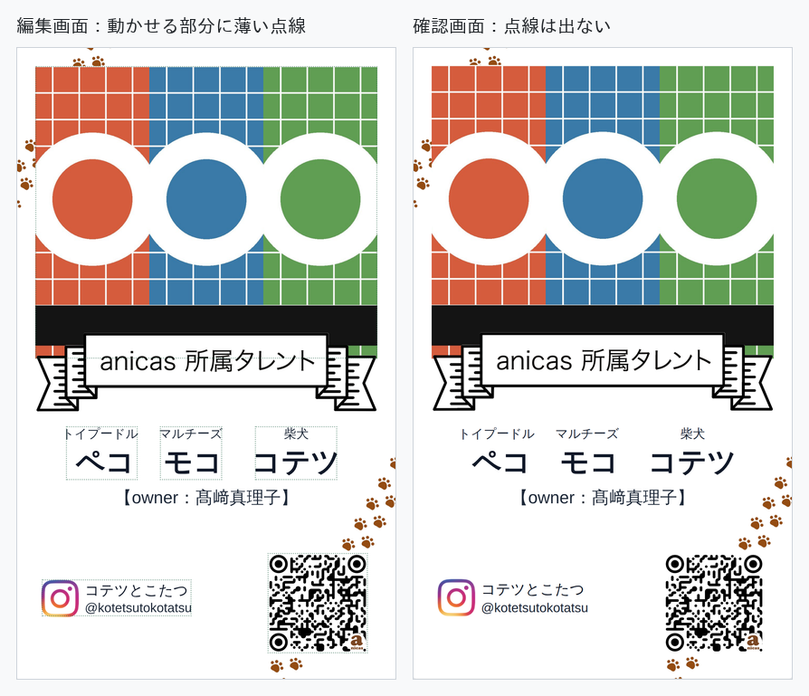

選ぶと点線が実線になり、**大きさを変えられる部分だけ**につまみが4つ出る。
ペットの列にはつまみが出ない（大きさは枠の外で決めるため）。


---

## 9. 文字の大きさ — 1つの指定で全部の列が揃う

列の角を引いて大きさを変える形だと3匹の名前を同じ大きさに揃えるのが難しいので、
**プレビューの下の「文字の大きさ」1つ**にまとめた。指定した大きさに収まらない列
だけが、その列の中で自動的に小さくなる。

| 指定 | 種類（3匹） | 名前（3匹） | |
|---|---|---|---|
| **1.25 倍** | 2.2869 / 2.2869 / 2.2869 mm | 5.2668 / 5.2668 / 5.2668 mm | **すべて同じ** |
| **1.40 倍** | 2.541 / **2.4872** / 2.541 mm | 5.852 / **5.7281** / 5.852 mm | 真ん中の列だけ収まらず小さくなる |
| **0.70 倍** | 1.8 / 1.8 / 1.8 mm | 3.0 / 3.0 / 3.0 mm | **すべて下限で止まる** |

1匹・2匹はどの指定でも全列同じ（1.25倍で 2.2869 / 5.2668 mm、0.70倍で 1.8 / 3.0 mm）。
下限は4章のまま——名前 3.0mm、種類 1.8mm。

**列をドラッグしても大きさは変わらない。** 以前つまみがあった枠の角を外へ引くと:

| | 引く前 | 引いた後 | |
|---|---|---|---|
| 1匹 | 幅 10.4056 mm | 幅 10.4056 mm | 幅の変化 **0.0000 mm** ／ 位置 +4.400 mm |
| 2匹 | 幅 10.4056 mm | 幅 10.4056 mm | 幅の変化 **0.0000 mm** ／ 位置 +3.103 mm |
| 3匹 | 幅 10.4056 mm | 幅 10.4056 mm | 幅の変化 **0.0000 mm** ／ 位置 +3.103 mm |

名前の級数も引く前後で 4.18 mm のまま変わらない。

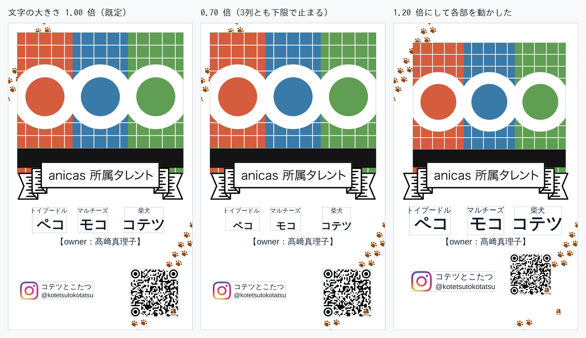

---

## 10. 崩れない仕組み（現状維持ぶん）

### 列どうしの間隔 — 変更なし

列は接するところまで寄せられる。3匹を左へ詰めたときの隣とのすき間は
プレビューの1画素ぶん（−0.0509mm）で、字の箱どうしが接した状態を画素に落とした
境目にあたる。

### 「最初に戻す」で全部が既定に戻る

すべてを動かしたあと「最初に戻す」を押して送信した。

- 送信された値は3パターンとも
  `{"front":{"photo":{"dx":0,"dy":0,"scale":1}, "ig":{…}, "qr":{…}, "pets":[]}}`
- 飛んだ PDF は**改修前のアプリが出す PDF と差分 0 画素**（350dpi、3パターンとも）

---

## 11. 画面の要素

ステップ4の要素を実測した（:4602 が PR #10 の現在、:4598 がこの改修）。

| | スライダー | 見出し | ボタン |
|---|---|---|---|
| 改修前（PR #8 / #9 時点） | 2本 | 写真の編集 / **ペット1の拡大率** / **名前の間隔** / 名刺プレビュー | 戻る・次へ |
| この回の直前（PR #10） | 0本 | 写真の編集 / 名刺プレビュー | 最初に戻す・戻る・次へ |
| 現在 | **1本** | 写真の編集 / 名刺プレビュー / **文字の大きさ** | 最初に戻す・戻る・次へ |

増えたのは「文字の大きさ」1つだけ。代わりに**列のドラッグ拡大縮小**（列ごとに
大きさがばらつく状態）と**一度だけ光る演出**がなくなっているので、操作の種類は減る。

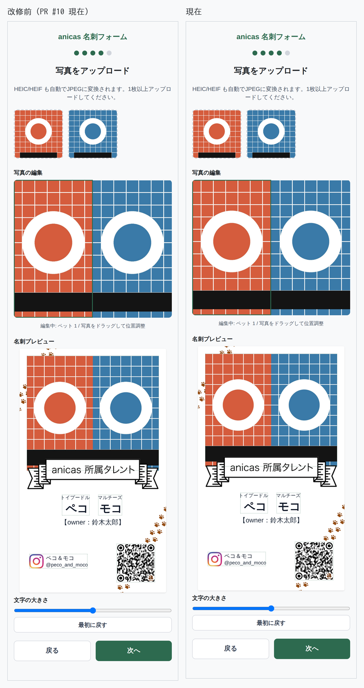

---

## 追加した資産

- `public/meishi-instagram.png` … `/meishi-template.png` が持つ Instagram の印
  （px 69–171 × 1464–1565、103×102）を、描かれていた白から取り出して透明背景に
  したもの。白の上に重ね直すと**元の画素と誤差 0** で戻る（アルファを
  `255 − min(R,G,B)` として色を割り戻しているため、白地では厳密に可逆）。
  行を動かしたときだけ、元の印を白で伏せてこれを置く。

## 検証で使ったもの

`pikepdf` / `pypdfium2`（PDFium＝Chrome の PDF エンジン）/ `zxing-cpp` / `Pillow` /
`playwright`（Chromium）。いずれも本番の依存には入れていない。
