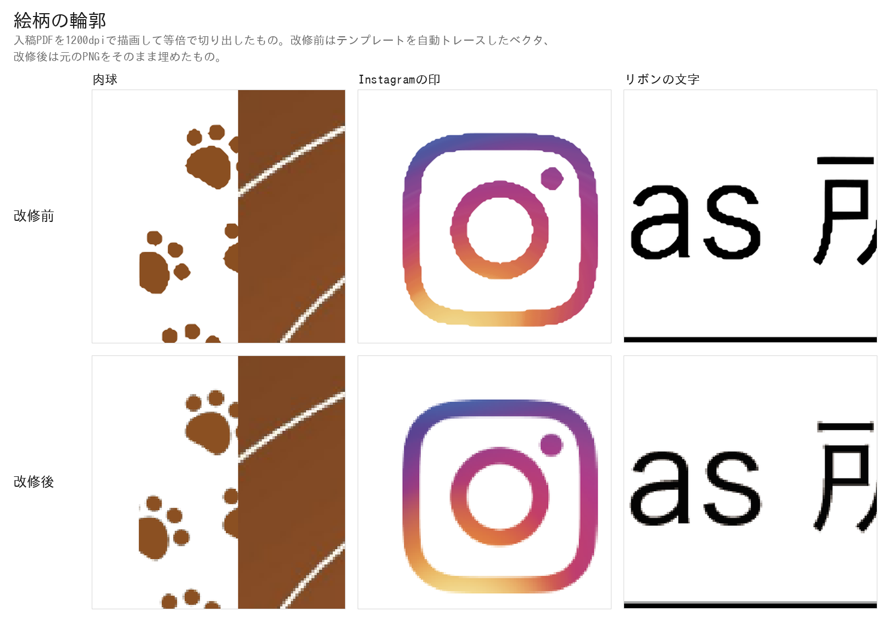
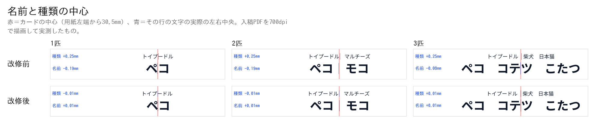
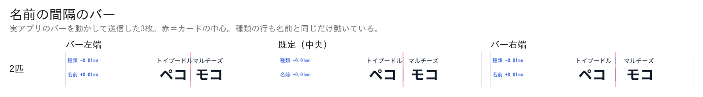
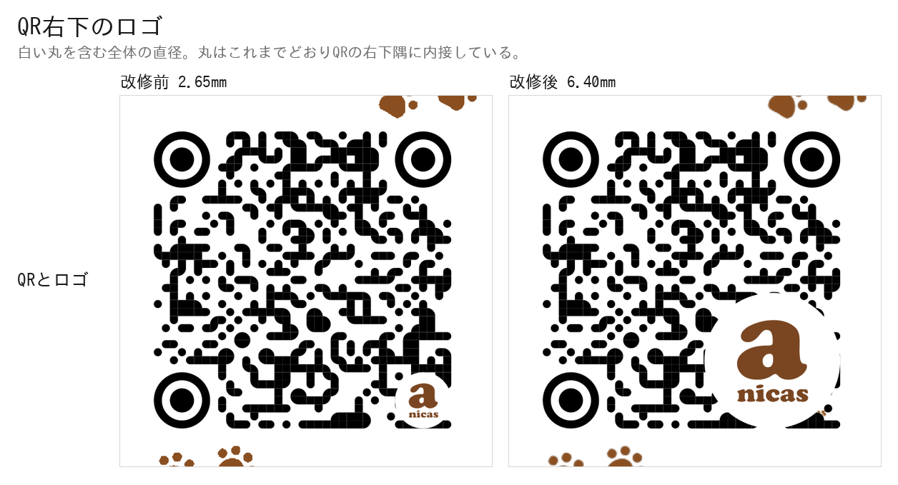
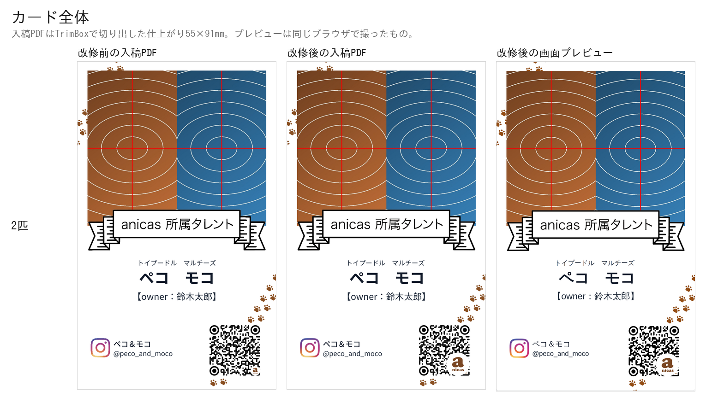

# 入稿PDFの印刷品質を直した検証

前回（PR #8）でテンプレートとリボンを自動トレースしてベクタにしたところ、
**トレースが元画像の画素の階段をそのまま輪郭にしてしまい**、肉球・Instagramの印・
リボンの「anicas 所属タレント」の文字がガタついていた。ここではそれをやめて元の
PNG をそのまま埋め、あわせて名前と種類の中心・名前の間隔・QR右下のロゴを直した。

検証はすべて **本番ビルドした実アプリを headless Chromium で実際に操作し**、
送信ボタンを押して飛んだ POST の `print_base64` を実測している。
見た目を別スクリプトで真似て比べる方法は使っていない。

```
next build → next start (:4598)
  ↓ Playwright で Step1〜Step5 を実操作（写真アップロード・バー操作を含む）→「送信する」
GAS の代わりに立てたローカルサーバ (:4599) が POST body をそのまま保存
  ↓
payload.print_base64 を base64 デコード → pdfimages / pdffonts / pdftotext /
PyMuPDF で描画して実測 / zxing-cpp でデコード
```

通したパターン:

| | ペット | Instagram | オーナー | バー |
|---|---|---|---|---|
| 1匹 | トイプードル ペコ | @peco_channel | 鈴木太郎 | （出ない） |
| 2匹 | ＋ マルチーズ モコ | @peco_and_moco | 鈴木太郎 | 中央 |
| 3匹 | ＋ 柴犬 コテツ / 日本猫 こたつ | @kotetsutokotatsu | 髙﨑真理子 | 中央 |
| 2匹（左端） | 同上 | 同上 | 同上 | −1 |
| 2匹（右端） | 同上 | 同上 | 同上 | +1 |
| 3匹（+0.5） | 同上 | 同上 | 同上 | +0.5 |
| ハンドル長 | 柴犬 コテツ | 14〜36文字の5種類 | 山田花子 | （出ない） |

3匹のオーナー名を **髙﨑** にしてあるのは、JIS 第2水準・IBM拡張の姓字が
埋め込みフォントで欠けないことを引き続き確かめるため。

---

## 1. 受入基準1 — 絵柄の階段状のガタつきがない

テンプレートとリボンを**トレースするのをやめ、元のPNGをそのまま埋める**ようにした。
`public/meishi-template.png` は 1046 × 1738 px。仕上がり55mm幅に置くので
**1046 ÷ (55 ÷ 25.4) ≈ 483 dpi**、必要な350dpiを上回る。



入稿PDFを1200dpiで描画して等倍で切り出したもの。改修前は輪郭が画素の階段を
なぞっている（肉球のふちが多角形、Instagramの印の角が階段、リボンの文字の
ストロークがギザギザ）。改修後は元画像のアンチエイリアスがそのまま出ている。

```
$ pdfimages -list two.pdf      # 改修後
page   num  type   width height color comp bpc  enc interp  object ID x-ppi y-ppi size ratio
   1     0 image    1046  1738  rgb     3   8  image  no         6  0   483   483 58.8K 1.1%
   1     1 image     682   593  rgb     3   8  image  no        12  0   350   350  328K  28%
   1     2 image    1046  1738  rgb     3   8  image  no         7  0   483   483 20.0K 0.4%
   1     3 smask    1046  1738  gray    1   8  image  no         7  0   483   483 3306B 0.2%
   1     4 image     500   500  rgb     3   8  image  no         8  0  3010  3010 5996B 0.8%
   1     5 smask     500   500  gray    1   8  image  no         8  0  3010  3010 6984B 2.8%
```

- 0 = テンプレート、2+3 = リボン（+ アルファ）。どちらも **1046×1738 のまま・483 dpi**。
- 1 = ペット写真、**350 dpi ちょうど**（従来どおり）。
- 4+5 = anicas マーク。500×500 の原本のまま（実効 3010 dpi）。
- QR とタレントの入力文字は 1 件も出てこない ＝ 画像化されていない。

文字が実テキストであることも変わっていない:

```
$ pdffonts two.pdf
name                                 type              encoding         emb sub uni object ID
NotoSansJP-Regular-8268              CID TrueType      Identity-H       yes no  yes      9  0
NotoSansJP-Bold-2114                 CID TrueType      Identity-H       yes no  yes     11  0
NotoSansJP-Medium-1733               CID TrueType      Identity-H       yes no  yes     10  0

$ pdftotext -layout three.pdf -
     トイプードル 柴犬 日本猫

ペコ コテツ              こたつ
    【owner：髙﨑真理子】

コテツとこたつ
@kotetsutokotatsu
```

PDF は 605 KB → 452 KB（2匹）。トレースしたベクタより元のPNGのほうが小さい。

---

## 2. 受入基準2 — 名前と種類の中心が一致（ずれ0.1mm以内）

### 原因

どちらの行も**送り幅（advance width）の中央**をカードの中心に合わせていた。
ところが和文の字は全角の枠のなかに描かれていて、字面の左右に残る余白
（サイドベアリング）は字ごとにまるで違う。

```
NotoSansJP-700 / unitsPerEm 1000
  ト  左の余白 304/1000   ル  右の余白  31/1000
  ペ  左の余白  35/1000   コ  右の余白 127/1000
```

「トイプードル」は左に 0.304em の空白をぶら下げ、「ペコ」は 0.035em しか
ぶら下げない。枠の中央を揃えると、**見えている字の中央は行ごとに別の位置**に来る。

### 直しかた

中央寄せの行は、**行頭・行末の字が持つ余白を先に差し引いてから**中央に置く
（`lib/print.ts` の `offsetToCentre`、プレビューは `MeishiPreview` の
`useInkShift` が canvas の `measureText` で同じ量を測る）。入力文字列そのものの
前後の空白は、これまでどおり `cardText` が落としている。

### 実測

入稿PDFを1200dpiで描画し、暗い・無彩色の画素（＝文字。肉球は茶色なので入らない）
の左端と右端から、行ごとの実際の左右中央を出したもの。カードの中心は用紙左端から
**30.500 mm**。

| | 種類の行 | 名前の行 | 2行の差 |
|---|---|---|---|
| 1匹 改修前 | +0.245 mm | −0.200 mm | **0.445 mm** |
| 1匹 改修後 | −0.009 mm | +0.001 mm | **0.011 mm** |
| 2匹 改修前 | +0.255 mm | −0.200 mm | **0.455 mm** |
| 2匹 改修後 | +0.001 mm | −0.009 mm | **0.011 mm** |
| 3匹 改修前 | +0.255 mm | −0.073 mm | **0.328 mm** |
| 3匹 改修後 | +0.001 mm | +0.001 mm | **0.000 mm** |

残る 0.011 mm は 1200dpi の画素 1 個（0.021 mm）より小さい ＝ 測定の粒度。



画面プレビューも同じスクリーンショットから同じ方法で測った（プレビュー要素の
横幅がカードの55mm、その中央がカードの中心）:

| | 種類の行 | 名前の行 | 2行の差 |
|---|---|---|---|
| 1匹 改修前 | +0.306 mm | −0.439 mm | **0.745 mm** |
| 1匹 改修後 | ±0.000 mm | +0.019 mm | **0.019 mm** |
| 2匹 改修前 | +0.306 mm | −0.420 mm | **0.726 mm** |
| 2匹 改修後 | −0.019 mm | ±0.000 mm | **0.019 mm** |
| 3匹 改修前 | +0.287 mm | −0.191 mm | **0.477 mm** |
| 3匹 改修後 | ±0.000 mm | ±0.000 mm | **0.000 mm** |

0.019 mm は撮影した画面の 1 画素（55mm ÷ 1440px = 0.038mm）の半分 ＝ 測定の粒度。

---

## 3. 受入基準3・4 — 名前の間隔のバー

2匹以上のときだけ、写真の拡大率のバーと同じかたまりの中に「名前の間隔」の
バーが出る。**新しい見出しもセクションも作っていない**（増えた要素はバー1つだけ）。

- 実装は「ペットどうしの間」を全角スペース1文字から**測ったすき間**に置き換えたもの
  （`petGap`）。既定は 1em ＝ 全角スペースと同じ幅なので、バーが中央のときの
  仕上がりは従来と 1 画素も変わらない。
- バーは **名前の行にも種類の行にも同じ物理量**を足し引きする。だから
  ペットの名前とその種類は必ず同じだけ動く。
- 可動域は種類の行の 1em（＝ 55mm カードで ±1.815 mm）。左端で種類どうしが接し、
  右端で既定の倍に開く。



実アプリのバーを動かして送信した入稿PDFの実測（2匹）:

| バー | 種類の行のすき間 | 名前の行のすき間 | ペコの位置 | トイプードルの位置 |
|---|---|---|---|---|
| 左端 (−1) | 0.000 mm | 2.365 mm | 21.150 mm | 20.261 mm |
| 中央 (0) | 1.815 mm | 4.180 mm | 20.242 mm | 19.353 mm |
| 右端 (+1) | 3.630 mm | 5.995 mm | 19.335 mm | 18.446 mm |

名前も種類も **±0.907 mm ＝ 1.815 ÷ 2** ずつ、同じだけ動いている。

3匹（バー +0.5）では真ん中のペットが動かず、両端が ±0.908 mm 動く:

| | トイプードル | 柴犬 | 日本猫 |
|---|---|---|---|
| 中央 (0) | 18.453 mm | 31.158 mm | 36.603 mm |
| +0.5 | 17.545 mm | **31.158 mm** | 37.510 mm |

| | ペコ | コテツ | こたつ |
|---|---|---|---|
| 中央 (0) | 9.679 mm | 22.219 mm | 38.939 mm |
| +0.5 | 8.772 mm | **22.219 mm** | 39.847 mm |

どのバー位置でも 2 行の中心は一致したまま（種類 −0.01 mm / 名前 +0.01 mm）。

**1匹のときバーは出ない。** Playwright が実際に数えた `input[type=range]#name-spread`
の個数: 1匹 = 0、2匹 = 1、3匹 = 1。

値は `name_spread` として GAS へのペイロードにも載せている（作り直しのため）。

---

## 4. 受入基準5 — ロゴの直径とQRの読み取り

### 先に、現状の実測値

指示は「現在の約5.4mmから約7.4mmにする」だったが、**改修前の実測は 2.653 mm** だった
（白い丸の直径。中のマークは 1.749 mm）。PDF の白い楕円と配置画像から直接読んでいる。

### 7.4mm は読めない

白い丸はQRのモジュールを隠す。隠れた分は誤り訂正レベルHが復元するが、
7.4mm はその限界を越えていた。**直径ごとに実アプリをビルドし直して送信し、
飛んだ入稿PDFを zxing-cpp でデコードした結果**（ハンドルは `peco_channel`）:

| 直径 | 150dpi | 200 | 300 | 350 | 600 | 1200 |
|---|---|---|---|---|---|---|
| 7.4 mm | ✗ | ✗ | ✗ | ✗ | ✗ | ✗ |
| 7.0 mm | ✗ | ○ | ✗ | ○ | ○ | ○ |
| 6.8 mm | ○ | ○ | ○ | ○ | ○ | ○ |
| **6.4 mm** | ○ | ○ | ○ | ○ | ○ | ○ |
| 5.4 mm | ○ | ○ | ○ | ○ | ○ | ○ |
| 4.65 mm | ○ | ○ | ○ | ○ | ○ | ○ |
| 2.65 mm（改修前） | ○ | ○ | ○ | ○ | ○ | ○ |

### ハンドルが長いほど厳しくなる

ハンドルが長いとQRのモジュールが増え、同じミリ数の丸がより多くのデータを隠す。
そこで **ハンドルの長さを変えて同じ表を取り直した**（1匹・写真同一）。Instagram の
ハンドルは最大30文字なので、そこまでが実際に起きうる範囲:

| 直径 | 14文字 | 20文字 | 25文字 | 30文字 | 36文字（規格外） |
|---|---|---|---|---|---|
| 6.8 mm | **150dpiで✗** | 全て○ | 全て○ | 全て○ | 全て✗ |
| **6.4 mm** | 全て○ | 全て○ | 全て○ | 全て○ | 300dpiのみ○ |
| 6.0 mm | 全て○ | 全て○ | 全て○ | 全て○ | 150/1200で✗ |
| 5.4 mm | 全て○ | 全て○ | 全て○ | 全て○ | 150dpiで✗ |
| 2.65 mm（改修前） | 全て○ | 全て○ | 全て○ | 全て○ | 150dpiで✗ |

（「全て○」＝ 150 / 200 / 300 / 350 / 600 / 1200 dpi の6条件すべて）

**6.8 mm は 14文字のハンドルで150dpiを落とす** ＝ 現状より読みにくくなる。
**6.4 mm は30文字までのどのハンドルでも現状（2.65mm）と完全に同じ**。
したがって採用は **6.4 mm**、白い丸を含む全体の直径。マーク本体は 4.220 mm。

36文字は Instagram のハンドルとして成立せず（QRの飛び先も存在しない）、
そこでは 6.4 mm が現状より弱くなる。実害はないが記録として残す。

### 実際に読めた中身

```
one    150〜1200 dpi -> https://www.instagram.com/peco_channel        OK
two    150〜1200 dpi -> https://www.instagram.com/peco_and_moco       OK
three  150〜1200 dpi -> https://www.instagram.com/kotetsutokotatsu    OK
```

スマホ撮影のシミュレーション（縮小＋レンズぼけ＋センサノイズ）でも、カード幅
400px まで 3 パターンとも成功する。



白い丸は**これまでどおりQRの右下隅に内接**している（丸の中心が右端・下端から
半径ぶん内側）。白い丸とマークの比率は **0.65934 のまま**、改修前と同じ。

---

## 5. 受入基準6 — 用紙・写真解像度・実テキスト化は維持

```
mediabox  0.000, 0.000, 61.000, 97.000 mm
trimbox   3.000, 3.000, 58.000, 94.000 mm
bleedbox  0.000, 0.000, 61.000, 97.000 mm
```

写真は `pdfimages -list` のとおり 682 × 593 px の **350 dpi ちょうど**、
タレントの入力文字は `pdffonts` / `pdftotext` のとおり埋め込みフォントの実テキスト。



---

## 6. 裏面を足すときのために

面ごとに部品を差し替えられる形は保っている。`lib/print.ts` の
`generateMeishiPrintPdf()` は「ページを1枚作る → 部品を順に置く」構造で、置くもの
（テンプレート・写真・リボン・文字・QR）はどれも `lib/meishi-layout.ts` の座標を
引数に取る独立した関数になっている。裏面は 2 枚目のページを足して、その面の
部品リストを渡すだけで足りる。今回は表面のみ。
