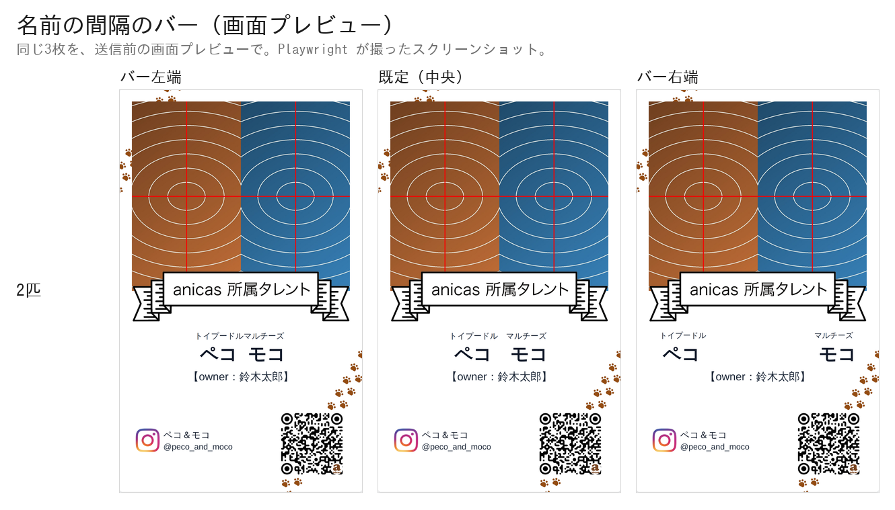
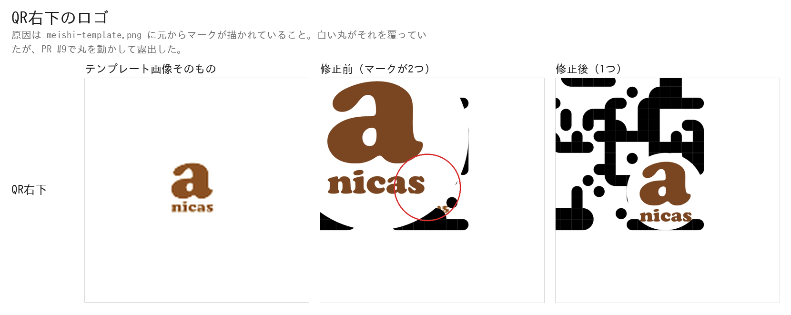
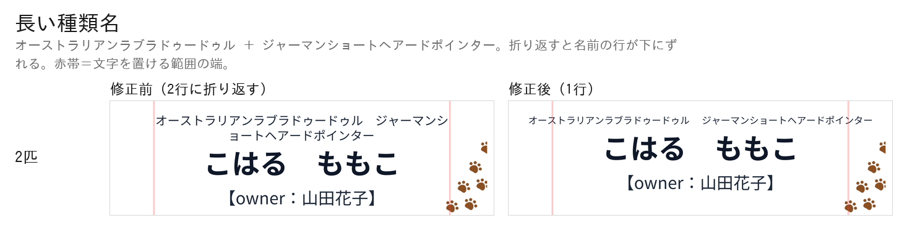
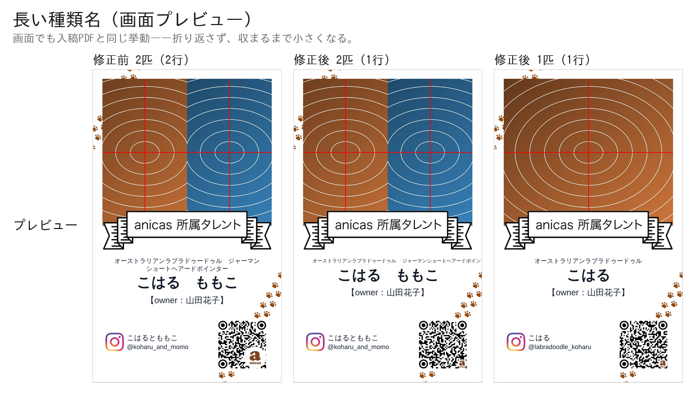

# 入稿PDFの印刷品質を直した検証

PR #8 でテンプレートとリボンを自動トレースしてベクタにしたところ、
**トレースが元画像の画素の階段をそのまま輪郭にしてしまい**、肉球・Instagramの印・
リボンの「anicas 所属タレント」の文字がガタついていた。ここではそれをやめて元の
PNG をそのまま埋め、あわせて名前と種類の中心・名前の間隔・QR右下のロゴ・長い
種類名の折り返しを直した。

検証はすべて **本番ビルドした実アプリを headless Chromium で実際に操作し**、
送信ボタンを押して飛んだ POST の `print_base64` を実測している。
見た目を別スクリプトで真似て比べる方法は使っていない。

```
next build → next start (:4598)
  ↓ Playwright で Step1〜Step5 を実操作（写真アップロード・バー操作を含む）→「送信する」
GAS の代わりに立てたローカルサーバ (:4599) が POST body をそのまま保存
  ↓
payload.print_base64 を base64 デコード → pdfimages / pdffonts / pdftotext /
PyMuPDF で描画して実測 / zxing-cpp でデコード
```

通したパターン:

| | ペット | Instagram | バー |
|---|---|---|---|
| 1匹 | トイプードル ペコ | @peco_channel | （出ない） |
| 2匹 | ＋ マルチーズ モコ | @peco_and_moco | 中央 / 左端 / 右端 |
| 3匹 | ＋ 柴犬 コテツ / 日本猫 こたつ | @kotetsutokotatsu | 中央 / 右端 |
| 長い種類名 1匹 | オーストラリアンラブラドゥードゥル こはる | @labradoodle_koharu | （出ない） |
| 長い種類名 2匹 | ＋ ジャーマンショートヘアードポインター ももこ | @koharu_and_momo | 中央 |
| 長いハンドル | 柴犬 コテツ | 30文字（Instagram の上限） | （出ない） |

3匹のオーナー名は **髙﨑真理子**。JIS 第2水準・IBM拡張の姓字が埋め込みフォントで
欠けないことを引き続き確かめるため。

---

## 1. 絵柄の階段状のガタつきがない

テンプレートとリボンを**トレースするのをやめ、元のPNGをそのまま埋める**ようにした。
`public/meishi-template.png` は 1046 × 1738 px。仕上がり55mm幅に置くので
**1046 ÷ (55 ÷ 25.4) ≈ 483 dpi**、必要な350dpiを上回る。


入稿PDFを1200dpiで描画して等倍で切り出したもの。改修前は輪郭が画素の階段を
なぞっている（肉球のふちが多角形、Instagramの印の角が階段、リボンの文字の
ストロークがギザギザ）。改修後は元画像のアンチエイリアスがそのまま出ている。

```
$ pdfimages -list two.pdf
page   num  type   width height color comp bpc  enc interp  object ID x-ppi y-ppi size ratio
   1     0 image    1046  1738  rgb     3   8  image  no         6  0   483   483 58.8K 1.1%
   1     1 image     682   593  rgb     3   8  image  no        12  0   350   350  328K  28%
   1     2 image    1046  1738  rgb     3   8  image  no         7  0   483   483 20.0K 0.4%
   1     3 smask    1046  1738  gray    1   8  image  no         7  0   483   483 3306B 0.2%
   1     4 image     500   500  rgb     3   8  image  no         8  0  5656  5656 5996B 0.8%
   1     5 smask     500   500  gray    1   8  image  no         8  0  5656  5656 6984B 2.8%
```

- 0 = テンプレート、2+3 = リボン（+ アルファ）。どちらも **1046×1738 のまま・483 dpi**。
- 1 = ペット写真、**350 dpi ちょうど**（従来どおり）。
- 4+5 = anicas マーク。500×500 の原本のまま。
- QR とタレントの入力文字は 1 件も出てこない ＝ 画像化されていない。

文字が実テキストであることも変わっていない:

```
$ pdffonts two.pdf
NotoSansJP-Regular-8268              CID TrueType      Identity-H       yes no  yes      9  0
NotoSansJP-Bold-2114                 CID TrueType      Identity-H       yes no  yes     11  0
NotoSansJP-Medium-1733               CID TrueType      Identity-H       yes no  yes     10  0
```

---

## 2. 名前と種類の中心が一致（ずれ0.1mm以内）

### 原因

どちらの行も**送り幅（advance width）の中央**をカードの中心に合わせていた。
和文の字は全角の枠のなかに描かれていて、字面の左右に残る余白（サイドベアリング）は
字ごとにまるで違う。

```
NotoSansJP-700 / unitsPerEm 1000
  ト  左の余白 304/1000   ル  右の余白  31/1000
  ペ  左の余白  35/1000   コ  右の余白 127/1000
```

「トイプードル」は左に 0.304em の空白をぶら下げ、「ペコ」は 0.035em しか
ぶら下げない。枠の中央を揃えると、**見えている字の中央は行ごとに別の位置**に来る。

### 直しかた

中央寄せの行は、**行頭・行末の字が持つ余白を先に差し引いてから**中央に置く
（`lib/print.ts` の `offsetToCentre`、プレビューは `MeishiPreview` の `inkShift`
が canvas の `measureText` で同じ量を測る）。入力文字列そのものの前後の空白は、
これまでどおり `cardText` が落としている。

### 実測

入稿PDFを1200dpiで描画し、暗い・無彩色の画素（＝文字。肉球は茶色なので入らない）
の左端と右端から、行ごとの実際の左右中央を出したもの。カードの中心は用紙左端から
**30.500 mm**。

| | 種類の行 | 名前の行 | 2行の差 |
|---|---|---|---|
| 1匹 改修前 | +0.245 mm | −0.200 mm | **0.445 mm** |
| 1匹 改修後 | −0.009 mm | +0.001 mm | **0.011 mm** |
| 2匹 改修前 | +0.255 mm | −0.200 mm | **0.455 mm** |
| 2匹 改修後 | +0.001 mm | −0.009 mm | **0.011 mm** |
| 3匹 改修前 | +0.255 mm | −0.073 mm | **0.328 mm** |
| 3匹 改修後 | +0.001 mm | +0.001 mm | **0.000 mm** |

残る 0.011 mm は 1200dpi の画素 1 個（0.021 mm）より小さい ＝ 測定の粒度。


画面プレビューも同じスクリーンショットから同じ方法で測った。**改修前 0.745 /
0.726 / 0.477 mm → 改修後 0.019 / 0.019 / 0.000 mm**（1匹 / 2匹 / 3匹）。
0.019 mm は撮影した画面の 1 画素（55mm ÷ 1440px = 0.038mm）の半分 ＝ 測定の粒度。

---

## 3. 名前の間隔のバー — 可動域は入力から計算する

2匹以上のときだけ、写真の拡大率のバーと同じかたまりの中に「名前の間隔」の
バーが出る。**新しい見出しもセクションも作っていない**（増えた要素はバー1つだけ）。

- 実装は「ペットどうしの間」を全角スペース1文字から**測ったすき間**に置き換えたもの
  （`petGap`）。既定は 1em ＝ 全角スペースと同じ幅なので、バーが中央のときの
  仕上がりは従来と 1 画素も変わらない。
- バーは **名前の行にも種類の行にも同じ物理量**を足し引きする。だから
  ペットの名前とその種類は必ず同じだけ動く。
- **可動域は固定値ではない。** 入力された文字を実際に測って毎回計算する
  （`spreadLimits`）。プレビューはブラウザのフォントを canvas で、入稿PDFは
  埋め込むフォントを fontkit で測り、同じ式に通す。
- バーそのものは −1 〜 +1 で、**既定は真ん中**。可動域は左右で長さが違うので、
  バーの左半分・右半分をそれぞれの側の可動域に割り当てている
  （`spreadFromBar`）。触らなければ従来どおりの仕上がり。

### 両端の決めかた

- **右端** = 縮まない行（名前の行）のいちばん外側の字が、文字を置ける範囲
  （カードの左右の余白）に届くところ。種類の行はここでは頭打ちにならない
  ——収まらなければ小さくなるので（下の 5）。
- **左端** = どれかの行で隣り合う文字が接するところ。種類の行のすき間（種類の
  1em）が名前の行のそれ（名前の1em）より狭いので、**先に接するのは種類の行**。

  指示は「2つの名前が触れる直前まで」だったが、そこまで詰めると種類の行は
  2.4mm 重なる。**種類の行も名前と同じだけ動く**という条件と両立しないので、
  どちらの行も壊れない側で止めている。名前どうしを触れさせたい場合は
  `spreadLimits` の `min` を名前の行だけから取ればよい（1行）。

### 実測 — バーの両端は入力で変わる

実アプリのバーを**その両端まで動かして送信し、飛んだ入稿PDFの名前の行の
すき間を1文字ずつ測った**もの（既定との差）:

| ペット | 名前 | 左へ | 右へ |
|---|---|---|---|
| 2匹 | ペコ / モコ | −1.815 mm | **+22.708 mm** |
| 2匹 | こはる / ももこ（種類が長い） | −1.815 mm | **+14.152 mm** |
| 3匹 | ペコ / コテツ / こたつ | −1.815 mm | **+0.708 mm** |
| 1匹 | — | （バーなし） | |

改修前は入力によらず **±1.815 mm 固定**だった。3匹のときに右が +0.708 mm しか
ないのは、名前3つがすでに文字を置ける範囲をほぼ埋めているため——これが
「文字数によって限界が変わる」ということ。




実アプリのバーを**その両端まで**動かして送信した3枚の入稿PDF（2匹）:

| バー | 種類の行のすき間 | 名前の行のすき間 | 名前の行の左端 | 名前の行の右端 |
|---|---|---|---|---|
| 左端 | **0.000 mm** | 2.365 mm | 21.150 mm | 40.235 mm |
| 既定 | 1.815 mm | 4.180 mm | 20.242 mm | 41.142 mm |
| 右端 | 24.523 mm | 26.888 mm | 8.888 mm | **52.496 mm** |

右端で名前の右端は **52.496 mm**、文字を置ける範囲の右端は **52.500 mm**
——0.004 mm 手前まで届いている。

すき間の増分は名前の行も種類の行も同じ **22.708 mm**。ペットの中心が動いた距離は
名前 ±11.354 mm、種類 −11.237 / +11.227 mm ——差の 0.12 mm は、この位置では
種類の行が 1行に収めるために 2.4% 縮んでいるぶん（下の 5）。

3匹（右端）では真ん中のペットは動かず、両端が両方の行とも **±0.708 mm** 動く:

| | ペコ | コテツ | こたつ |
|---|---|---|---|
| 既定 | 9.679 mm | 22.219 mm | 38.939 mm |
| 右端 | 8.971 mm | **22.219 mm** | 39.648 mm |
| 種類 既定 | 18.453 mm | 31.158 mm | 36.603 mm |
| 種類 右端 | 17.745 mm | **31.158 mm** | 37.311 mm |

どのバー位置でも2行の中心は一致したまま（差 0.000〜0.011 mm）。

**1匹のときバーは出ない。** Playwright が実際に数えた `input#name-spread` の個数:
1匹 = 0、2匹 = 1、3匹 = 1。

値は `name_spread`（カード幅に対する比）として GAS へのペイロードにも載せている。
名前を後から長くして可動域が狭まった場合は、プレビューも入稿PDFも保存値を
その場の上限まで戻してから描く（`clampSpread`）。

---

## 4. QR右下のロゴ — マークが2つあった不具合

### 原因

**`public/meishi-template.png` に元から anicas のマークが描かれている。**
デザイン画像そのものの一部で、カード上 1.420 × 1.735 mm、中心 (52.190, 88.751) mm。

コードが描くマークはこれとは別で、`lib/qr.ts` が白い丸とマークの位置を決め、
プレビュー（`rasterise`）と入稿PDF（`lib/print.ts` の `drawQr`）がそれぞれ
**1回ずつ**描いている。つまり「QRを作る側とPDFに置く側の両方が描いていた」のでは
なく、**デザイン画像に1つ、コードに1つ**あった。

白い丸はもともとこの焼き込みマークをちょうど覆う位置・大きさだったので、
見えるマークは1つだった。PR #9 で丸を 2.653mm → 6.4mm に大きくし、同時に中心を
QR右下隅への内接位置（左上寄り）に移したため、**焼き込みマークの右下がはみ出した**。



左＝テンプレート画像そのもの（QR右下の窓を切り出したもの）、
中＝PR #9 の入稿PDF（赤丸が焼き込みマーク）、右＝修正後。

### 直しかた

白い丸を **PR #9 で変える前の値に戻した**——ファインダパターン（QRの目）と同じ
7モジュール、位置も「4つめの目」の位置。焼き込みマークはふたたび完全に隠れる。

`lib/qr.ts` にコメントで残してある: この丸は焼き込みマークを覆う役目があるので
動かしたり小さくしたりしてはいけない。

### 実測 — 丸の直径と、マークが1つであること

| | 白い丸 | マーク | 丸に対する比 | PDF内のマーク配置数 |
|---|---|---|---|---|
| PR #9 | 6.4000 mm | 4.2198 mm | 0.65934 | 1 |
| **修正後** | **2.6526 mm** | **2.2456 mm** | 0.84655 | **1** |
| PR #9 以前 | 2.6526 mm | 1.7490 mm | 0.65934 | 1 |

PDF が置いている 500×500 のマークは **1枚だけ**（`page.get_image_info()` の
500×500 を全部数えた）。もう1つはテンプレート画像の中にあり、白い丸の下にある。

**焼き込みマークが丸に隠れているかの実測**（テンプレート画像の茶色い画素すべてと
丸の中心との距離の最大値）:

| QRのモジュール数 | ハンドル | 丸の直径 | 焼き込みマークの最遠点 | 丸の半径 | |
|---|---|---|---|---|---|
| 37 | 〜26文字 | 2.6526 mm | 1.0405 mm | 1.3263 mm | 隠れる |
| 41 | 27〜30文字 | 2.3466 mm | 1.0409 mm | 1.1733 mm | 隠れる |
| 45 | 31文字以上（規格外） | 2.1425 mm | 1.1944 mm | 1.0713 mm | 0.123 mm はみ出す |

Instagram のハンドルは最大30文字なので、実際に起きうる範囲ではすべて隠れる。
31文字以上を入力した場合だけ 0.12 mm 覗く（QRの飛び先も存在しないハンドル）。

### 3. マークを1mm大きくする — 0.497mm までしか大きくできない

白い丸の直径を変えずにマークだけを大きくすると、**丸からはみ出す**のが先に来る。

`public/anicas_logo_br_square.png` の字面は円ではなく縦長のかたまりで、
**いちばん外側の画素が箱の中心から 1.18127 ×（箱の半分）** のところにある。
つまり箱の直径を丸の直径と同じにすると、四隅で丸から出てしまう。
はみ出さない最大は 丸の直径 ÷ 1.18127 = **丸の 84.655%**。

- 現在（PR #9 以前）: 1.7490 mm
- はみ出さない最大: **2.2456 mm**（+0.4966 mm）
- 指示の +1mm = 2.749 mm には **3.25 mm の丸が要る**が、丸は大きくできない

そこで **2.2456 mm（+0.497 mm）** にした。`LOGO_IN_DISC` の1行で変えられる。


### 4. QRが読み取れる

丸の大きさも位置も PR #9 以前に戻したので、QRが隠される量は以前とまったく同じ
（マークは丸の上に描かれるだけで、追加のモジュールを隠さない）。
zxing-cpp での実読み取り:

```
one         150 / 200 / 300 / 350 / 600 / 1200 dpi -> https://www.instagram.com/peco_channel        すべてOK
two         同上                                    -> https://www.instagram.com/peco_and_moco       すべてOK
three       同上                                    -> https://www.instagram.com/kotetsutokotatsu    すべてOK
longhandle  同上（30文字ハンドル）                    -> https://www.instagram.com/anicas_shiba_kotetsu_kotatsu12  すべてOK
```

スマホ撮影のシミュレーション（縮小＋レンズぼけ＋センサノイズ）でも、
1匹・2匹・3匹はカード幅 260px まで、30文字ハンドルは 400px まで成功する。

---

## 5. 長い種類名は1行に収める

### 症状

種類の行が文字を置ける範囲に収まらないと折り返し、**名前の行が下にずれて**
名前と種類の位置関係が崩れていた。

実測（修正前・2匹・オーストラリアンラブラドゥードゥル＋ジャーマンショートヘアード
ポインター）:

```
y= 59.55mm  size 1.815mm  オーストラリアンラブラドゥードゥル　ジャーマンシ
y= 61.84mm  size 1.815mm  ョートヘアードポインター                 ← 2行目
y= 66.89mm  size 4.180mm  こはる　ももこ                          ← 名前が 2.27mm 下がる
```

**1匹のときは折り返さない**（17文字 × 1.815mm = 30.9mm で、置ける範囲 44mm に
収まる）。起きるのは2匹以上のとき。

### 直しかた

種類の行は**折り返さず、収まるまで文字を小さくする**（`fittedSize`）。
すき間はバーが決めた値のまま変えず、字だけを縮めるので、種類の行は名前の行と
同じだけ動き続ける。プレビューは `white-space: nowrap` ＋ 同じ計算、入稿PDFは
折り返し処理を通さない。

**行の高さは縮めない**——字だけを小さくして、行そのものは design どおりの高さを
保つ。だから下の名前の行はまったく動かない。

下限は **4pt（1.411mm）**——名刺に載せて読める和文の下限として。

### 実測




| | 種類の行 | 名前の行のy | カードの文字の行数 |
|---|---|---|---|
| 修正前 2匹 | 1.815mm・**2行** | 66.89 mm | 6 |
| 修正後 2匹 | **1.411mm（4.00pt）・1行** | **64.63 mm** | 5 |
| 修正後 1匹 | 1.815mm（縮まない）・1行 | 64.63 mm | 5 |
| 修正後 通常（トイプードル） | 1.815mm・1行 | 64.63 mm | 5 |

名前の行は **64.63 mm** で、種類が長かろうと短かろうと 1 画素も動かない。
画面プレビューでも同じで、ペット文字ブロックの行数は 修正前 4行 → 修正後 3行、
名前の行の上端は 通常 61.82mm に対し長い種類名で 61.74mm（0.08mm ＝ 測定の粒度）。

### 下限に達しても収まらない場合

**長い種類名2つ（17文字＋18文字）は、4pt まで小さくしても置ける範囲に収まらない。**
1行には収まるが、左右に 3.6mm ずつはみ出す:

```
修正後 longbreed2: size 1.4111mm (4.00pt)  x 4.910..56.114 mm
                   文字を置ける範囲 8.500..52.500 mm、仕上がりの断裁位置 3..58 mm
```

断裁位置までは左右とも 1.9mm 残っているので切れはしないが、余白は狭い。
これ以上詰めるには 3.4pt まで下げる必要があり、読める大きさを優先して 4pt で
止めている。判断が変われば `MIN_TYPE_SIZE` の1行で下げられる。

---

## 6. 用紙・写真解像度・実テキスト化は維持

```
mediabox  0.000, 0.000, 61.000, 97.000 mm
trimbox   3.000, 3.000, 58.000, 94.000 mm
bleedbox  0.000, 0.000, 61.000, 97.000 mm
```

写真は 682 × 593 px の **350 dpi ちょうど**、タレントの入力文字は埋め込みフォントの
実テキスト、QR はパスのまま。


---

## 7. 裏面を足すときのために

面ごとに部品を差し替えられる形は保っている。`lib/print.ts` の
`generateMeishiPrintPdf()` は「ページを1枚作る → 部品を順に置く」構造で、置くもの
（テンプレート・写真・リボン・文字・QR）はどれも `lib/meishi-layout.ts` の座標を
引数に取る独立した関数になっている。裏面は 2 枚目のページを足して、その面の
部品リストを渡すだけで足りる。今回は表面のみ。
