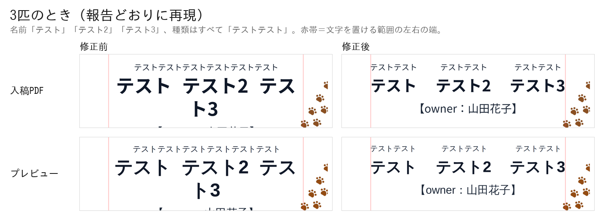
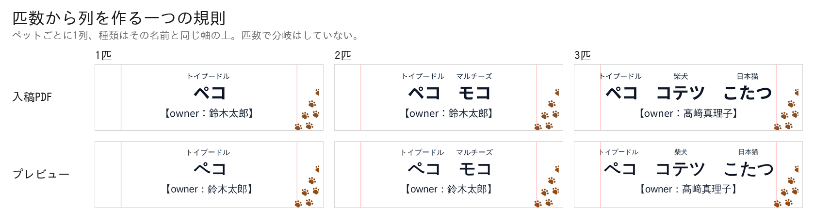
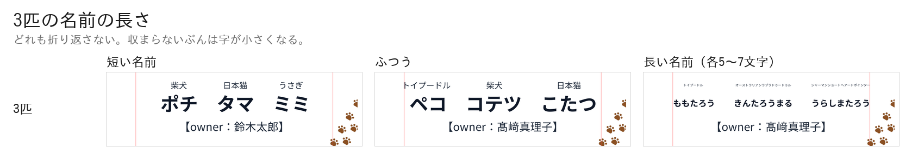

# 入稿PDFの印刷品質を直した検証

PR #8 でテンプレートとリボンを自動トレースしてベクタにしたところ、
**トレースが元画像の画素の階段をそのまま輪郭にしてしまい**、肉球・Instagramの印・
リボンの「anicas 所属タレント」の文字がガタついていた。ここではそれをやめて元の
PNG をそのまま埋め、あわせて

- ペットの文字を**匹数ぶんの列**に組み直し（3匹で崩れていたのを直す）
- 名前の間隔のバーの可動域を入力から計算し
- QR右下にマークが2つ出ていた不具合を直し
- 長い種類名・長い名前が折り返さないように

した。

検証はすべて **本番ビルドした実アプリを headless Chromium で実際に操作し**、
送信ボタンを押して飛んだ POST の `print_base64` を実測している。
見た目を別スクリプトで真似て比べる方法は使っていない。

```
next build → next start (:4598)
  ↓ Playwright で Step1〜Step5 を実操作（写真アップロード・バー操作を含む）→「送信する」
GAS の代わりに立てたローカルサーバ (:4599) が POST body をそのまま保存
  ↓
payload.print_base64 を base64 デコード → pdfimages / pdffonts / pdftotext /
PyMuPDF で描画して実測 / zxing-cpp でデコード
```

通したパターン:

| | ペット | バー |
|---|---|---|
| 1匹 | トイプードル ペコ | （出ない） |
| 2匹 | ＋ マルチーズ モコ | 中央 / 左端 / 右端 |
| 3匹 | ＋ 柴犬 コテツ / 日本猫 こたつ | 中央 / 左端 / 右端 |
| 3匹・報告の入力 | テスト / テスト2 / テスト3、種類はすべてテストテスト | 中央 |
| 3匹・短い名前 | ポチ / タマ / ミミ | 中央 |
| 3匹・長い名前 | ももたろう / きんたろうまる / うらしまたろう、種類も長い | 中央 |
| 長い種類名 1匹 | オーストラリアンラブラドゥードゥル こはる | （出ない） |
| 長い種類名 2匹 | ＋ ジャーマンショートヘアードポインター ももこ | 中央 / 右端 |
| 長いハンドル | 柴犬 コテツ、30文字（Instagram の上限） | （出ない） |

3匹のオーナー名は **髙﨑真理子**。JIS 第2水準・IBM拡張の姓字が埋め込みフォントで
欠けないことを引き続き確かめるため。

---

## 1. 絵柄の階段状のガタつきがない

テンプレートとリボンを**トレースするのをやめ、元のPNGをそのまま埋める**ようにした。
`public/meishi-template.png` は 1046 × 1738 px。仕上がり55mm幅に置くので
**1046 ÷ (55 ÷ 25.4) ≈ 483 dpi**、必要な350dpiを上回る。


入稿PDFを1200dpiで描画して等倍で切り出したもの。改修前は輪郭が画素の階段を
なぞっている（肉球のふちが多角形、Instagramの印の角が階段、リボンの文字の
ストロークがギザギザ）。改修後は元画像のアンチエイリアスがそのまま出ている。

```
$ pdfimages -list two.pdf
page   num  type   width height color comp bpc  enc interp  object ID x-ppi y-ppi size ratio
   1     0 image    1046  1738  rgb     3   8  image  no         6  0   483   483 58.8K 1.1%
   1     1 image     682   593  rgb     3   8  image  no        12  0   350   350  328K  28%
   1     2 image    1046  1738  rgb     3   8  image  no         7  0   483   483 20.0K 0.4%
   1     3 smask    1046  1738  gray    1   8  image  no         7  0   483   483 3306B 0.2%
   1     4 image     500   500  rgb     3   8  image  no         8  0  5656  5656 5996B 0.8%
   1     5 smask     500   500  gray    1   8  image  no         8  0  5656  5656 6984B 2.8%
```

- 0 = テンプレート、2+3 = リボン（+ アルファ）。どちらも **1046×1738 のまま・483 dpi**。
- 1 = ペット写真、**350 dpi ちょうど**（従来どおり）。
- 4+5 = anicas マーク。500×500 の原本のまま。
- QR とタレントの入力文字は 1 件も出てこない ＝ 画像化されていない。

文字が実テキストであることも変わっていない:

```
$ pdffonts two.pdf
NotoSansJP-Regular-8268              CID TrueType      Identity-H       yes no  yes      9  0
NotoSansJP-Bold-2114                 CID TrueType      Identity-H       yes no  yes     11  0
NotoSansJP-Medium-1733               CID TrueType      Identity-H       yes no  yes     10  0
```

---

## 2. ペットごとの列 — 3匹で崩れていたものを直す

### 症状（実アプリで再現ずみ）

3匹で名前「テスト」「テスト2」「テスト3」、種類はすべて「テストテスト」を入れると:

- 種類が **1かたまり**「テストテストテストテストテストテスト」になり、どの名前に
  対応するのか分からない
- 名前が **折り返して**「ト3」だけが2行目に落ちる



### 原因

3つあった。

1. **種類の行と名前の行は、それぞれ別々に中央に置かれていた。** ペット i の種類が
   ペット i の名前の上に来るしくみが、そもそも無かった。2匹のときは種類と名前の
   幅がたまたま近く、対になって見えていただけ（実測で 0.38mm ずれていた）。
2. **名前の行には「収まるまで小さくする」規則が無かった**（種類の行にだけあった）。
   「テスト」＋「テスト2」＋「テスト3」は 11em ＝ 0.836 で、文字を置ける範囲 0.8 を
   超えるので折り返す。
3. その結果、バーの可動域が計算上つぶれて左端に張りつき、**種類のすき間が 0** に
   なって1かたまりに見えていた。

### 直しかた — 匹数から列を作る一つの規則

カードは **ペット1匹につき1列**を持つ。列には種類が上・名前が下、**同じ軸**の上に
乗る。列を並べる規則は匹数によらず一つで、コードに匹数の分岐は無い
（`layoutPets`。2匹用・3匹用を別々に持っていない）。

```
名前を1行に組む（測った幅＋バーのすき間）→ 字面で中央に置く
  → 各ペットの軸 ＝ その名前の字面の中心
  → 種類はその軸の上に、字面の中心を合わせて置く
```

「字面で」というのは、文字送りの箱ではなく**実際にインクが乗る範囲**で、という
意味。和文の字は全角の枠のなかに描かれていて、左右に残る余白は字ごとにまるで
違う（NotoSansJP-700 で ト は左に 0.304em、ペ は 0.035em）。枠で中央を取ると、
見えている中心は行ごとに別の位置に来てしまう（`inkOffset` / `inkCentred`）。

軸の出しかたは「1行を中央に置く」そのままなので、**1匹・2匹の名前はこれまでと
1画素も変わらない**。変わるのは種類が自分の名前の軸に乗ることだけ。

大きさは、どちらの行も**収まる最大**にする:

| | 上限 |
|---|---|
| 名前 | design の 4.180mm。文字を置ける範囲に収まらなければ、収まる大きさまで |
| 種類 | design の 1.815mm。隣の種類に 1em 以内まで近づかない・範囲の端に届かない大きさまで |

折り返しは**しない**（プレビューは `white-space: nowrap`、入稿PDFは折り返し処理を
通さない）。行の高さは design のままなので、字が小さくなっても下の行は動かない。

### 実測 — 種類と名前の中心

入稿PDFから、**列は文字送りの箱が接しているかどうかで厳密に分け**（語の中では箱が
接し、ペットの間には必ずすき間がある）、各列の中心は1200dpiで描画した**字面**から
読んだもの。

| | 列 | 種類の中心 | 名前の中心 | ずれ |
|---|---|---|---|---|
| 1匹 | 1 | 30.501 mm | 30.501 mm | **0.000 mm** |
| 2匹 | 1 | 24.225 mm | 24.225 mm | **0.000 mm** |
| | 2 | 36.904 mm | 36.915 mm | **0.011 mm** |
| 3匹 | 1 | 13.663 mm | 13.663 mm | **0.000 mm** |
| | 2 | 28.639 mm | 28.649 mm | **0.011 mm** |
| | 3 | 45.371 mm | 45.381 mm | **0.011 mm** |
| 3匹（報告の入力） | 1〜3 | — | — | **0.011 mm 以下** |
| 3匹・長い名前 | 1〜3 | — | — | **0.011 mm 以下** |
| 3匹・短い名前 | 1〜3 | — | — | **0.011 mm 以下** |

0.011 mm は 1200dpi の画素 1 個（0.021mm）の半分 ＝ 測定の粒度。**修正前の同じ
測定では 14.160 mm**（種類が1列しか無く、名前3列のどれとも対応していない）。

画面プレビューでも同じ方法で測って **0.019 mm 以下**（画面の1画素は 0.038mm）。

### 実測 — 1匹・2匹は変わっていない

修正前の入稿PDFと1画素ずつ突き合わせたもの:

| | 行 | 位置の変化 |
|---|---|---|
| 1匹 | 種類・名前・owner・IG名・ハンドル | **すべて 0.000 mm** |
| 2匹 | 名前 | **0.000 mm** |
| 2匹 | 種類 トイプードル | −0.825 mm（自分の名前の軸に乗るため） |
| 2匹 | 種類 マルチーズ | +0.254 mm（同上） |

2匹で種類だけが動くのは、これまで種類と名前が **0.38mm ずれて**いたのを、
ぴったり重ねたぶん。



### 実測 — 折り返さない

ペット文字ブロックの行数は、どの入力でも **3行**（種類・名前・owner）:

| | 名前 | 名前の大きさ | 種類の大きさ | 行数 |
|---|---|---|---|---|
| 3匹・短い名前 | ポチ / タマ / ミミ | 4.180 mm | 1.815 mm | 3 |
| 3匹・ふつう | ペコ / コテツ / こたつ | 4.180 mm | 1.815 mm | 3 |
| 3匹・報告の入力 | テスト / テスト2 / テスト3 | 3.501 mm | 1.780 mm | 3 |
| 3匹・長い名前 | ももたろう / きんたろうまる / うらしまたろう | 1.876 mm | 0.731 mm | 3 |
| （修正前・報告の入力） | 同上 | 4.180 mm | 1.815 mm | **4** |



どの入力でも**文字を置ける範囲（用紙左端から 8.500 〜 52.500 mm）を出ない**。

---

## 3. 名前の間隔のバー

2匹以上のときだけ、写真の拡大率のバーと同じかたまりの中に「名前の間隔」の
バーが出る。**新しい見出しもセクションも作っていない**（増えた要素はバー1つだけ）。

- バーは**列の間隔**を動かす。種類は名前の軸に乗っているので、名前とその種類は
  必ず一緒に動く。
- **可動域は固定値ではない。** 入力された名前を実際に測って毎回計算する
  （`spreadLimits`）。プレビューはブラウザのフォントを canvas で、入稿PDFは
  埋め込むフォントを fontkit で測り、同じ式に通す。
- バーそのものは −1 〜 +1 で、**既定は真ん中**。可動域は左右で長さが違うので、
  バーの左半分・右半分をそれぞれの側に割り当てている（`spreadFromBar`）。

### 両端の決めかた

- **左端** = 名前の文字送りの箱どうしが接するところ。字面はサイドベアリングぶん
  離れているので、実際には 1.16mm の空きが残る。
- **右端** = 名前が文字を置ける範囲の端に届くところ。**そこから先には行かない**
  ——行くと、間隔を空けるためだけに名前を今より小さくすることになるから。
  名前がすでに範囲を埋めているカード（報告の入力など）では右端＝既定で、
  バーは詰める方向にだけ効く。

### 実測 — 3匹でバーを両端まで動かした入稿PDF


| バー | 名前のすき間 | 種類のすき間 | 種類の大きさ | 名前の左端 | 名前の右端 |
|---|---|---|---|---|---|
| 左端 | 接する（字面で 1.16mm） | 3.958 / 8.297 mm | 1.815 mm | 14.012 mm | 46.990 mm |
| 既定 | 5.334 / 5.122 mm | 8.149 / 12.488 mm | 1.815 mm | 9.821 mm | 51.181 mm |
| 右端 | 6.054 / 5.821 mm | 9.694 / 13.716 mm | 1.586 mm | 9.123 mm | 51.880 mm |

右端で種類が 1.815 → 1.586mm に小さくなるのは、列が範囲の端に寄って、その上の
種類が端に触れないようにするため。どのバー位置でも種類と名前の中心は
**0.011mm 以内**で一致したまま。

**1匹のときバーは出ない。** Playwright が数えた `input#name-spread` の個数:
1匹 = 0、2匹 = 1、3匹 = 1。

値は `name_spread`（カード幅に対する比）として GAS へのペイロードにも載せている。

---

## 4. プレビューと入稿PDFの一致

同じ関数（`layoutPets` / `spreadLimits`）を、プレビューは canvas で測った幅から、
入稿PDFは fontkit で測った幅から動かしている。列の中心を突き合わせると:

| 3匹 | 列1 | 列2 | 列3 |
|---|---|---|---|
| 入稿PDF | 13.663 mm | 28.649 mm | 45.371 mm |
| プレビュー | 13.255 mm | 28.609 mm | 45.568 mm |
| 差 | 0.408 mm | 0.040 mm | 0.197 mm |

差は**画面のフォントと埋め込みフォントの字幅の違い**そのもの（画面は端末の和文
フォント、PDF は Noto Sans JP）。構造——列の数、対応、折り返しの有無、種類が
名前の軸に乗ること——はどちらも同じ。

---

## 5. QR右下のロゴ — マークが2つあった不具合

### 原因

**`public/meishi-template.png` に元から anicas のマークが描かれている。**
デザイン画像そのものの一部で、カード上 1.420 × 1.735 mm、中心 (52.190, 88.751) mm。

コードが描くマークはこれとは別で、`lib/qr.ts` が白い丸とマークの位置を決め、
プレビュー（`rasterise`）と入稿PDF（`lib/print.ts` の `drawQr`）がそれぞれ
**1回ずつ**描いている。つまり「QRを作る側とPDFに置く側の両方が描いていた」のでは
なく、**デザイン画像に1つ、コードに1つ**あった。

白い丸はもともとこの焼き込みマークをちょうど覆う位置・大きさだったので、
見えるマークは1つだった。PR #9 で丸を 2.653mm → 6.4mm に大きくし、同時に中心を
QR右下隅への内接位置（左上寄り）に移したため、**焼き込みマークの右下がはみ出した**。


左＝テンプレート画像そのもの（QR右下の窓を切り出したもの）、
中＝PR #9 の入稿PDF（赤丸が焼き込みマーク）、右＝修正後。

### 直しかた

白い丸を **PR #9 で変える前の値に戻した**——ファインダパターン（QRの目）と同じ
7モジュール、位置も「4つめの目」の位置。焼き込みマークはふたたび完全に隠れる。

`lib/qr.ts` にコメントで残してある: この丸は焼き込みマークを覆う役目があるので
動かしたり小さくしたりしてはいけない。

### 実測 — 丸の直径と、マークが1つであること

| | 白い丸 | マーク | 丸に対する比 | PDF内のマーク配置数 |
|---|---|---|---|---|
| PR #9 | 6.4000 mm | 4.2198 mm | 0.65934 | 1 |
| **修正後** | **2.6526 mm** | **2.2456 mm** | 0.84655 | **1** |
| PR #9 以前 | 2.6526 mm | 1.7490 mm | 0.65934 | 1 |

PDF が置いている 500×500 のマークは **1枚だけ**（`page.get_image_info()` の
500×500 を全部数えた）。もう1つはテンプレート画像の中にあり、白い丸の下にある。

**焼き込みマークが丸に隠れているかの実測**（テンプレート画像の茶色い画素すべてと
丸の中心との距離の最大値）:

| QRのモジュール数 | ハンドル | 丸の直径 | 焼き込みマークの最遠点 | 丸の半径 | |
|---|---|---|---|---|---|
| 37 | 〜26文字 | 2.6526 mm | 1.0405 mm | 1.3263 mm | 隠れる |
| 41 | 27〜30文字 | 2.3466 mm | 1.0409 mm | 1.1733 mm | 隠れる |
| 45 | 31文字以上（規格外） | 2.1425 mm | 1.1944 mm | 1.0713 mm | 0.123 mm はみ出す |

Instagram のハンドルは最大30文字なので、実際に起きうる範囲ではすべて隠れる。
31文字以上を入力した場合だけ 0.12 mm 覗く（QRの飛び先も存在しないハンドル）。

### 3. マークを1mm大きくする — 0.497mm までしか大きくできない

白い丸の直径を変えずにマークだけを大きくすると、**丸からはみ出す**のが先に来る。

`public/anicas_logo_br_square.png` の字面は円ではなく縦長のかたまりで、
**いちばん外側の画素が箱の中心から 1.18127 ×（箱の半分）** のところにある。
つまり箱の直径を丸の直径と同じにすると、四隅で丸から出てしまう。
はみ出さない最大は 丸の直径 ÷ 1.18127 = **丸の 84.655%**。

- 現在（PR #9 以前）: 1.7490 mm
- はみ出さない最大: **2.2456 mm**（+0.4966 mm）
- 指示の +1mm = 2.749 mm には **3.25 mm の丸が要る**が、丸は大きくできない

そこで **2.2456 mm（+0.497 mm）** にした。`LOGO_IN_DISC` の1行で変えられる。


### 4. QRが読み取れる

丸の大きさも位置も PR #9 以前に戻したので、QRが隠される量は以前とまったく同じ
（マークは丸の上に描かれるだけで、追加のモジュールを隠さない）。
zxing-cpp での実読み取り:

```
one         150 / 200 / 300 / 350 / 600 / 1200 dpi -> https://www.instagram.com/peco_channel        すべてOK
two         同上                                    -> https://www.instagram.com/peco_and_moco       すべてOK
three       同上                                    -> https://www.instagram.com/kotetsutokotatsu    すべてOK
longhandle  同上（30文字ハンドル）                    -> https://www.instagram.com/anicas_shiba_kotetsu_kotatsu12  すべてOK
```

スマホ撮影のシミュレーション（縮小＋レンズぼけ＋センサノイズ）でも、
1匹・2匹・3匹はカード幅 260px まで、30文字ハンドルは 400px まで成功する。

---

## 6. 長い種類名

長い種類名は、以前は折り返して名前の行を下にずらしていた。列にしたことで、
折り返さず **その列に収まる大きさ**に落ちる。


| | 種類 | 行数 |
|---|---|---|
| 2匹・長い種類名2つ（修正前・PR #8時点） | 1.815mm・**2行**、名前が 2.27mm 下にずれる | 6 |
| 同（PR #9 の2コミット目） | 1.411mm（4pt）・1行、左右に 3.6mm はみ出す | 5 |
| **同（今回）** | **0.900mm・1行・はみ出しなし**、種類どうしは 0.931mm 空く | 5 |
| 1匹・長い種類名 | 1.815mm（縮まない）・1行 | 5 |

### 「収まらない」ときの下限

前回は下限 4pt を優先して左右にはみ出させていた。今回の指示どおり
**はみ出さないことを優先**するようにしたので、下限は無く、収まる大きさまで落ちる。

そのぶん、入りきらない入力ではとても小さくなる:

| | 名前 | 種類 |
|---|---|---|
| 2匹・種類17文字＋18文字 | 4.180 mm | **0.900 mm（2.6pt）** |
| 3匹・名前5〜7文字＋種類17〜18文字 | 1.876 mm（5.3pt） | **0.731 mm（2.1pt）** |

**2.1〜2.6pt は読める大きさではない。** 44mm の幅に17文字の種類を2つ3つ並べる
こと自体が物理的に無理で（35文字で 1.26mm/字 ＝ 3.6pt が理論上の限界）、
レイアウトの問題ではなく入力の問題。バーを右端まで開いても改善しない
（列が端に寄って、種類が端に触れないよう逆に小さくなる: 0.900 → 0.753mm）。

対処は入力側（ステップ2で種類の文字数に上限を設ける、など）になるので、
判断をお願いしたい。今回は勝手に上限を足していない。
## 7. 用紙・写真解像度・実テキスト化は維持

```
mediabox  0.000, 0.000, 61.000, 97.000 mm
trimbox   3.000, 3.000, 58.000, 94.000 mm
bleedbox  0.000, 0.000, 61.000, 97.000 mm
```

写真は 682 × 593 px の **350 dpi ちょうど**、タレントの入力文字は埋め込みフォントの
実テキスト、QR はパスのまま。


---

## 8. 裏面を足すときのために

面ごとに部品を差し替えられる形は保っている。`lib/print.ts` の
`generateMeishiPrintPdf()` は「ページを1枚作る → 部品を順に置く」構造で、置くもの
（テンプレート・写真・リボン・文字・QR）はどれも `lib/meishi-layout.ts` の座標を
引数に取る独立した関数になっている。裏面は 2 枚目のページを足して、その面の
部品リストを渡すだけで足りる。今回は表面のみ。
