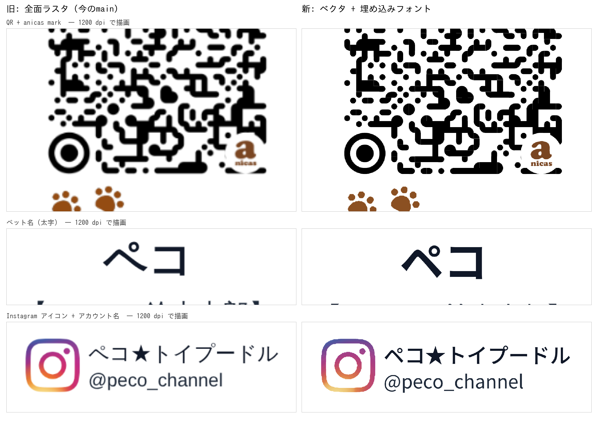
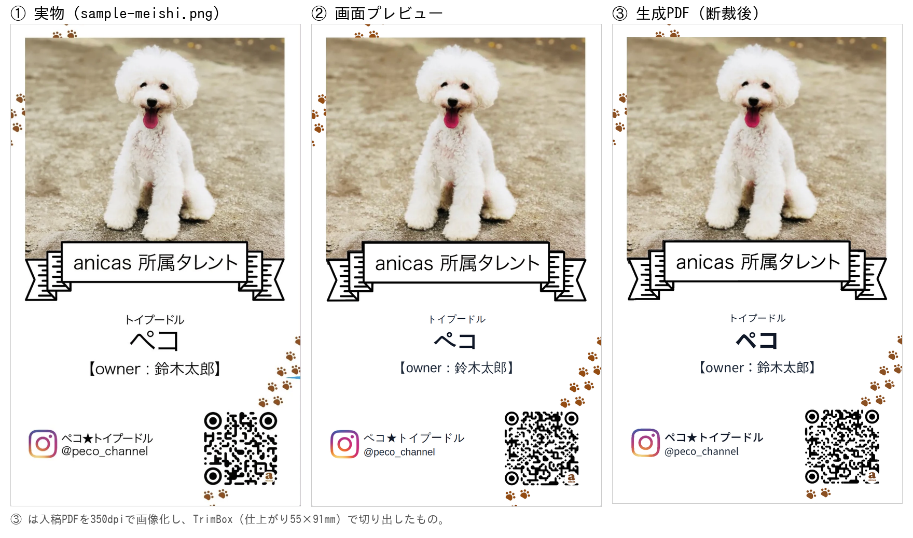
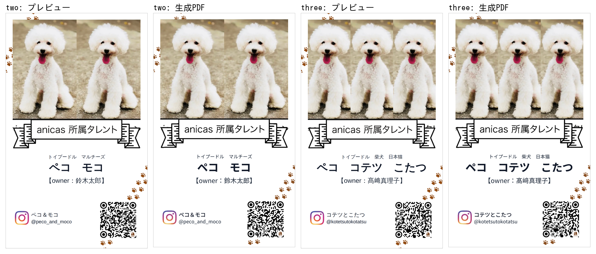
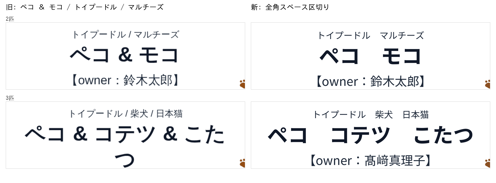

# 入稿PDFをベクタ化した検証

> **一部は後続の改修で取り下げている。** テンプレートとリボンをトレースして
> ベクタにした部分（下記「追加した資産」の `meishi-*.pdf`）は、トレースが元画像の
> 画素の階段をそのまま輪郭にしてしまい肉球・Instagramの印・リボンの文字が
> ガタついたため、**元の PNG をそのまま埋める方式に戻した**。文字の実テキスト化と
> QR のパス化はそのまま残っている。現状は
> [docs/print-quality-verification.md](print-quality-verification.md) を参照。

名刺全体を 1 枚の画像（840×1336・350dpi）にして PDF に貼っていたのをやめ、
**写真だけを画像**として埋め、テンプレート・リボン・文字・QR・ロゴは
**PDF の図形と文字**として描くようにした改修の検証記録。

実物のイラレ版を PDF で実測すると、文字は画像化されておらず、QR とロゴは別々の
高解像度画像として置かれていた。輪郭の鮮明さの差はここから出ていた。

検証は前回と同じく **本番ビルドした実アプリを headless Chromium で実際に操作し**、
送信ボタンを押して飛んだ POST の `print_base64` を実測している。
見た目を別スクリプトで真似て比べる方法は使っていない。

```
next build → next start (:4598)
  ↓ Playwright で Step1〜Step5 を実操作（写真アップロード含む）→「送信する」
GAS の代わりに立てたローカルサーバ (:4599) が POST body をそのまま保存
  ↓
payload.print_base64 を base64 デコード → pdffonts / pdfimages / pdftotext /
pdftoppm + zxing-cpp で実測
```

3 パターンを通した。文言は実物名刺にそろえてある。

| | ペット | Instagram | オーナー |
|---|---|---|---|
| 1匹 | トイプードル ペコ | @peco_channel / ペコ★トイプードル | 鈴木太郎 |
| 2匹 | トイプードル ペコ / マルチーズ モコ | @peco_and_moco / ペコ＆モコ | 鈴木太郎 |
| 3匹 | ＋ 柴犬 コテツ / 日本猫 こたつ | @kotetsutokotatsu / コテツとこたつ | 髙﨑真理子 |

3匹のオーナー名を **髙﨑** にしてあるのは、JIS 第2水準・IBM拡張の姓字が
埋め込みフォントで欠けないことを確かめるため。

## 1. 受入基準1 — 文字が文字として入っている

`pdffonts` — 3 ウェイトとも **埋め込み済み（emb yes）**、Unicode 対応表つき
（uni yes）:

```
$ pdffonts one.pdf
name                                 type              encoding         emb sub uni object ID
------------------------------------ ----------------- ---------------- --- --- --- ---------
NotoSansJP-Regular-979               CID TrueType      Identity-H       yes no  yes    104  0
NotoSansJP-Bold-7888                 CID TrueType      Identity-H       yes no  yes    103  0
NotoSansJP-Medium-2708               CID TrueType      Identity-H       yes no  yes    105  0
```

`pdftotext -layout` — 選択・検索できる文字として取り出せる（＝画像化されていない）。
組み上がりの改行位置もそのまま出る:

```
$ pdftotext -layout one.pdf -
           トイプードル
            ペコ
    【owner：鈴木太郎】
ペコ★トイプードル
@peco_channel

$ pdftotext -layout three.pdf -
     トイプードル         柴犬   日本猫
ペコ       コテツ              こたつ
    【owner：髙﨑真理子】
コテツとこたつ
@kotetsutokotatsu
```

改修前は `pdffonts` が空（フォントなし）、`pdftotext` も空だった。

## 2. 受入基準2 — 埋め込み画像は写真とロゴだけ

```
$ pdfimages -list one.pdf
page   num  type   width height color comp bpc  enc interp  object ID x-ppi y-ppi size ratio
--------------------------------------------------------------------------------------------
   1     0 image     682   593  rgb     3   8  image  no       102  0   350   350  648K  55%
   1     1 image     500   500  rgb     3   8  image  no       101  0  7261  7261 5996B 0.8%
   1     2 smask     500   500  gray    1   8  image  no       101  0  7261  7261 6984B 2.8%
```

- 1 件目 = ペット写真。682×593px、実効 **350 dpi**。
- 2 件目 = anicas マーク。`public/anicas_logo_br_square.png` を **500×500 のまま**
  埋め、名刺上のサイズに縮小して配置しているので実効 7261 dpi。3 件目はその
  アルファチャンネル（smask）。
- テンプレート・リボン・文字・QR は 1 件も出てこない = 画像化されていない。

改修前は `image 840 1336` の 1 件だけ、つまり名刺まるごと 1 枚の画像だった。

比較（1200 dpi で描画して等倍拡大）:



QR のモジュール、anicas マーク、ペット名、Instagram アイコンとアカウント名——
どれも旧版は 350 dpi のドットがそのまま見えているのに対し、新版は解像度に依らない
輪郭になっている。

## 3. 受入基準3 — 用紙と写真解像度は現状維持

```
MediaBox   0, 0, 61.000, 97.000 mm
TrimBox    3, 3, 58.000, 94.000 mm   （仕上がり 55 × 91 mm）
BleedBox   0, 0, 61.000, 97.000 mm
```

写真は `pdfimages -list` のとおり **350 dpi ちょうど**。名刺の写真枠の大きさから
逆算した画素数（682×593）にリサンプルして埋めているので、以前と同じ解像度で、
以前と同じ `object-fit: cover` の切り取りになる。

PDF のサイズは 0.72 MB → 0.95 MB（1匹の場合）。増分は写真が全面ラスタではなく
写真枠ぶんの PNG になった一方、テンプレートのベクタが乗ったぶん。

## 4. 受入基準4 — プレビューと配置が一致



生成 PDF を TrimBox で切り出したカードと、①同一ブラウザで撮った画面プレビュー、
②実物名刺 `public/sample-meishi.png` のランドマーク位置を実測した
（位置はカードに対する比率で取り、mm に換算）。

### 4-a. 生成PDF vs 画面プレビュー

| ランドマーク | left | top | right | bottom |
|---|---|---|---|---|
| 写真 | +0.00 | −0.10 | +0.00 | +0.00 |
| リボン | +0.00 | +0.00 | −0.05 | +0.10 |
| Instagram アイコン | +0.05 | +0.25 | +0.00 | +0.25 |
| QR | −0.15 | +0.00 | −0.05 | +0.00 |
| ペット文字ブロック | −0.25 | +0.30 | +0.00 | +0.00 |
| IG 文字ブロック | +0.05 | +0.00 | +0.00 | +0.00 |

**文字を含む全ランドマークで最大 0.30 mm**（350 dpi で約 4 px）。

### 4-b. 生成PDF vs 実物名刺

| ランドマーク | left | top | right | bottom |
|---|---|---|---|---|
| 写真 | +0.10 | −0.05 | −0.20 | +0.00 |
| リボン | +0.05 | +0.00 | −0.05 | +0.10 |
| Instagram アイコン | +0.25 | +0.05 | +0.25 | +0.05 |
| QR | −0.30 | +0.00 | −0.05 | +0.00 |
| ペット文字ブロック | **+1.60** | +0.10 | +0.00 | +0.00 |
| IG 文字ブロック | +0.30 | +0.00 | +0.00 | +0.00 |

図版要素はすべて **0.30 mm 以内**。ペット文字ブロックだけ左端が 1.6 mm 内側に入るが、
これは実物がイラレで別の書体で組まれているためで、配置ではなく書体差
（前回の検証と同じ結果）。`lib/meishi-layout.ts` の座標は今回いっさい触っていない。

2匹・3匹でも、折り返し位置までプレビューと一致する:



## 5. 受入基準5 — つなぎ文字



- 名前 `ペコ ＆ モコ` → `ペコ　モコ`
- 種類 `トイプードル / マルチーズ` → `トイプードル　マルチーズ`

3匹では旧版が `ペコ & コテツ & こた / つ` と折り返していたのが、
`ペコ　コテツ　こたつ` で 1 行に収まるようになった。

定義は `lib/meishi-layout.ts` の `PET_SEPARATOR` と `cardText()` の 1 か所だけで、
プレビュー（`MeishiPreview`）と入稿PDF（`lib/print.ts`）はどちらもそこから文字列を
受け取る。`【owner：…】` と `@…` の組み立ても同じ関数に寄せたので、
文言の重複定義は残っていない。

## 6. QR の実デコード

生成 PDF を画像化して zxing-cpp でデコード。3 パターンすべて正しい Instagram URL:

```
one    300 dpi (721x1146) -> https://www.instagram.com/peco_channel        OK
one    350 dpi (841x1337) -> https://www.instagram.com/peco_channel        OK
one    200 dpi (481x764)  -> https://www.instagram.com/peco_channel        OK
one    150 dpi (361x573)  -> https://www.instagram.com/peco_channel        OK
two    300 dpi (721x1146) -> https://www.instagram.com/peco_and_moco       OK
three  300 dpi (721x1146) -> https://www.instagram.com/kotetsutokotatsu    OK

スマホ撮影シミュレーション（350dpi 画像を縮小＋ぼかし＋ノイズ）— 3パターンとも全条件で成功:
  カード幅 1000px / blur 0.6 / noise σ3
  カード幅  800px / blur 0.8 / noise σ4
  カード幅  600px / blur 1.0 / noise σ5
  カード幅  500px / blur 1.2 / noise σ6

対照: 実物名刺 public/sample-meishi.png -> https://www.instagram.com/peco_channel
```

## 7. 図版のベクタ化の忠実度

`public/meishi-template.png` / `meishi-ribbon.png` を
`scripts/build-print-vectors.py` で輪郭に起こし、
`public/meishi-template.pdf` / `meishi-ribbon.pdf` として置いている。
PNG は引き続きデザインの原本で、画面プレビューはそのまま PNG を使う。

ベクタPDFを元PNGと同じ 1046×1738 で描画して画素差を取った結果:

| | 平均差 | p99 | 差>32 の画素 |
|---|---|---|---|
| meishi-template | 0.495 / 255 | 8 | 0.49% |
| meishi-ribbon | 0.338 / 255 | 0 | 0.34% |

差が出るのは輪郭の 1px 分だけ（元PNGのアンチエイリアスに対して、ベクタ側は
その解像度でのエッジになる）。

Instagram アイコンだけは多色のグラデーションなので、輪郭を potrace で起こしたうえで
グラデーションを最小二乗で当てはめて（中心・扁平率・回転を最適化、平均誤差
6.7/255）96 ストップの放射グラデーションとして描いている:


`pdfimages -list` は両ベクタPDFに対して 1 件も画像を返さない（＝完全にベクタ）。

## 8. フォント

`public/fonts/NotoSansJP-{400,500,700}.ttf` — Noto Sans JP（OFL-1.1、
`public/fonts/OFL.txt`）を cp932 相当（JIS X 0208 + NEC/IBM 拡張、9,377字）に
サブセットしたもの。`scripts/build-print-fonts.sh` で再生成できる。
`NotoEmoji-400.ttf` はそこに無い文字（アカウント名の絵文字など）が来たときだけ
取りに行く。

PDF に入るのはそのカードが実際に使った字だけ（pdf-lib が埋め込み時にさらに
サブセットする）。1匹の PDF に入った 3 ウェイトのフォントは合計 4.4 KB（圧縮後のストリーム実測）。

### ハマりどころ（`scripts/build-print-fonts.sh` にコメント済み）

- **WOFF2 は使えない**。glyf 変換がかかっているため fontkit がサブセットできない。
- **WOFF も使わない**。テーブルごとの deflate を JS で展開してからでないと
  サブセットできず、送信 1 回あたり **+2.6 秒**かかった。無圧縮 TTF なら +11 ms。
  配信時は Web サーバが gzip するので回線上のサイズは WOFF とほぼ同じ
  （2.33 MB → gzip 1.38 MB）。
- **字形データを 4 バイト境界にパディングして出す**。fontkit のサブセッタは
  `loca` を short 形式（オフセットを 1/2 にして格納）で書くのに自分ではパディング
  しないので、奇数長の字形があるとそこから後ろの字が**無言で欠ける**。
  実際、パディング前は「トイプードル」が「トイプー」になっていた。
  偶数長にそろえると解消する。1 フォントあたり +11 KB。

## 9. 送信にかかる時間

送信ボタンから「送信完了しました」まで（本番ビルド・ローカル配信）:

```
1匹 941 ms   2匹 932 ms   3匹 937 ms      （改修前: 666 / 612 / 830 ms）
```

フォント 3 本（初回のみ 3 × 1.38 MB、以後はブラウザキャッシュ）と
テンプレートのベクタPDFを取りに行くぶん、100〜300 ms 増えている。
画面に足したものはなく、表示は既存の「送信中…」のまま。
