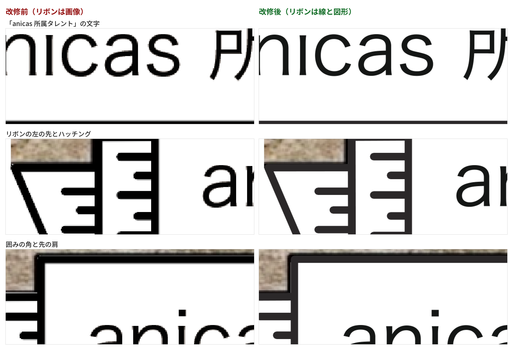
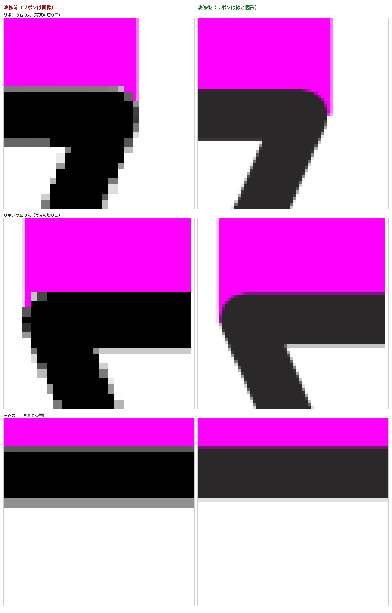
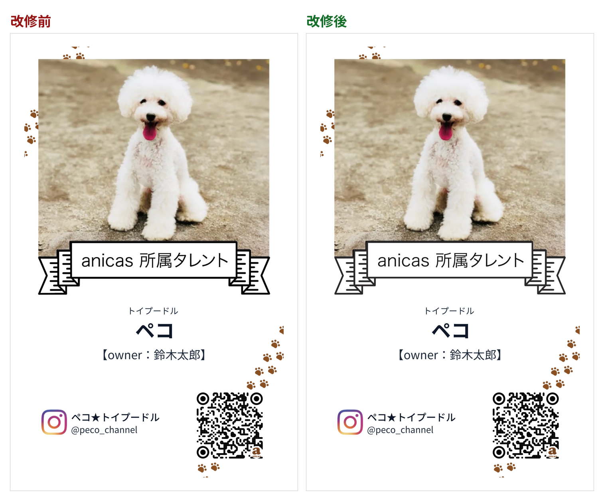

# リボンと「anicas 所属タレント」を線と図形にした検証

入稿PDFの中で、リボンと「anicas 所属タレント」を **画像ではなくイラストレーター
そのままの線と図形** にした改修の検証記録。

ラクスルの確認用データで拡大すると、リボンの黒い線と文字の輪郭に画素の段差が
見えていた。原因は、この2つが `public/meishi-ribbon.png`（483dpi の画像）として
入稿PDFに入っていたこと。今回、元のイラストレーターのファイルから書き出した
`public/ribbon_only.pdf`（パスだけ・文字はアウトライン化済み）の中身を、
そのままPDFの図形として置くようにした。

写真の切り抜き（リボンの輪郭で切る仕組み）と画面プレビューは変えていない。

検証は既存の記録と同じく **本番ビルドした実アプリを headless Chromium で実際に
操作し**、送信ボタンを押して飛んだ POST の `print_base64` を実測している。
見た目を別スクリプトで真似て比べる方法は使っていない。

```
next build → next start
  ↓ Playwright で Step1〜Step5 を実操作（写真アップロード含む）→「送信する」
GAS の代わりに立てたローカルサーバが POST body をそのまま保存
  ↓
payload.print_base64 を base64 デコード → pdfimages / pdftoppm / pdftotext /
PyMuPDF で実測
```

改修前は同じ手順を、改修前のコミットの worktree をビルドして通している。
1匹・2匹・3匹の3パターン、それぞれ **実物の写真**（`public/sample-meishi.png`
の写真枠）と **べた塗りのマゼンタ**（写真の画素が紙に出たら一目で分かる）の
2種類、計12本のPDFを実測した。文言は既存の記録と同じ。

| | ペット | Instagram | オーナー |
|---|---|---|---|
| 1匹 | トイプードル ペコ | @peco_channel / ペコ★トイプードル | 鈴木太郎 |
| 2匹 | ＋ マルチーズ モコ | @peco_and_moco / ペコ＆モコ | 鈴木太郎 |
| 3匹 | ＋ 柴犬 コテツ / 日本猫 こたつ | @kotetsutokotatsu / コテツとこたつ | 髙﨑真理子 |

---

## 受入基準1 — 入稿PDFの中に画像として入っていない

`pdfimages -list`（1匹の場合。2匹・3匹も同じ内訳）:

```
### 改修前
page   num  type   width height color comp bpc  enc interp  object ID x-ppi y-ppi size ratio
   1     0 image    1046  1738  rgb     3   8  image  no         6  0   483   483 58.8K 1.1%   ← テンプレート
   1     1 image     682   584  rgb     3   8  image  no        12  0   350   350  645K  55%   ← 写真
   1     2 image    1046  1738  rgb     3   8  image  no         7  0   483   483 20.0K 0.4%   ← リボン
   1     3 smask    1046  1738  gray    1   8  image  no         7  0   483   483 3306B 0.2%   ← リボンのアルファ
   1     4 image     500   500  rgb     3   8  image  no         8  0  5656  5656 5996B 0.8%   ← anicas マーク
   1     5 smask     500   500  gray    1   8  image  no         8  0  5656  5656 6984B 2.8%

### 改修後
   1     0 image    1046  1738  rgb     3   8  image  no         6  0   483   483 58.8K 1.1%   ← テンプレート
   1     1 image     682   584  rgb     3   8  image  no        44  0   350   350  645K  55%   ← 写真
   1     2 image     500   500  rgb     3   8  image  no         7  0  5656  5656 5996B 0.8%   ← anicas マーク
   1     3 smask     500   500  gray    1   8  image  no         7  0  5656  5656 6984B 2.8%
```

**リボンの 1046×1738 画像とそのアルファが消えている。** ✅

代わりに入っているのは図形。ページ上の描画命令の数が **589 → 658**（+69）で、
`public/ribbon_only.pdf` が持つ図形の数とちょうど一致する。PDF 内では
`/EmbeddedPdfPage-…` という Form XObject として入っている。

文字（ペット名・オーナー・Instagram）は今までどおり本物のテキストのまま:

```
$ pdftotext -layout three.pdf -
トイプードル          柴犬    日本猫
ペコ コテツ                こたつ
      【owner：髙﨑真理子】
  コテツとこたつ
  @kotetsutokotatsu
```

---

## 受入基準2 — 位置・大きさが改修前と一致（0.1mm以内）

入稿PDFを **1200dpi で描画**し、同じ座標系でランドマークを mm 実測した。
1匹・2匹・3匹すべてで同じ値。

| ランドマーク | 辺 | 改修前 mm | 改修後 mm | ズレ |
|---|---|---|---|---|
| リボン＋文字（インク全体） | 左 | 5.9342 | 5.9553 | **+21.2 µm** |
| | 右 | 55.1255 | 55.1043 | **−21.2 µm** |
| | 上 | 44.1007 | 44.1007 | **±0 µm** |
| | 下 | 55.4672 | 55.4248 | **−42.3 µm** |
| 「anicas 所属タレント」の字面 | 左 | 15.2488 | 15.2488 | **±0 µm** |
| | 右 | 46.1310 | 46.1310 | **±0 µm** |
| | 上 | 46.5102 | 46.5102 | **±0 µm** |
| | 下 | 49.7275 | 49.7275 | **±0 µm** |
| 囲みの縦罫（左） | — | 12.0943 | 12.0902 | −4.1 µm |
| 囲みの縦罫（右） | — | 48.9187 | 48.9092 | −9.5 µm |
| 囲みの横罫（上） | — | 44.2942 | 44.2800 | −14.2 µm |
| 囲みの横罫（下） | — | 51.8552 | 51.8331 | −22.1 µm |

**最大ズレ 42.3 µm = 0.042 mm。** 受入基準の 0.1mm に対して 1/2 以下。✅

### 置き場所は「そのまま」では合わなかった

依頼文の「同じ位置・同じ大きさで書き出しているので置き場所はそのまま合うはず」は
**実測すると合わなかった**。`ribbon_only.pdf` を A4 のアートボード中央の 55×91mm と
みなして素直に置くと、リボンの画像に対して **横 1.0098 倍・縦 1.0070 倍** ずれる
（約1%、リボンの幅で 0.49mm）。

原因は書き出し側ではなく **`meishi-ribbon.png` / `meishi-template.png` の側**。
この画像はカードより約 1% 小さい範囲を写しており、カードはそれを引き伸ばして
使っている（1046px の横幅が、元データ上では 55mm ではなく 54.47mm 相当）。

そこで置き場所は宣言せず **実測して決めている**。`scripts/build-vector-art.sh` が

- リボンの画像を、カード自身の画素の格子（テンプレートの 1046×1738）の上で読む
- 線と図形をずっと細かく描いて、同じ格子に面積平均で落とす
- 両者が一致する4つの数（軸ごとの倍率と位置）を最小二乗で求める

を行い、結果を `lib/vector-art.ts` に書き出す。求めた置き場所を逆向きに検証すると、
**1940 か所のインクの縁で rms 13.4 µm・p99 50.5 µm・最悪 118.8 µm**（画像自身の
1画素が 53 µm）。基準を満たさなければスクリプトは何も書かずに落ちる。

---

## 受入基準2の目的 — 段差が消えたか

入稿PDFを **1200dpi で描画して等倍で切り出したもの**。



数値でも測った。リボンの左の先には長い直線の斜辺がある。483dpi の画像は
その斜辺を自分の画素の格子にしか置けないので、**1画素（52.6 µm）ずつ階段状に
進む**。線と図形には乗るべき格子がない。斜辺を副画素精度で追い、本来の直線を
引き算した残りが段差そのもの:

| | 直線からのずれ sd | 最大幅（peak-to-peak） |
|---|---|---|
| 改修前 | 13.47 µm | **60.03 µm**（1200dpi で 2.84 px） |
| 改修後 | 1.46 µm | **4.25 µm**（0.20 px） |

**60 µm → 4 µm。** 4.25 µm は 1200dpi の描画自体の粒度（1px = 21 µm の 1/5）で、
測定の下限。改修前の 60.03 µm は 483dpi の1画素 52.6 µm とほぼ一致していて、
これが「画素の階段」だったことを裏づける。

輪郭の切れ味（インクが 10%→90% になるまでの幅）も測った。文字は曲線の集まりなので
斜辺のように直線を引き算できないが、こちらは曲線でもそのまま測れる:

| | 改修前 | 改修後 |
|---|---|---|
| 「anicas 所属タレント」の文字 | 71.30 µm | **45.81 µm** |
| リボンの輪郭（先・囲み・ハッチング） | 70.60 µm | **46.80 µm** |
| QR（もともと図形・対照） | 34.93 µm | 34.93 µm（変化なし） |

QR は改修前から図形なので値が 1 µm も動かない。測り方が安定していることと、
リボン以外に手が入っていないことの裏づけになっている。

### 描画エンジンをまたいでも同じ

同じPDFを **poppler（pdftoppm）** と **MuPDF** の2つで 1200dpi 描画し、
リボン帯のインクの外形を比べた:

```
改修前  poppler  x  5.9055.. 55.1180 mm      MuPDF  x  5.9267.. 55.1180 mm   （21 µm 違う）
改修後  poppler  x  5.9478.. 55.0968 mm      MuPDF  x  5.9478.. 55.0968 mm   （完全一致）
```

改修前は描画エンジンによって画像の縁の解釈が 21 µm ずれていたが、改修後は
どちらも同じ位置に同じ形を描く。印刷所の RIP が何であっても同じ結果になる。

---

## 受入基準3 — 写真の切り抜きが今までどおり

べた塗りマゼンタの写真で実測（1匹・2匹・3匹すべて同じ値）。

```
写真が見えている範囲     改修前  x 5.9478..55.1180 mm, y 5.4398..81.4917 mm
                        改修後  x 5.9478..55.1180 mm, y 5.4398..81.4917 mm   ← 完全一致

写真とリボンの間に紙が挟まった列（すき間）   改修前 0 列 / 改修後 0 列
リボンより下に写真が出ている列（はみ出し）   改修前 0 列 / 改修後 0 列

写真とリボンの境目（2323 列）の移動量  中央値 0 µm, 95% 42.3 µm
```

**すき間 0・はみ出し 0。** 写真の見えている範囲は改修前と1画素も違わない。✅

境目が 73 µm（350dpi の1ドット）以上動いた列は 2323 列中 11 列だけで、その11列は
すべて **型紙の輪郭が真上に立ち上がる4か所**（`RIBBON_TOP` が同じ x を2度通る
リボンの肩、x = 12.73 / 48.22 / 51.06 mm）と **リボンの左右の先端**。輪郭が垂直な
場所では、横に 20 µm 動くだけで「その列で写真が終わる高さ」は大きく動く——
境目そのものが動いたわけではない。



### 残っている差（先端 21 µm）

リボンの左右の先は、画像では **アンチエイリアスで2画素ぶん太っていた** のに対し、
線と図形では数学的にとがった1点になる。そのぶん、先端で写真の角が
**1200dpi の1画素（21 µm）だけ** 余分に見える。上の画像の右上・左上の細い
マゼンタがそれ。

- 21 µm は **350dpi の1ドット（73 µm）の 1/3.5** で、印刷機が再現できる大きさではない
- 受入基準が他所で使っている 0.1mm の 1/5

型紙側（`RIBBON_SPAN` / `RIBBON_TOP`）は「変えない」指示なのでそのままにしてある。
もし完全に 0 にしたい場合は、テンプレートのリボンを消す範囲を左右だけ内側に
寄せて、先端のごく一部だけ画像を残す手がある（`lib/vector-art.ts` の `clear` を
左右だけ縮める）。ただしその場合、**いちばんとがった先端に画素の段差が戻る** ので、
今回は採っていない。

### テンプレートに焼き込まれたリボンを消している

`public/meishi-template.png` にはリボンが焼き込まれていて、そのうえに
リボンを重ねる作りになっている。線と図形は画像と 1 画素以内でしか一致しないので、
**そのままだとテンプレート側のリボンの縁がはみ出して段差が戻る**（実測で
斜辺の段差が 60 µm → 50 µm にしか改善しなかった）。

そこで、テンプレートを置いた直後・写真を置く前に **リボンの箱を紙の白で
塗りつぶしてから** 線と図形を置いている。この箱の中にテンプレートの他の絵が
無いことは `scripts/build-vector-art.sh` が毎回確かめていて（現状 0 画素）、
写真より先に置くので写真を削ることもない。

---

## 受入基準4 — 画面プレビューと入稿PDFがずれない

同じブラウザで撮ったプレビューの実レンダリングと、そのとき送信されたPDFを
比べた（カードに対する比率で取り、mm に換算）。

| ランドマーク | 辺 | 改修前 | 改修後 | 変化 |
|---|---|---|---|---|
| リボン＋文字 | 左 | −12.2 µm | +9.0 µm | +21.2 |
| | 右 | +24.7 µm | +3.6 µm | −21.1 |
| | 上 | +47.7 µm | +47.7 µm | ±0 |
| | 下 | +123.0 µm | **+80.7 µm** | −42.3 |
| 「anicas 所属タレント」の文字 | 上下左右 | 最大 +83.3 µm | 最大 +83.3 µm | **±0** |
| 写真 | 左右上 | 最大 +51.9 µm | 最大 +51.9 µm | ±0 |
| | 下 | +47.8 µm | +153.6 µm | +105.8 |

リボンと文字は **すべて 0.1mm 以内**、しかも下辺は 123 → 81 µm と改修前より
縮んでいる。✅

写真の「下」の +153.6 µm は、2323 列すべての中でいちばん低い1画素を取った値で、
上に書いた **先端 21 µm の話と同じ場所**（境目全体では中央値 0 µm・95% 42 µm）。

ペット名・Instagram・QR はプレビューとの差が **1 µm も変わっていない**
（それぞれ最大 336 / 394 / 90 µm）。これは画面のブラウザ既定フォントと
入稿PDFの埋め込みフォントの字形差で、以前からある値。今回の改修とは無関係。

---

## 受入基準5 — 他の要素が動いていない

| ランドマーク | ズレ（1匹/2匹/3匹すべて） |
|---|---|
| 写真 | **±0 µm** |
| ペット名・種類のブロック | **±0 µm** |
| Instagram の行 | **±0 µm** |
| QR | **±0 µm** |

さらに、改修前後のページを 1200dpi で1画素ずつ比べると、**違いがあるのは
x 5.884..55.118 mm / y 44.090..55.457 mm の範囲だけ**（ページの 1.55%）。
これはリボン自身の箱で、そこから外へは1画素も出ていない。

用紙まわりも変わっていない:

```
MediaBox   0, 0, 61.000, 97.000 mm
TrimBox    3, 3, 58.000, 94.000 mm   （仕上がり 55 × 91 mm）
BleedBox   0, 0, 61.000, 97.000 mm
写真        682 × 584 px, 350 dpi
```

---

## 受入基準6 — 1匹・2匹・3匹すべて

12本すべてを同じ手順で実測し、上の表の値は **3パターンで完全に同じ**。
リボンはペットの数に依存しないので当然だが、実測して確かめてある。



---

## 印刷所に渡るものの変化

### 黒インクが K 単色になった

線と図形は元のイラストレーターの色指定をそのまま持っている。リボンの黒は
**`0 0 0 1 K`（K 100% の単色）**。改修前は PNG の RGB(0,0,0) だった。

- 細い線・文字は K 単色が定石（版ずれの縁取りが出ない、インク総量が上がらない）
- **元のイラストレーター版と同じ指定**になった、ということでもある
- 画面や確認用データでは、K100 は RGB 黒よりわずかに薄く見える（上の拡大画像で
  改修後の黒が少し明るいのはこのため。紙の上では濃い黒で刷られる）

カード上の他の黒（テンプレートの肉球・Instagram の印、ペット名などの文字）は
今までどおり RGB。**リボンだけ色指定の系統が違う**状態になるので、
気になるようなら次の部品を線にするときに合わせて相談したい。

### ファイルは小さくなった

| | 改修前 | 改修後 | 差 |
|---|---|---|---|
| 1匹 | 786,050 B | 771,790 B | −14,260 B |
| 2匹 | 700,935 B | 686,679 B | −14,256 B |
| 3匹 | 669,863 B | 655,594 B | −14,269 B |

リボンの画像（約 23KB）が図形（約 9KB）に置き換わったぶん。

なお `public/ribbon_only.pdf` には **イラストレーターの編集用データ
（PieceInfo）とプレビュー用サムネイルが 164KB** 入っている。そのまま埋めると
入稿PDF1本ごとに 164KB の死荷重になり、印刷所に元データの編集状態まで渡ることに
なるので、埋め込む前に落としている（`lib/print.ts` の `embedVector`）。図形と
色の指定はそのまま。

### レイヤー（optional content）について

`ribbon_only.pdf` は Illustrator のレイヤーを optional content として持っていて、
「ガイド」レイヤーだけ **オフ**。Form XObject として埋めるとレイヤーの
オン・オフ表は付いてこないため、オフのレイヤーに中身があると入稿PDFで
復活してしまう。

実測したところ **オフの「ガイド」レイヤーは空**（描画命令 0）で、中身のある
レイヤーはすべてオンだった。`scripts/build-vector-art.sh` がこれを毎回確かめ、
オフのレイヤーにインクがあれば落ちるようにしてある。poppler と MuPDF の描画が
完全一致していることからも、余計なものが出ていないことが確認できる。

---

## 部品を増やせる形にしてある

「肉球やテンプレートの絵も線にしたい」に備えて、線と図形を差し込む仕組みは
**部品を1つずつ足せる形**にしてある。

- `scripts/build-vector-art.sh` の `PARTS` に
  「線と図形のファイル / 置き換える画像 / その下に敷かれる画像」を1行足して再実行すると、
  置き場所と消す箱が実測され、`lib/vector-art.ts` に追記される
- `lib/print.ts` は `VECTOR_ART.<部品名>` を、その部品を描く順番のところで
  `clearForVector` → `drawVector` するだけ

スクリプトは追加のたびに次を自動で確かめる:

- ファイルに画像が入っていないこと（＝本当に線と図形であること）
- 文字がテキストのまま残っていないこと（アウトライン化されていること）
- オフのレイヤーが空であること
- 消す箱の中に、その部品以外の絵がテンプレートに無いこと
- 置き場所の誤差が rms 30 µm・p99 60 µm 以内であること

今回入れたのはリボンと「anicas 所属タレント」だけ。テンプレートと写真は
今までどおり画像のまま。
