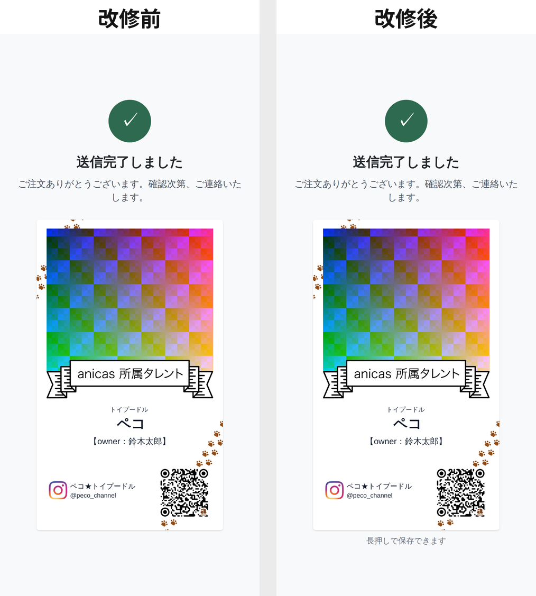
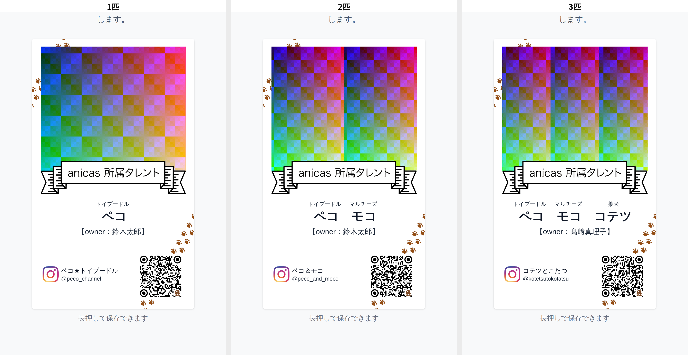
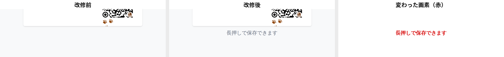

# 完了の画面に「長押しで保存できます」を1行足した回の検証

完了の画面に出ている名刺の絵は、長押しすれば端末の「写真に保存」が出る。ただし
**絵を見ただけではそれが分からない**。そこを1行だけで埋めた回の検証記録。

変えたのは `app/page.tsx` の完了画面だけ。増やしたもの＝**絵の直下の1行**
（「長押しで保存できます」）。ボタン・説明文・入口は増やしていない（押せるものは
改修前後とも **0**）。減らしたものは無い。

この画面は縦に中央揃え（`justify-center`）なので、**流れの中に1行足すと絵ごと
上にずれる**。そこで1行は絵の枠から下に浮かせて（`absolute` / `top-full`）出して
いる。流れの高さが変わらないので、絵は1画素も動かない。

検証は **本番ビルドした実アプリを、スマホと同じ画面のタッチ操作だけの headless
Chromium で実際に操作し**、Step1 から送信までを通して測っている。

```
next build → next start
  ├─ :4611  この改修
  └─ :4610  改修前（9e3bd53）を git worktree でビルド
       ↓ Playwright で Step1〜Step5 を実操作（写真アップロードを含む）
       ↓ 「送信する」
GAS の代わりに立てたローカルサーバ (:4599) が POST body をそのまま保存
       ↓
画面は全ステップを画素で突き合わせ、print_base64 は pypdfium2 (PDFium) で
350 / 600 / 1200 dpi に描画して画素比較する
```

3パターンを通した。文言はこれまでの検証記録とそろえてある。

| | ペット | Instagram | オーナー |
|---|---|---|---|
| 1匹 | トイプードル ペコ | @peco_channel / ペコ★トイプードル | 鈴木太郎 |
| 2匹 | ＋ マルチーズ モコ | @peco_and_moco / ペコ＆モコ | 鈴木太郎 |
| 3匹 | ＋ 柴犬 コテツ | @kotetsutokotatsu / コテツとこたつ | 髙﨑真理子 |

写真は毎回同じ画素のダミー画像を使っているので、改修前後の差はコードの差だけを
反映する。

---

## 1. 絵の直下に1行が出ている



| 測ったこと | 結果（1匹・2匹・3匹とも同じ） |
|---|---|
| 文言 | `長押しで保存できます` |
| 要素 | `<p>` 1つ（ボタンでもリンクでもない） |
| 文字の大きさ | **12px**（`text-xs`）。同じ画面の本文は 14px、名刺の絵は 280 × 465 |
| 色 | `text-gray-500` — フォームの他の補足（Step3 の注記・図のキャプション）と同じ |
| 絵の下端からの間隔 | **8px** |
| 絵と重なっているか | **重なっていない**（矩形が交差しない） |
| 画面に増えた押せるもの | **0**（改修前 0 → 改修後 0） |

1匹・2匹・3匹とも、絵の直下の同じ位置に同じ1行が出る。



---

## 2. 絵は1画素も動いていない

ページ自身に矩形を測らせた。**3つの画面サイズ × 1匹・2匹・3匹の9通りすべてで、
改修前と改修後の値が完全に一致**している。

| 画面 | 絵の位置（上端 / 左端） | 絵の大きさ | 改修前 | 改修後 |
|---|---|---|---|---|
| iPhone SE 375 × 667 | 204 / 47.5 | 280 × 465.234 | ← | **同じ** |
| iPhone 12 390 × 844 | 279.375 / 55 | 280 × 465.234 | ← | **同じ** |
| iPhone 14 Pro Max 430 × 932 | 323.375 / 75 | 280 × 465.234 | ← | **同じ** |

絵そのもの（`` の `src` に入っている `data:image/png`）も、sha256 が
改修前後で一致する。1匹 `baee329d7a…` / 2匹 `642677ec36…` / 3匹 `7320b79caa…`。

画素でも確かめた。完了画面のスクリーンショット（iPhone 12・1170 × 2532）を
改修前後で1画素ずつ突き合わせ、**絵の矩形の中**と**絵より上**を数えた。

| | 絵の中の差分 | 絵より上の差分 | 絵より下の差分 | 変わった範囲 |
|---|---|---|---|---|
| 1匹 | **0** | **0** | 4,298 | y 2266〜2301 |
| 2匹 | **0** | **0** | 4,298 | y 2266〜2301 |
| 3匹 | **0** | **0** | 4,298 | y 2266〜2301 |

絵の下端は 2234 行目。**変わった画素は 1つ残らずその 32 画素（＝ 10.7px）下から
始まる**。つまり変わったのは足した1行だけで、絵には一切かかっていない。



### 長押しを妨げるものは増えていない

絵の上を 3 × 3 の9点で突いて、指が当たるのが絵自身かどうかを見た。

| 測ったこと | 改修前 | 改修後 |
|---|---|---|
| 絵の上の9点で `document.elementFromPoint` が返すもの | 全点 **その ``** | 全点 **その ``** |
| `contextmenu` を止めている箇所 | 無し（`defaultPrevented` false） | 無し（`defaultPrevented` false） |

足した1行は絵の**下**にあり、絵とは重なっていない。

---

## 3. 他の画面は1画素も変わっていない

Step1 から Step5 までを同じ操作・同じ写真で撮り、改修前後で1画素ずつ
突き合わせた。あわせて、**同じ（改修前の）ビルドを2回**通した対照も撮っている。

| 画面 | 画素数 | 同じビルド2回 | 改修前 vs 改修後 |
|---|---|---|---|
| Step1 ペットの数 1匹 / 2匹 / 3匹 | 2,962,440 | 0 / 0 / 0 | **0 / 0 / 0** |
| Step2 ペット情報 1匹 / 2匹 / 3匹 | 2,962,440〜3,383,640 | 0 / 0 / 0 | **0 / 0 / 0** |
| Step3 アカウント情報 1匹 / 2匹 / 3匹 | 4,310,280 | 0 / 0 / 0 | **0 / 0 / 0** |
| Step4 写真とプレビュー 1匹 / 2匹 / 3匹 | 4,176,900 | 0 / 0 / 0 | **0 / 0 / 0** |
| Step5 確認 1匹 / 2匹 / 3匹 | 3,913,650〜4,229,550 | 0 / 0 / 0 | **0 / 0 / 0** |

15画面すべてで差分 0。変わったのは完了の画面だけ。

---

## 4. 送信されるデータは変わっていない

足したのは画面の文字だけで、payload には触れていない。同じ操作・同じ写真で
改修前後の POST body を突き合わせた。

| 項目 | 1匹 | 2匹 | 3匹 |
|---|---|---|---|
| キーの集合 | 一致 | 一致 | 一致 |
| `ig_handle` / `ig_name` / `owner_name` / `pets` / `adjust` / `line_user_id` | 一致 | 一致 | 一致 |
| `print_base64` のバイト列 | 不一致 | 不一致 | 不一致 |

`print_base64` のバイト列だけが違うが、これは**同じビルドを2回走らせても同じように
食い違う**（`generateMeishiPrintPdf` がテンプレート・リボン・ロゴ・フォントを
`Promise.all` で同時に読むため、PDF の中の並び順とフォントのサブセットタグが毎回
変わる）。前回の検証記録と同じ現象で、この改修とは関係しない。

そこで PDFium で描画して画素で比べた。**どの解像度でも1画素も違わない。**

| | 350 dpi (841 × 1337) | 600 dpi (1441 × 2292) | 1200 dpi (2882 × 4583) |
|---|---|---|---|
| 改修前 vs 改修後 1匹 | 0 px | 0 px | 0 px |
| 改修前 vs 改修後 2匹 | 0 px | 0 px | 0 px |
| 改修前 vs 改修後 3匹 | 0 px | 0 px | 0 px |
| 同じビルド2回 1匹 / 2匹 / 3匹 | 0 px | 0 px | 0 px |

入稿データは今まで通り。

---

## 実機で見てほしいこと

- iPhone SE のような**縦の短い端末**では、完了の画面はもともと画面に収まらず
  少しスクロールする。足した1行はその**いちばん下**（絵の下 8px、ページの下端）に
  出る。読める位置ではあるが、下の余白は無い。iPhone 12 と iPhone 14 Pro Max では
  スクロールなしで出る。
- **長押しして「写真に保存」が実際に出るか**は、前回同様この環境では測れない
  （headless Chromium は長押しのメニュー自体を出さない）。ページ側にそれを妨げる
  ものが無いことまでは上のとおり確認済み。
